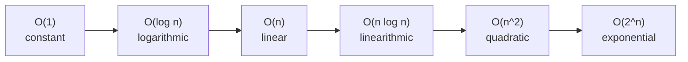
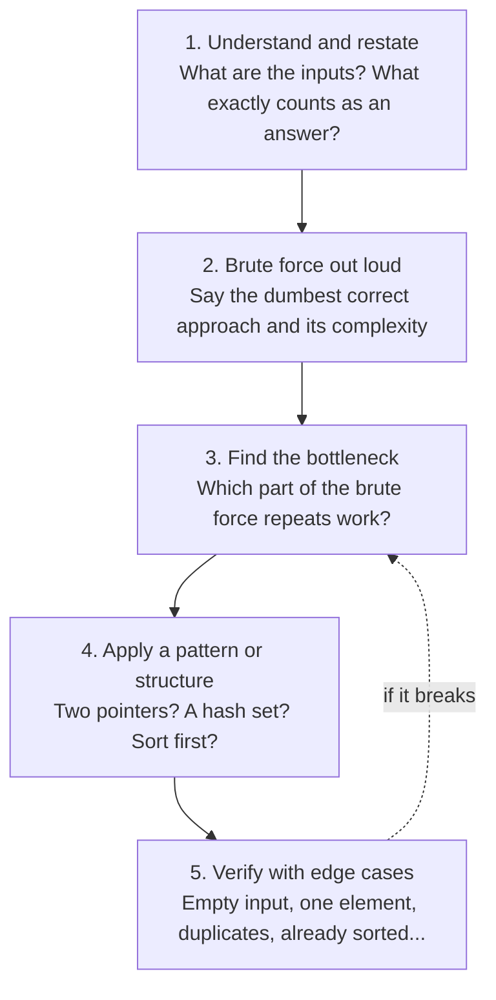

# 01 — Big-O & Foundations

## Why this exists

Two programs can take the same input and produce the same answer — and
one finishes in 1 ms while the other takes an hour. You can't always
tell which is which by reading the code casually, and you definitely
don't want to find out by running it on real data. Complexity is how
you predict performance **before** running anything: count how the
number of operations grows as the input grows, not how many
milliseconds a run took on your laptop.

Every module after this one teaches you a way to make the "bottleneck"
step of that prediction go away. This module teaches you how to name
the bottleneck in the first place.

## The RAM model, in one paragraph

Pretend your computer is a simple machine where every basic
operation — reading a value, writing a value, doing one bit of
arithmetic or comparison — costs exactly **1 "op"**, regardless of what
the value is. Big-O counts how the *number of ops* scales with input
size `n`, ignoring the exact hardware, language, or how fast any one op
runs. It's a deliberately blurry lens: it throws away constant factors
so it can tell you the one thing that matters for big inputs — the
*shape* of the growth curve.

## Growth curves



*What to notice: each arrow is a step up in how violently the op count
explodes as n grows — the gap between neighbors widens dramatically as
you move right.*

| Complexity | Ops at n = 1,000,000 | Feels like |
| --- | --- | --- |
| O(1) | 1 | instant |
| O(log n) | ~20 | instant |
| O(n) | 1,000,000 | well under a second |
| O(n log n) | ~20,000,000 | still under a second |
| O(n^2) | 1,000,000,000,000 | minutes to hours |
| O(2^n) | more than atoms in the observable universe | never finishes |

## How to recognize it

Cues you can read straight off a problem or a piece of code, before
you've traced through a single example:

- A fixed number of steps no matter how big the input is → **O(1)**.
- One loop, straight through the input, once → **O(n)**.
- A loop that halves (or doubles) what's left each step → **O(log n)**.
- A sort, or a loop combined with a halving/binary step → **O(n log n)**.
- A loop nested inside another loop over the *same* input → **O(n^2)**.
- Two (or more) recursive calls that each shrink the input by only 1 →
  **O(2^n)**.
- **Sequential** steps ADD their costs. **Nested/dependent** steps
  MULTIPLY them. This one rule explains almost every case above.

### Reading complexity from code

```ts
// sequential — ADD: O(n) + O(n) = O(n)
function f(arr: number[]): number {
  let total = 0
  for (const x of arr) total += x   // O(n)
  for (const y of arr) total += y   // O(n)
  return total                       // O(n) + O(n) = O(n), still linear
}

// nested — MULTIPLY: O(n) * O(n) = O(n^2)
function g(arr: number[]): number {
  let total = 0
  for (const a of arr) {                  // n times
    for (const b of arr) total += a * b   // n times, for EACH a
  }
  return total                             // O(n) * O(n) = O(n^2)
}

// halving — LOG: each step throws away half the remaining problem
function h(n: number): number {
  let steps = 0
  while (n > 1) {
    n = Math.floor(n / 2)
    steps++
  }
  return steps                              // O(log n)
}
```

## Space complexity

Space complexity counts **extra** memory your algorithm allocates —
new arrays, hash sets/maps, or (once you meet recursion in module 08)
the call stack — never the memory the input already occupies. A
function that loops over an array with a couple of extra variables is
O(1) space. A function that builds a new array the same size as the
input is O(n) space, even if it changes nothing about the *time* it
takes.

## Amortized cost — a teaser

Sometimes a single operation is expensive, but only rarely. If you
spread that rare expensive cost across all the cheap operations around
it, the *average* cost per operation can still be small — this is
"amortized" cost. You'll prove this with real numbers in module 02,
when you build a dynamic array that doubles its capacity when full:
resizing is O(n) on that one call, but it happens so rarely that
appending n items still costs O(n) *in total* — amortized O(1) per
append.

## The 5-step problem-solving framework

Every pattern this course teaches — two pointers, sliding window,
hashing, binary search, DP, all of it — is something you reach for at
**step 4**. Learn this loop now; you'll run it on every exercise from
here on.



*What to notice: step 4 is a placeholder today — you don't know any
patterns yet. Every module from 02 onward hands you one more tool to
drop into that box.*

### Worked example: does a pair sum to a target?

`nums = [2, 7, 11, 15]`, `target = 9`. Applying steps 1–4: restate as
"find two different positions whose values add to 9"; the brute force
compares every pair (O(n^2)); the bottleneck is re-scanning the array
to find each partner; the pattern is to remember what you've already
seen instead of re-scanning. One pass, tracking a set of values seen
so far:

| Step | x | complement (target - x) | complement seen already? | seen after this step |
| --- | --- | --- | --- | --- |
| 1 | 2 | 7 | no | {2} |
| 2 | 7 | 2 | **yes → return true** | {2, 7} |

Step 5 (verify): what if the array is empty? Has one element? Has the
target appear only once (no valid pair, e.g. `[4]`, target `8`)? The
exercises walk through exactly this.

## Gotchas

- **Constants don't matter — until they do.** O(n) beats O(n^2)
  eventually, always. But for small, fixed n, a "worse" complexity with
  a tiny constant can outrun a "better" one with a large constant. Big-O
  is about the trend as n grows, not a guarantee for every n.
- **Best / worst / average case.** A hash-set lookup is O(1) *on
  average* but O(n) in the worst case (many collisions). Unless stated
  otherwise, this course means worst case.
- **"n" must be named.** "O(n)" is meaningless until you say what n
  counts — array length? number of digits? number of graph edges? The
  same code can be a different complexity depending on what you call n
  (see snippet H in ex01: is n the matrix's side length, or its total
  cell count?).

## Try it now

→ `exercises/ex01-growth-rates.ts` through `ex05-target-pair.ts`, then
`checkpoint.ts`. Check with `npm test -- 01`.
