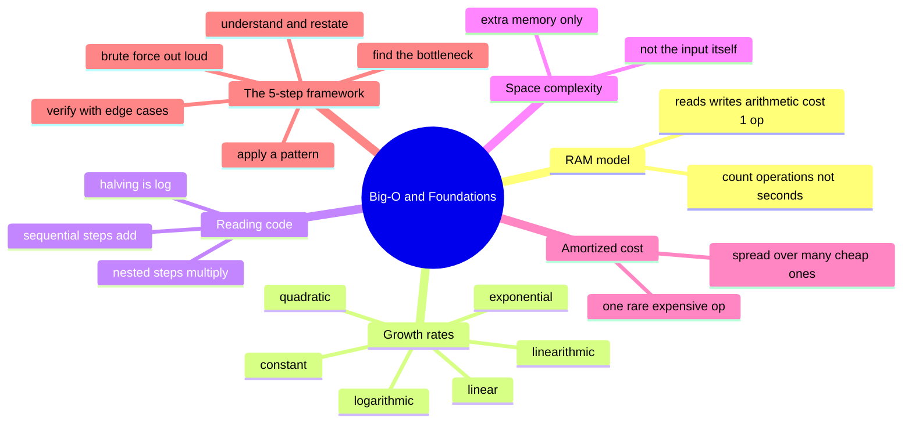

# 01 — Big-O & Foundations · Cheat-sheet

## Concept map

*What to notice: everything branches off two ideas — how to READ a
growth rate, and the 5-step LOOP you run to find one when it isn't
already written for you.*

## Complexity table (n = 1,000,000)

| Complexity | Ops at n = 1,000,000 | Feels like |
| --- | --- | --- |
| O(1) | 1 | instant |
| O(log n) | ~20 | instant |
| O(n) | 1,000,000 | well under a second |
| O(n log n) | ~20,000,000 | still under a second |
| O(n^2) | 1,000,000,000,000 | minutes to hours |
| O(2^n) | more than atoms in the observable universe | never finishes |

## Reading complexity from code

- A fixed number of steps regardless of input size → **O(1)**.
- One straight pass over the input → **O(n)**.
- A loop that halves (or doubles) what's left each step → **O(log n)**.
- A sort, or a loop combined with a halving step → **O(n log n)**.
- A loop nested inside another loop over the *same* input → **O(n^2)**.
- Two-plus recursive calls that each shrink the input by 1 → **O(2^n)**.
- **Sequential steps ADD. Nested/dependent steps MULTIPLY.**

## The 5-step framework

1. **Understand & restate** — what are the inputs, what counts as an
   answer?
2. **Brute force out loud** — say the dumbest correct approach and its
   complexity.
3. **Find the bottleneck** — which part of the brute force repeats
   work?
4. **Apply a pattern or structure** — this is where every later module
   plugs in.
5. **Verify with edge cases** — empty input, one element, duplicates,
   already sorted...

## Gotchas

- Constants don't matter for large n — but they can dominate for small,
  fixed n.
- "O(1) average, O(n) worst case" — hash-set lookups are the classic
  example. This course means worst case unless stated otherwise.
- Always name what "n" counts. The same code can be a different
  complexity depending on what you call n.

## Self-quiz

1. Two programs solve the same problem; one takes 1 ms, the other an
   hour, on the same input. What does Big-O let you do about that, and
   when?
2. In the RAM model, what operations cost "1 op"?
3. Two O(n) loops back to back — what's the total? Two O(n) loops
   nested, over the same input — what's the total?
4. Why does repeatedly halving n take O(log n) steps, not O(n)?
5. What counts toward space complexity, and what doesn't?
6. What does "amortized O(1)" mean, in one sentence?
7. Name the 5 steps of the problem-solving framework, in order.
8. Why must "n" always be named ("n of what?") when you state a
   complexity?

Answers

1. It lets you predict which one will be slow *before* running
   anything, by counting how the operation count scales with input
   size — not by literally timing the code.
2. A single read, write, or arithmetic/comparison operation.
3. Sequential: O(n) + O(n) = O(n) (still add). Nested: O(n) * O(n) =
   O(n^2) (multiply).
4. Because the remaining problem shrinks by a constant *fraction* each
   step, not a constant amount — the number of times you can halve n
   before reaching 1 is floor(log2(n)).
5. Extra memory your algorithm allocates (new arrays, hash sets, the
   recursion call stack) — not the memory the input already occupies.
6. Averaged over a sequence of operations, even though a few are
   individually expensive, the average cost per operation stays within
   the stated bound.
7. Understand & restate → brute force out loud → find the bottleneck →
   apply a pattern/structure → verify with edge cases.
8. Because "O(n)" is meaningless without knowing what n measures —
   array length, digit count, node count, etc. — the same code can be a
   different complexity class depending on what you call n.

## Pattern-recognition drill

For each one-liner, name the **complexity class** (not a pattern — this
module is about reading growth rates) before checking the answer.

1. Look up a user by ID in a hash map.

Answer
O(1) — a single hash lookup, no scan.

2. Binary-search a sorted list of a million prices for one exact match.

Answer
O(log n) — each comparison halves the remaining range.

3. Merge-sort a list of n names.

Answer
O(n log n) — the classic comparison-sort bound.

4. Compare every pair of n cities, brute force, to find the closest
   pair.

Answer
O(n^2) — a loop nested inside a loop over the same n cities.

5. Print every value from 1 to n, once each.

Answer
O(n) — one straight pass.

6. Generate every subset of a set of n items by recursively trying
   "include" and "exclude" for each item.

Answer
O(2^n) — two recursive branches per item, n items deep.

