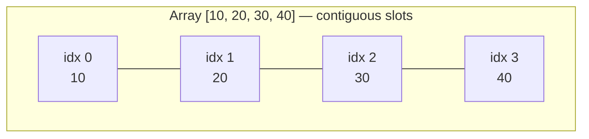
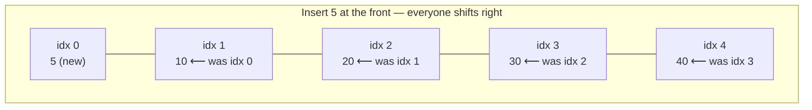
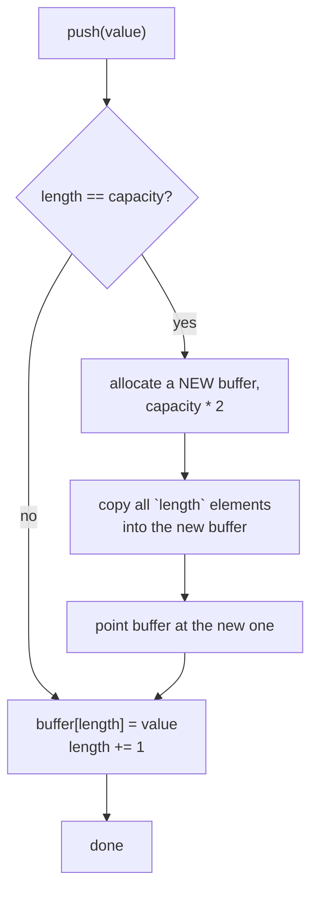

# 02 — Arrays & Dynamic Arrays

## Why this exists

Every other structure in this course gets measured against the array.
It gives O(1) index access because its elements sit in one contiguous
block of memory — the address of slot `i` is just
`base + i * elementSize`, no searching required. That contiguity is
also its weakness: inserting or deleting anywhere but the end means
shifting every element after it, an O(n) cost. Understanding exactly
*why* arrays are fast at reading and slow at mid-array writing is the
foundation for recognizing when a problem needs something else (a
linked list, a hash map, a heap...) later in the course.

## Static arrays: contiguous memory



*What to notice: `get(2)` jumps straight to `base + 2*size` — no walk
required. That direct-addressing trick is what O(1) index access means
in practice.*



*What to notice: one insert-at-front touches every existing element —
O(n) — because contiguity has to be preserved after the new slot opens
up. Insert/delete at the very END is the cheap case (no shifting).*

| Operation | Front | Middle | Back |
| --- | --- | --- | --- |
| Read (`get(i)`) | O(1) | O(1) | O(1) |
| Insert | O(n) — shift everything right | O(n) — shift the tail | O(1) amortized* |
| Delete | O(n) — shift everything left | O(n) — shift the tail | O(1) |
| Search (unsorted) | O(n) | O(n) | O(n) |

\* only for a *dynamic* array with spare capacity — see below.

## Dynamic arrays: capacity vs. length

A **static** array has a fixed size decided at creation. A **dynamic**
array (JS's `Array`, Python's `list`, Java's `ArrayList`, C++'s
`vector`) *feels* like it grows for free — but underneath, it is a
static array plus two numbers: **length** (how many slots are in use)
and **capacity** (how many slots actually exist in the backing
buffer). `push` is cheap exactly when `length < capacity`: write to
the next slot, bump length. The interesting case is when the buffer is
full.

Module 01's `append_costs(n)` exercise simulated this by hand: mostly
free appends, with an occasional expensive one. This module builds the
real thing.

## Resize: the doubling strategy



*What to notice: the expensive branch (allocate + copy, O(n)) only
fires when the buffer is completely full — and after it fires, the
buffer has room for `n` more pushes before it fires again.*

**Why doubling, and why is it still O(1) amortized?** If you grew
capacity by a fixed amount (say +1) every time, you'd pay for a resize
on *every* push — O(n) per push, O(n²) total. Doubling instead means
resizes happen at length 1, 2, 4, 8, ..., n — geometrically rarer. The
total copying work across n pushes is `1 + 2 + 4 + ... + n < 2n`.
Spread that `2n` over `n` pushes and each push costs O(1) *on average*
— "amortized" O(1), even though any single push might trigger an O(n)
copy.

## How to recognize it

Reach for array/index techniques when a problem statement says:

- "in place" or "O(1) extra space" — don't allocate a second array;
  overwrite the one you were given.
- "shift", "rotate", or "partition" — think in terms of index
  gymnastics (two pointers, reversal tricks) rather than building a new
  structure.
- The input is a plain array/string and the ask is about order,
  position, or a running total — arrays are usually the right tool
  before reaching for anything fancier.
- "reverse", "in-place dedupe", "merge two sorted lists into a fixed
  buffer" — all classic array-mutation prompts, covered below.

## The template: reader/writer two-index sweep

A huge chunk of "in place" array problems share one skeleton: a fast
**read** pointer visits every element once, and a slow **write**
pointer trails behind, only advancing when the read pointer finds
something worth keeping.

```ts
function compactInPlace(nums: number[], shouldKeep: (x: number) => boolean): number {
  let write = 0
  for (let read = 0; read < nums.length; read++) {
    if (shouldKeep(nums[read]!)) {
      nums[write] = nums[read]!
      write += 1
    }
  }
  return write // new length; nums[write..] is leftover, ignore it
}
```

This is a preview of the two-pointer pattern module 04 covers in full
depth — here it always moves in the *same direction* (both pointers
only go right).

## Worked example: dedupe-sorted, traced

`dedupeSorted([1, 1, 2, 2, 2, 3])` should keep one copy of each run and
return the new length.

| step | read | nums[read] | write (before) | action | nums after |
| --- | --- | --- | --- | --- | --- |
| start | — | — | 1 | `write` starts at 1 (index 0 is always kept) | `[1,1,2,2,2,3]` |
| 1 | 1 | 1 | 1 | `1 === nums[write-1]` (1) → skip | `[1,1,2,2,2,3]` |
| 2 | 2 | 2 | 1 | `2 !== 1` → write, `write` → 2 | `[1,2,2,2,2,3]` |
| 3 | 3 | 2 | 2 | `2 === nums[write-1]` (2) → skip | `[1,2,2,2,2,3]` |
| 4 | 4 | 2 | 2 | `2 === nums[write-1]` (2) → skip | `[1,2,2,2,2,3]` |
| 5 | 5 | 3 | 2 | `3 !== 2` → write, `write` → 3 | `[1,2,3,2,2,3]` |

Result: return `3`; `nums[0..3)` is `[1, 2, 3]` — everything from index
3 onward is leftover and the caller ignores it.

## Complexity

Reading (`get`), writing (`set`), and appending to a dynamic array with
spare capacity are all O(1) — direct addressing does the work. Any
operation that has to touch every element (reverse, dedupe, sum a row,
transpose) is O(n) or O(rows·cols) because there is no way to skip
elements and still guarantee correctness. Dynamic array resize is O(n)
*worst case* per call but O(1) *amortized* across a sequence of pushes
— always state which one you mean, they answer different questions.

## Strings: immutable, so build-then-join

Strings in TypeScript (and most languages) are immutable: every
`s += char` allocates a brand-new string and copies the old one into
it. A loop of n concatenations is `1 + 2 + ... + n` characters copied —
O(n²) total, not O(n). The fix mirrors the dynamic array lesson: build
pieces into an array (`Array.push` is O(1) amortized, same doubling
trick under the hood) and call `.join('')` once at the end. Same shape
of trap, same shape of fix.

## Common gotchas

- **Off-by-one on bounds.** `index < length`, not `<= length` — the
  classic source of a phantom out-of-bounds read.
- **`length` vs `capacity`.** `size()`/`length` is how much data is
  there; `capacity()` is how much room exists. Confusing them makes
  "is it full?" checks wrong.
- **Aliasing vs. copying.** `const b = a` gives you a second reference
  to the *same* array — mutate through `b` and `a` changes too.
  `[...a]` or `a.slice()` makes a real, independent copy.
- **`noUncheckedIndexedAccess`.** In this repo, `arr[i]` has type
  `T | undefined` — the compiler is reminding you that indices you
  haven't proven are in range might not hold a value.
- **Rotation amount can exceed the array length.** Always reduce `k`
  with `((k % n) + n) % n` before using it (handles `k > n` and
  negative `k` alike).
- **Merging into spare capacity from the front, not the back.** Filling
  `mergeInto` left-to-right overwrites values in `a` before you have
  read them — that's why it fills from the back.

## Try it now

→ `exercises/ex01-dynamic-array.ts` through `ex06-matrix-walk.ts`, then
`checkpoint.ts`. Check with `npm test -- 02`.
