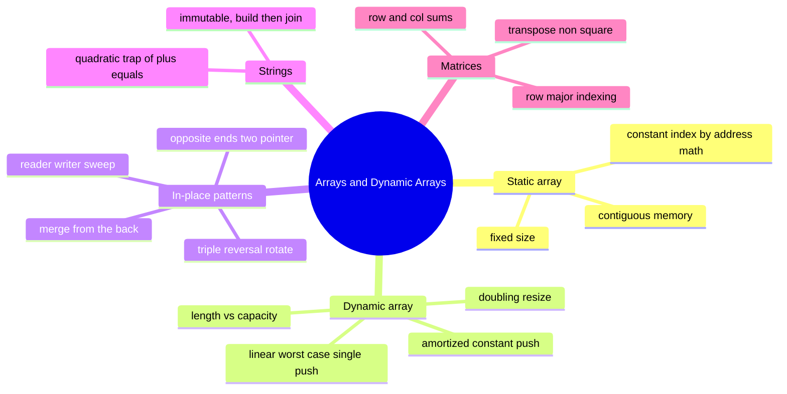

# 02 — Arrays & Dynamic Arrays · Cheat-sheet

## Concept map

*What to notice: everything under "In-place patterns" is the same
family of trick — move indices carefully so you never need a second
array.*

## Op-cost cheat table

| Operation | Front | Middle | Back |
| --- | --- | --- | --- |
| Read `get(i)` | O(1) | O(1) | O(1) |
| Insert | O(n) | O(n) | O(1) amortized (dynamic array only) |
| Delete | O(n) | O(n) | O(1) |
| Search (unsorted) | O(n) | O(n) | O(n) |

## Resize rules (dynamic array)

- Start at capacity 1 (or any small constant).
- When `length === capacity`, allocate a NEW buffer at `capacity * 2`,
  copy every element across, then write.
- Total copy work over n pushes: `1 + 2 + 4 + ... + n < 2n` →
  **amortized O(1) per push**, even though any single push can be
  O(n).
- The backing buffer is only ever indexed (`buffer[i] = x`) inside a
  from-scratch build — never grown with the language's own
  `push`/`append`.

## In-place pattern list

| Pattern | Shape | Used in |
| --- | --- | --- |
| Reader/writer sweep | fast `read`, slow `write`, same direction | `removeValue`, `dedupeSorted`, `compact` |
| Opposite-ends swap | `lo`/`hi` walk toward the middle | `reverse` |
| Triple reversal | reverse(all) + reverse(part) + reverse(rest) | `rotateRight`, `rotateDisplay` |
| Merge from the back | write pointer starts at the END, walks left | `mergeInto` |

## String-building rule

Strings are immutable → `s += x` in a loop is O(n²) (new allocation +
copy every time). Push pieces into an array, `.join('')` once: O(n).

## Self-quiz

1. Why is `get(i)` O(1) on an array but O(n) on a linked list?
2. What's the difference between a dynamic array's `length` and its
   `capacity`?
3. Why does doubling capacity give amortized O(1) push, but growing by
   a fixed +1 each time does not?
4. You need to rotate an array right by `k` where `k` can be larger
   than the array's length. What do you do before rotating?
5. Why does `mergeInto` fill from the BACK of the array instead of the
   front?
6. What's wrong with building a string via `result += nextChar` inside
   a loop over n characters?
7. `const b = a` where `a` is an array — does mutating `b` affect `a`?
   Why or why not?
8. `mainDiagonal` on a grid with 4 rows and 2 columns returns how many
   elements?

Answers

1. An array computes the address of slot `i` directly
   (`base + i*size`); a linked list has to walk `i` pointers from the
   head, so it's O(i) → O(n) worst case.
2. `length` is how many elements are actually stored; `capacity` is how
   many slots the backing buffer has room for (`capacity >= length`).
3. Fixed +1 growth means a resize (and full copy) on every single
   push — O(n) work per push, O(n²) total. Doubling makes resizes
   exponentially rarer, so the total copying across n pushes is < 2n,
   averaging to O(1) per push.
4. Reduce it first: `k = ((k % n) + n) % n` (handles `k > n` and
   negative `k`).
5. Filling from the front would overwrite values in `a`'s valid prefix
   before they've been compared/read; filling from the back always
   writes into a slot whose original content has already been used or
   was never valid data.
6. Each `+=` allocates a brand-new string and copies everything so
   far into it — total work is `1+2+...+n`, which is O(n²), not O(n).
7. Yes — `const b = a` copies the reference, not the array. Both names
   point at the same underlying data. Use `a.slice()` or `[...a]` for
   an independent copy.
8. 2 — `mainDiagonal` walks `min(rows, cols)` steps, so `min(4, 2) = 2`.

## Pattern-recognition drill

For each one-liner, name the technique before checking the answer.

1. "Given a sorted array, remove duplicates in place and return the new
   length."
2. "Rotate an array right by k positions using no extra array."
3. "You're told a string will be built by repeatedly appending
   characters inside a loop — what's the efficient way to do it?"
4. "Given a grid of numbers, return a new grid with rows and columns
   swapped."
5. "Two sorted arrays; one has extra unused space at the end sized to
   fit the other. Combine them without allocating anything new."
6. "An array of shelf slots, some empty (null); pack the occupied ones
   to the front, in order."

Answers

1. In-place reader/writer sweep (`dedupeSorted`).
2. Triple reversal (`rotateRight`).
3. Build-then-join — push pieces into an array, `.join('')` once.
4. Matrix walk — `transpose`.
5. Merge from the back (`mergeInto`).
6. In-place reader/writer sweep, keeping non-null values (`compact`).

