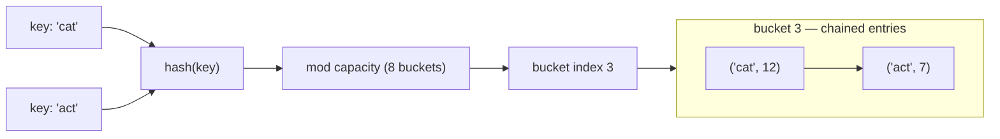
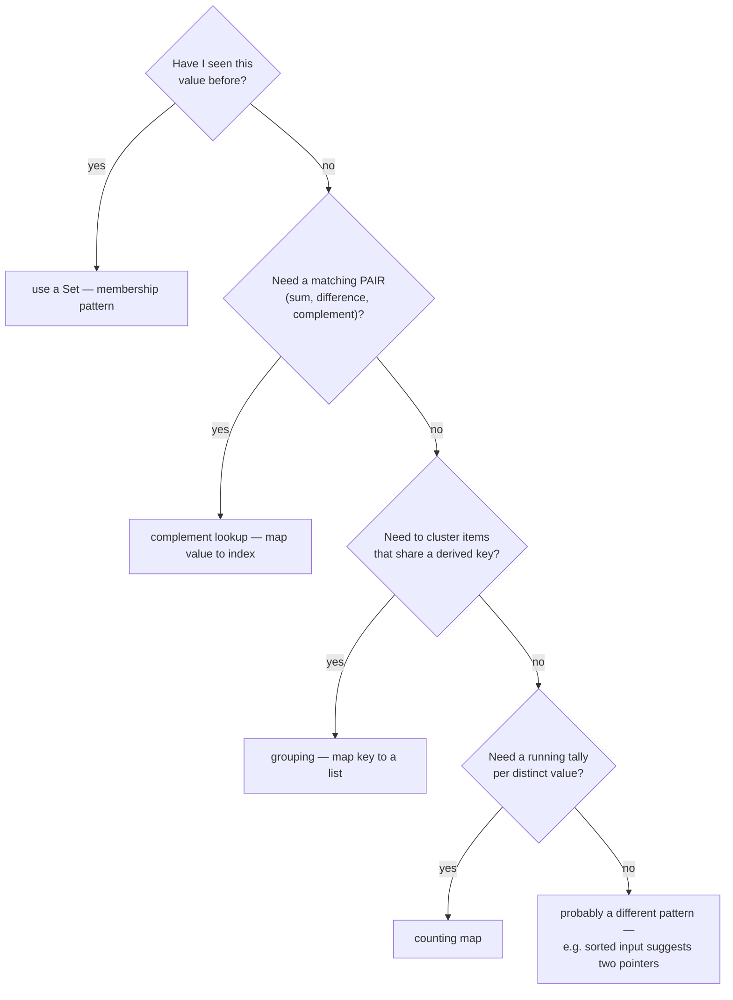

# 03 — Hashing

## Why this exists

Searching an unsorted array for a value is O(n) — worst case, you check
every element. A hash table trades memory for speed: it computes where
a value *should* live from the value itself, so lookup, insert, and
delete are all O(1) on average. Half of all interview optimizations
come down to "throw a hash map at it" — replacing a nested loop that
re-scans data with a map that remembers what's already been seen.

## The structure



*What to notice: "cat" and "act" hash to different numbers but land on
the same bucket index — that's a collision. Chaining just appends both
entries to that bucket's list instead of overwriting one.*

## How it works

- **Hash function** — turns a key into a number. Good ones spread
  similar keys far apart (module 03's build exercise uses a
  polynomial rolling hash for strings).
- **Buckets** — a fixed-size array; `hash(key) mod capacity` picks a
  bucket for a key.
- **Collisions** — two keys landing in the same bucket. Unavoidable
  once you have more possible keys than buckets (pigeonhole
  principle).
- **Chaining** — the standard fix: each bucket holds a small list, and
  a collision just appends to it.
- **Load factor** — `size / capacity`. Keep it low (this course resizes
  at 0.75) so chains stay short.
- **Resize** — when the load factor crosses the threshold, capacity
  doubles and every entry gets rehashed (bucket indices depend on
  capacity, so old placements don't carry over).

Average case is O(1) because a good hash function plus a bounded load
factor keeps every chain to O(1) entries. Worst case is O(n) — an
adversarial or badly-distributed hash could dump every key into one
bucket, degrading lookup to a linear scan of that bucket.

## How to recognize it



*What to notice: almost every hashing use case reduces to one of four
questions — seen-before, pair-match, grouping, or counting. If the
input is already sorted, that's often a cue for a cheaper pattern
(two pointers, module 04) instead.*

Cues in the problem statement:
- "Have I seen this before?" / "does X exist elsewhere in the list?"
  → a `Set`.
- "count occurrences" / "how many times does X appear?" → a counting
  map.
- "find the complement" / "two values that add up to..." → complement
  lookup.
- "group things that share a key" (anagrams, same remainder, same
  category) → grouping map.

## Templates

```ts
// Counting
const counts = new Map<string, number>()
for (const item of items) {
  counts.set(item, (counts.get(item) ?? 0) + 1)
}

// Complement lookup (the two-sum shape)
const seenAt = new Map<number, number>()
for (let i = 0; i < nums.length; i++) {
  const complement = target - nums[i]!
  if (seenAt.has(complement)) {
    /* found a pair: seenAt.get(complement), i */
  }
  seenAt.set(nums[i]!, i)
}

// Grouping
const groups = new Map<string, string[]>()
for (const item of items) {
  const key = canonicalKey(item)
  const group = groups.get(key)
  if (group) group.push(item)
  else groups.set(key, [item])
}
```

## Worked example: two-sum, traced

`pairSum([2, 7, 11, 15], 9)` — find two indices whose values sum to 9.

| i | value | needed (`target - value`) | in map? | map after this step |
| - | - | - | - | - |
| 0 | 2 | 7 | no | `{2: 0}` |
| 1 | 7 | 2 | **yes**, at index 0 | → return `[0, 1]` |

The map never needs to hold the "needed" value in advance — it's built
incrementally, one value ahead of where it's checked. That's what
makes one pass enough.

## Complexity

| Operation | Average | Worst case | Why |
| - | - | - | - |
| `get` / `set` / `delete` | O(1) | O(n) | Worst case: every key collides into one bucket, degrading to a linear scan. |
| Build a map of n items | O(n) | O(n²) | n average-O(1) operations, or n worst-case-O(n) ones. |

The average case holds because a good hash function spreads keys
evenly across buckets, and the load factor cap keeps each bucket's
chain length bounded by a constant.

## Common gotchas

- **Iteration order** — a hash map (JS `Map`) happens to preserve
  insertion order, but never treat that as "sorted". Don't rely on
  hash-based iteration order for correctness elsewhere.
- **Mutable keys** — mutating an object after using it as a key can
  silently break lookups (its hash/identity no longer matches what
  was stored). Prefer primitives or immutable keys.
- **Float keys** — floating-point rounding (`0.1 + 0.2 !== 0.3`) makes
  floats unreliable map keys; round or scale to integers first if you
  must key on them.
- **Colliding canonical forms** — a grouping key that isn't actually
  unique to the group you intend (e.g. truncating instead of using the
  full signature) silently merges groups that shouldn't merge.

## Try it now

→ `exercises/ex01-first-unique.ts` through `ex06-build-hash-map.ts`,
then `checkpoint.ts`. Check with `npm test -- 03`.
