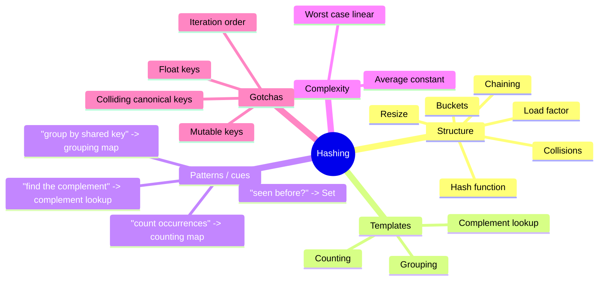

# 03 — Hashing: Summary

## Cheat sheet

**The three templates**

| Template | Shape | Example |
| - | - | - |
| Counting | `counts.set(k, (counts.get(k) ?? 0) + 1)` | first-unique char, majority element |
| Complement lookup | check `target - value` before recording `value` | two-sum, `pairSum` |
| Grouping | `groups.get(key)?.push(item) ?? groups.set(key, [item])` | anagrams, `usersByAction` |

**Hash map operation cost**

| Operation | Average | Worst case |
| - | - | - |
| `get` / `set` / `delete` | O(1) | O(n) |
| Iterate all entries | O(n) | O(n) |

**Set vs. Map**

| | `Set` | `Map` |
| - | - | - |
| Stores | values only | key -> value pairs |
| Use when | "have I seen this?" | "what count/index/group goes with this?" |

**Load-factor rule**: resize (double capacity, rehash everything) once
`size / capacity` exceeds ~0.75. Keeps chains short, keeps `get`/`set`
close to O(1).

**Bad hash-map keys**: mutable objects (identity can drift after
mutation), floats (rounding makes equal-looking values compare
unequal).

## Mindmap

*What to notice:* every branch traces back to one question — "have I
seen this key before, and what do I need to remember about it?"

## Self-quiz

1. Why is a hash map's average-case lookup O(1) but worst case O(n)?
2. What's the difference between a `Set` and a `Map`, and when do you
   reach for each?
3. In the two-sum template, why does one pass suffice -- what would go
   wrong if you checked for the complement *after* recording the
   current value instead of before?
4. What does "load factor" mean, and what does resizing actually do to
   fix it?
5. Why is a plain `for...of` iteration order over a `Map` not the same
   guarantee as "sorted"?
6. Give one example of a bad hash-map key and explain why it's risky.
7. In `longestConsecutive` (ex04), why does the algorithm only start
   counting a run from values with no left-neighbor in the set -- what
   would break (or just get slower) if it didn't check that?
8. A hash map you built resizes at load factor 0.75 by doubling
   capacity. Why does this keep `set`'s *amortized* cost O(1) even
   though any single resizing call is O(n)?

Answers

1. Average case assumes a well-distributed hash and a bounded load
   factor, so each bucket holds ~O(1) entries. Worst case, a bad hash
   or adversarial input dumps every key into one bucket, and a lookup
   degenerates to scanning that bucket's whole chain -- O(n).
2. A `Set` stores values only (membership tests); a `Map` stores
   key -> value pairs. Reach for `Set` when the question is "have I
   seen this?"; reach for `Map` when you need to attach a count,
   index, or group to each key.
3. Checking the complement *before* recording the current value
   guarantees you never pair a value with itself using the same
   index. If you recorded first, checking `target - value` right
   after inserting `value` could match `value` against itself when
   `target == 2 * value`, producing an invalid same-index "pair".
4. Load factor is `size / capacity` -- how full the bucket array is.
   Resizing doubles capacity and rehashes every entry into the new,
   larger bucket array (bucket indices depend on capacity, so old
   placements are invalid post-resize). This keeps chains short.
5. JavaScript's `Map` happens to preserve *insertion* order during
   iteration -- it's a deliberate design choice, but it says nothing
   about the values' relative *sizes*. Don't substitute it for an
   actual sort.
6. A mutable object key: if you mutate the object after storing it, a
   custom equality/hash based on its contents may no longer match what
   was stored, silently breaking future lookups. (Floats are the other
   classic answer: `0.1 + 0.2 !== 0.3` due to rounding.)
7. Skipping "not a run start" values keeps the total work across all
   starts bounded by O(n) -- every value gets extended into at most
   once, from its true run beginning. Without that check, every value
   would try to walk its whole run, redoing the same work many times
   over (O(n) run lengths x O(n) starts -> O(n^2) worst case).
8. Amortized analysis: across n inserts, a resize (O(current size))
   only happens O(log n) times, and each one is triggered by having
   done that many O(1) inserts since the last resize. Spread the total
   resizing cost over all n inserts and the average per-insert cost
   stays O(1) -- the same argument used for a dynamic array's amortized
   push (module 02).

## Pattern-recognition drill

For each one-liner, name the pattern/structure *before* checking the
answer.

1. "Find whether any value appears twice in this array."
2. "Given a list of numbers, find two that sum to a target."
3. "Group these product SKUs by their category code."
4. "Given a sorted array, find two numbers that sum to a target."
5. "Count how many times each word appears in a document."
6. "Find the first character in a string that appears only once."
7. "Given two arrays, find values missing from the second that appear
   in the first."
8. "Cluster words that are letter-rearrangements of each other."

Answers

1. **Set** -- "have I seen this before?" is the membership-test cue.
2. **Complement lookup (hash map)** -- the two-sum shape; O(n) one pass.
3. **Grouping (hash map)** -- cluster by a derived key (category code).
4. **Two pointers** (module 04!) -- "sorted array" is the cue that
   overrides the default hash-map instinct; two pointers gets O(1)
   extra space instead of O(n).
5. **Counting map** -- a running tally per distinct key.
6. **Counting map (two-pass)** -- tally, then scan for count == 1.
7. **Set difference** -- build a `Set` from one array, filter the other
   against it.
8. **Grouping (hash map)** -- canonical key = sorted letters (or a
   26-count signature).

