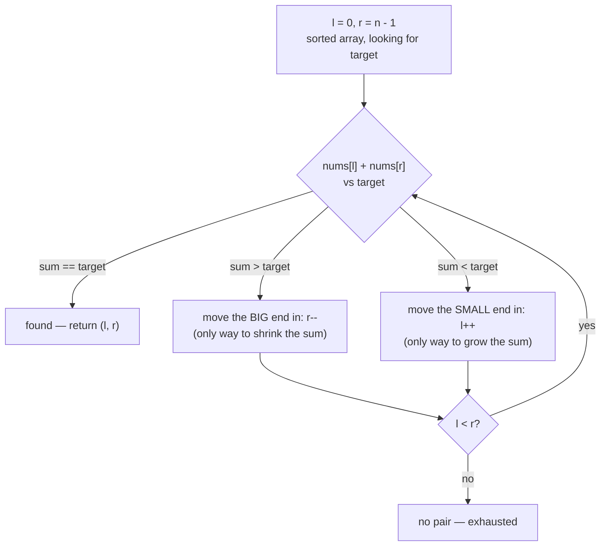
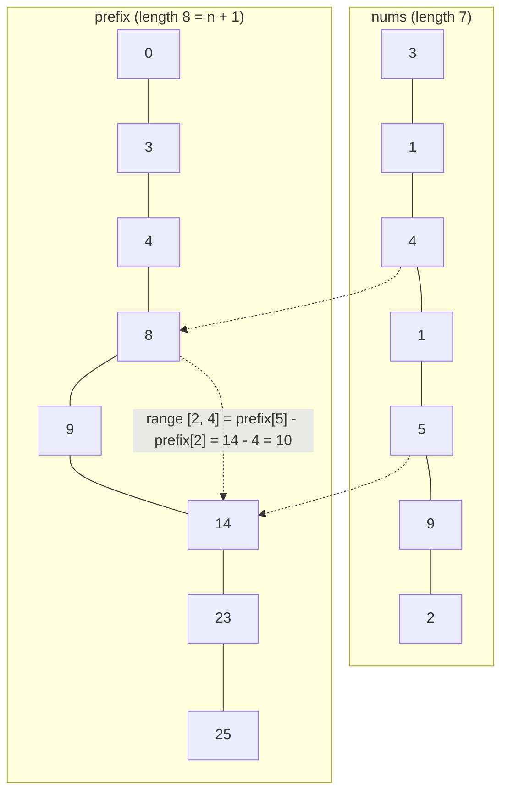

# 04 — Two Pointers & Prefix Sums

## Why this exists

A lot of "find a pair/range that satisfies X" problems start life as a
nested loop: for every `i`, scan every `j`, check the condition. That's
O(n²). Two facts let you collapse that second loop into O(n) — or O(1)
per query:

- If the array is **sorted** (or the condition is monotone), two
  indexes that only ever move toward each other can find the answer
  without ever re-scanning. That's **two pointers**: O(n) time instead
  of O(n²), O(1) extra space.
- If the question is "what's the sum of this range?" asked **many
  times**, precomputing running totals once turns every query into a
  subtraction. That's **prefix sums**: O(n) to build, O(1) per query,
  instead of O(n) per query.

Different shape, same spirit: do a little extra thinking up front so
you never redo work you've already done.

## Part A — Two pointers

### The rule, in one picture



*What to notice: on a sorted array, the sum only moves in one direction
per move, so each step provably gets closer to the target — nothing
needs re-checking.*

Trace it on `[1, 2, 4, 7, 11]`, target `9`:

| step | l | r | nums[l] | nums[r] | sum | vs target | move |
| --- | --- | --- | --- | --- | --- | --- | --- |
| 1 | 0 | 4 | 1 | 11 | 12 | too big | `r--` |
| 2 | 0 | 3 | 1 | 7 | 8 | too small | `l++` |
| 3 | 1 | 3 | 2 | 7 | 9 | **match** | return `[1, 3]` |

Why is it safe to move `r` left the moment the sum is too big, without
checking any of `r`'s other pairings with `l`? Because the array is
sorted: `nums[r]` was already the biggest value `l` could pair with —
every `nums[l] + nums[k]` for `k < r` is smaller still, so none of them
can equal `target` either. `nums[r]` is eliminated *entirely*, not just
against this `l`. Same argument, mirrored, for moving `l` right.

### How to recognize two pointers

- The input is **sorted** (or you're told to sort it first) and you
  need a pair/triplet hitting a target sum.
- "In place", O(1) extra space is explicitly asked for.
- Checking a string reads the same forwards and backwards
  (palindrome-style problems).
- "Partition"/"segregate" the array by some predicate (move all X to
  the front, keep relative order or don't care).
- You're compacting an array — dropping some elements, keeping others,
  without allocating a new one (a **reader/writer** pointer pair).

### Two templates

**Opposite ends** — indices start at the two ends and close inward.
Use when the array is sorted and you're comparing a combined value
(sum, or a mirror check) against a target.

```ts
let l = 0
let r = nums.length - 1
while (l < r) {
  const sum = nums[l]! + nums[r]!
  if (sum === target) {
    // found
  } else if (sum > target) {
    r--
  } else {
    l++
  }
}
```

**Same-direction (reader/writer)** — both indices start at 0 and only
move forward; `writer` marks where the next "kept" element goes,
`reader` scans ahead. Use for in-place compaction/partitioning where
order among kept elements matters.

```ts
let writer = 0
for (let reader = 0; reader < nums.length; reader++) {
  if (keep(nums[reader]!)) {
    nums[writer] = nums[reader]!
    writer++
  }
}
// nums[0..writer) now holds the kept elements, in order
```

### Complexity

Both templates touch each index a constant number of times — `l`/`r`
each move at most `n` steps total (opposite ends), and `reader` makes
one pass while `writer` never outruns it (same-direction). **O(n)
time, O(1) extra space**, versus the O(n²) nested-loop brute force (or
O(n) time / O(n) space if you reach for a hash map instead — fine when
the array *isn't* sorted, wasteful when it is).

## Part B — Prefix sums

### Why this exists

"What's the sum of `nums[i..j]`?" asked once is an O(n) scan. Asked
`q` times, that's O(n·q) — slow when both are large. Precompute once,
answer every query in O(1).



*What to notice: `prefix[k]` is the sum of the first `k` elements —
`prefix[0] = 0` before anything is added — so a query for `nums[i..j]`
inclusive is just `prefix[j + 1] - prefix[i]`, no loop required.*

Build rule: `prefix[0] = 0`, then `prefix[k] = prefix[k - 1] + nums[k - 1]`
for `k` from `1` to `n`. The extra slot at the front is what makes the
subtraction formula work uniformly, even when `i === 0`.

### How to recognize prefix sums

- "Sum of a range/subarray", asked more than once → precompute, don't
  rescan.
- "How many subarrays have sum exactly X" → prefix sum turns this into
  a running-count-of-prefix-values problem (pair it with a hash map —
  see ex07).
- "Equal split point" / "pivot index" — compare a running left-sum
  against a running (or precomputed) right-sum.

### Complexity

Building the prefix array is one O(n) pass. Every `query(i, j)` after
that is O(1) — two array reads and a subtraction. Total: O(n) build +
O(1) per query, versus O(n) *per query* if you re-sum every time.

## Common gotchas

- **Pointer crossing**: `while (l < r)` vs `while (l <= r)` — for
  distinct-pair problems you want `l < r` (a value can't pair with
  itself); read the problem before copying the template.
- **Duplicate skipping in triplet problems**: after finding a match (or
  after moving a pointer), skip over repeated values, or the same
  triplet gets emitted multiple times.
- **Prefix off-by-one**: `prefix` has length `n + 1`. Forgetting the
  leading `0`, or querying with `prefix[j] - prefix[i]` instead of
  `prefix[j + 1] - prefix[i]`, is the #1 bug here. Always double-check
  against a tiny hand example (like the one above).
- **`noUncheckedIndexedAccess`**: `nums[l]` types as `number | undefined`.
  A `!` after a loop-guaranteed-valid index is fine and used throughout
  this module's solutions — but only when the invariant is genuinely
  guaranteed (e.g., inside `while (l < r)`, not past the array's end).

## Try it now

→ `exercises/ex01-sorted-pair-target.ts` through
`exercises/ex07-subarray-sum-k.ts`, then `checkpoint.ts`.
Check with `npm test -- 04`.
