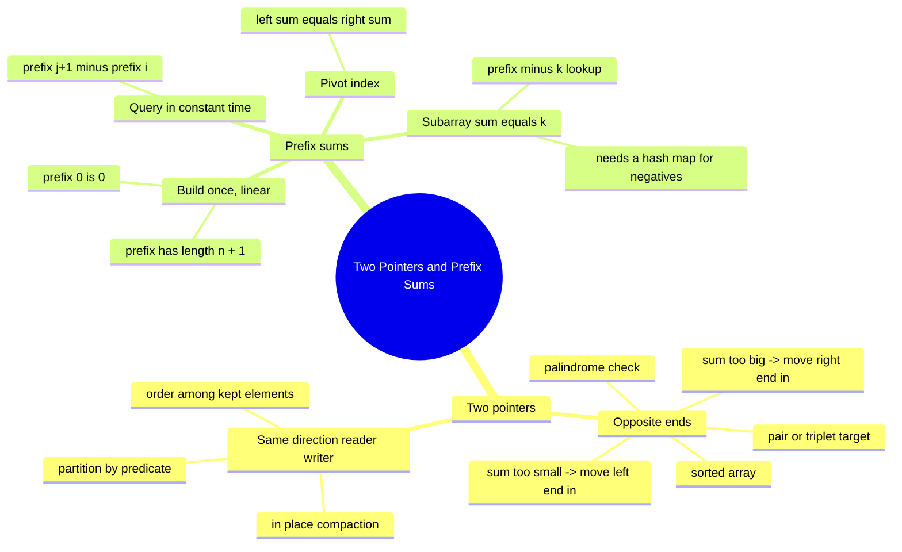

# 04 — Two Pointers & Prefix Sums · Cheat-sheet

## Concept map



*What to notice: two pointers trims a nested loop to one pass by moving
in a provably safe direction; prefix sums trims repeated re-scanning by
paying the scan cost once, up front.*

## The two templates, side by side

| | Opposite ends | Same direction (reader/writer) |
| --- | --- | --- |
| Start | `l = 0`, `r = n - 1` | `writer = 0`, `reader = 0` |
| Move rule | `l` and `r` close inward | both only ever move forward |
| Stop when | `l >= r` | `reader` reaches the end |
| Needs sorted input? | usually yes | no |
| Typical use | pair/triplet sum, palindrome, max-area | move/partition/dedupe in place |
| Space | O(1) | O(1) |

```ts
// opposite ends
let l = 0, r = nums.length - 1
while (l < r) {
  const sum = nums[l]! + nums[r]!
  if (sum === target) { /* found */ }
  else if (sum > target) r--
  else l++
}

// same direction (reader/writer)
let writer = 0
for (let reader = 0; reader < nums.length; reader++) {
  if (keep(nums[reader]!)) nums[writer++] = nums[reader]!
}
```

**When-sorted-matters rule**: opposite-ends two pointers only proves
correctness because a sorted array's sum moves monotonically as either
pointer moves. Given an unsorted array, sort it first (O(n log n)) if
that's still cheaper than the O(n^2) or O(n)-extra-space alternative —
or reach for a hash map (module 03) if you can't afford to lose the
original order/indices.

## Prefix sum recipe

```ts
const prefix = new Array<number>(nums.length + 1)
prefix[0] = 0
for (let k = 1; k <= nums.length; k++) {
  prefix[k] = prefix[k - 1]! + nums[k - 1]!
}
// inclusive range sum nums[i..j]:
const rangeSum = prefix[j + 1]! - prefix[i]!
```

The `n + 1` convention (a leading `0`) is what makes the subtraction
formula work even when `i === 0` — no special-casing needed.

**Decision note — counting subarrays with a target sum**: negatives in
the input? Use prefix sum + hash map of prefix-sum counts (ex07) — a
sliding window can't handle them because shrinking the window doesn't
reliably shrink the sum. All-positive input? A sliding window (next
module) can do it in O(n) time *and* O(1) space, no hash map needed.

## Rules to remember

- Opposite ends: `l < r` (not `<=`) when a value can't pair with
  itself; re-read the problem before copying the template.
- After finding a match in a triplet/duplicate-sensitive problem, skip
  repeated values at every moving index, or you'll emit the same
  answer twice.
- Reader/writer preserves the *order* of kept elements; a swap-based
  opposite-ends partition does not (and doesn't need to, when order
  isn't part of the spec).
- `prefix[k]` is the sum of the first `k` elements — `prefix.length`
  is always `nums.length + 1`.
- `noUncheckedIndexedAccess` means `nums[i]` types as `number |
  undefined`; a `!` is fine once a loop invariant guarantees the index
  is valid.

## Self-quiz

1. Why is it safe, on a sorted array, to permanently rule out `r` the
   moment `nums[l] + nums[r]` is too big — without checking `r`
   against any other `l`?
2. What's the difference in stop condition between "distinct pair"
   two-pointer problems and ones where an element could pair with
   itself?
3. Why does reader/writer preserve order but an opposite-ends swap
   partition does not?
4. Write the one-line formula for `nums[i..j]` inclusive, given a
   prefix array built with the `n + 1` convention.
5. Why is `prefix[0] = 0` necessary, rather than starting the array at
   `nums[0]`?
6. In "container with most water", why do you always move the pointer
   at the *shorter* line, never the taller one?
7. Why does counting subarrays with a given sum need a hash map on top
   of prefix sums, instead of prefix sums alone?
8. Your array has negative numbers and you need to count subarrays
   summing to `k`. Would a sliding window work? Why or why not?

<details><summary>Answers</summary>

1. `nums[r]` was already the largest value available to pair with
   `l`; since the array is sorted, every `nums[l] + nums[k]` for
   `k < r` is smaller still, so none of them can hit `target` either —
   `r` is eliminated for every remaining `l`, not just the current one.
2. Distinct pairs need `l < r` (so an index never pairs with itself);
   if self-pairing is valid, `l <= r` is correct instead.
3. Reader/writer only ever writes forward into slots it has already
   read past, so relative order survives; a swap moves an element
   backward in one step, breaking the original order of what's kept.
4. `prefix[j + 1] - prefix[i]`.
5. Without it, a range starting at `i = 0` would need special-casing
   (there's no `prefix[-1]` to subtract) — the leading zero makes the
   formula uniform for every `i`, including `0`.
6. Capacity is capped by the shorter line, and width can only shrink
   as the pointers close in — keeping the shorter line can never beat
   the current best, so moving it is the only move that could still
   improve the answer.
7. Prefix sums alone tell you the running total; you still need to
   know how many *earlier* prefixes equal `runningSum - k` to count
   matching subarrays in O(1) per step, and a hash map is what makes
   that lookup O(1).
8. No — shrinking a variable window's left edge only reliably shrinks
   the sum if every element is non-negative. With negatives, removing
   an element could *increase* the sum, so the window's monotonic
   assumption breaks.

</details>

## Pattern-recognition drill

For each prompt, name the pattern (two pointers — opposite ends, two
pointers — reader/writer, or prefix sums) before checking the answer.

1. "Given a sorted array of temperatures, find two that average to a
   target reading."
2. "Remove all instances of a given value from an array in place and
   return the new length."
3. "Given `n` daily rainfall totals, answer `q` queries asking for the
   total rainfall between day `i` and day `j`."
4. "Check whether a sentence, ignoring spaces and punctuation, is a
   palindrome."
5. "Find the number of ways to split an array into two parts with
   equal sum."
6. "Given an array that may contain negative numbers, count subarrays
   summing to zero."
7. "Given an unsorted array, find two numbers that add up to a target
   and return their original indices."
8. "Given heights of fence posts, find the two posts that trap the
   most water between them."

<details><summary>Answers</summary>

1. Two pointers — opposite ends (sorted input + pair target).
2. Two pointers — reader/writer (in-place compaction).
3. Prefix sums (many range-sum queries on a fixed array).
4. Two pointers — opposite ends (palindrome check).
5. Prefix sums (equal-split / pivot-index shape).
6. Prefix sums + hash map (negatives rule out sliding window).
7. Hashing (module 03) — unsorted input means opposite-ends two
   pointers doesn't apply until you sort, and sorting loses the
   original indices unless you track them separately.
8. Two pointers — opposite ends (container-with-most-water shape).

</details>
