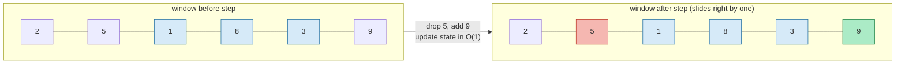
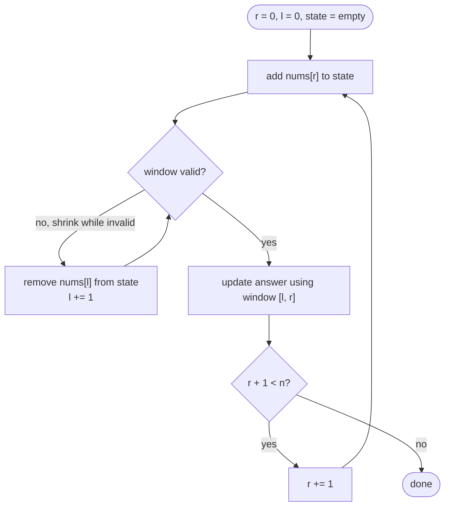

# 05 — Sliding Window

## Why this exists

Lots of problems ask for the "best contiguous run" — the biggest-sum
subarray of length `k`, the longest substring without repeats, the
shortest run that covers a budget. The brute force checks every
contiguous range: for each of the O(n) start points, walk forward and
recompute the range's state from scratch, O(n) work each time → O(n²)
(or worse if the state itself is expensive to rebuild, like a
character-frequency map).

Almost all of that work is repeated. Sliding one edge of the range by
one position barely changes its state — one element leaves, one
element enters. A **window** exploits that: keep a range `[l, r]` and
its state, and instead of recomputing, *update* the state as the edges
move. Total edge movement across the whole array is O(n), so the whole
scan is O(n) (or O(n · alphabet) when the state is a small frequency
table).

## The window sliding



*What to notice: the window doesn't get recomputed — the leaving
element (`5`, red) is subtracted/removed from the state and the
entering element (`9`, green) is added, both O(1) operations, so the
whole state update per step is O(1) instead of O(k).*

## Fixed-size windows

The window length `k` never changes. Loop once: add `nums[r]`, and
once the window has `k` elements, record the answer, then drop
`nums[r - k + 1]` before advancing. Every element enters once and
leaves once → O(n) total.

## Variable-size windows

The window length changes as you scan. Grow the right edge every
step (always). Then, **while the window is invalid** (or, for the
"shortest" variant, while it's still valid — see the worked examples),
shrink the left edge until it's fixed. Record the answer at the right
moment — usually right after the shrink loop, when the window is back
to a state worth measuring.



*What to notice: the `while` around the shrink step is doing the real
work — it can fire zero, one, or many times per outer step, but each
`l` only ever moves forward, so the total shrink work across the whole
run is still O(n).*

## How to recognize it

- The problem asks for the **longest / shortest / max / min** window,
  substring, or subarray that satisfies some condition `X`, and the
  window must be **contiguous**.
- The condition is checkable incrementally — adding or removing one
  element updates it in O(1) (a running sum, a frequency map, a count
  of "characters currently over budget"...).
- The shrink trick specifically needs `X` to be **monotone**: once the
  window is invalid, growing it (adding more elements) can only make
  it *more* invalid, never fix it. That's what guarantees `l` never
  needs to move backward.
- **Counter-example:** "subarray sums to exactly target" with
  **negative numbers allowed** is not monotone — growing a
  too-small-sum window can still land back on target, and shrinking
  a too-large one can undershoot. That needs prefix sums + a hash map
  (module 04, ex07), not a window.

## The template

```ts
function variableWindow(input: string): number {
  const state = new Map<string, number>() // window's O(1)-updatable state
  let left = 0
  let best = 0

  for (let right = 0; right < input.length; right++) {
    // 1. grow: add input[right] to state
    const c = input[right]!
    state.set(c, (state.get(c) ?? 0) + 1)

    // 2. shrink while the window is invalid
    while (/* window [left, right] is invalid */ false) {
      const dropped = input[left]!
      const next = (state.get(dropped) ?? 0) - 1
      if (next === 0) state.delete(dropped)
      else state.set(dropped, next)
      left++
    }

    // 3. record — window [left, right] is valid here
    best = Math.max(best, right - left + 1)
  }

  return best
}
```

## Worked example: longest substring without repeats, on `"abcabcbb"`

Track a `last-seen index` per character. Shrink `left` to just past
any repeat still inside the window.

| r | char | window | duplicate in-window? | l after shrink | length |
| - | ---- | ------ | --------------------- | --------------- | ------ |
| 0 | a | `a` | no | 0 | 1 |
| 1 | b | `ab` | no | 0 | 2 |
| 2 | c | `abc` | no | 0 | 3 |
| 3 | a | `abca` | yes (`a` at 0) | 1 | 3 |
| 4 | b | `bca`→`bcab` | yes (`b` at 1) | 2 | 3 |
| 5 | c | `cab`→`cabc` | yes (`c` at 2) | 3 | 3 |
| 6 | b | `abcb`... | yes (`b` at 4) | 5 | 2 |
| 7 | b | `bb` | yes (`b` at 6) | 7 | 1 |

Best length seen: **3** (`"abc"`).

## Complexity

Every element enters the window exactly once (the `for` loop) and
leaves at most once (the shrink loop, since `left` only moves
forward). That's O(n) total pointer movement, and each movement does
O(1) state work (or O(alphabet) for a fixed small alphabet like
lowercase letters) → **O(n) time**. Space is O(k) or O(alphabet) for
the window's state — O(1) if the alphabet is fixed size.

## Common gotchas

- Shrink with `while`, not `if` — one grow step can require the
  window to shrink by more than one position.
- Decide **exactly when** you update the answer: after the shrink
  loop (most "make it valid, then measure" problems) vs. inside the
  grow step (fixed windows, once you've reached size `k`). Doing it
  at the wrong point silently measures the wrong window.
- Window state must be **O(1)-updatable** — if "is this window valid?"
  requires rescanning the window, you've lost the whole point.
- Off-by-one on window length: it's `right - left + 1`, not
  `right - left`.
- Empty input / `k` larger than the array — decide (and test) the
  behavior instead of leaving it to whatever the loop happens to do.
- A frequency count can go "stale" (e.g. track a running max that's
  no longer actually in the window) and still be safe to use — see
  ex04's docstring for exactly why.

## Try it now

→ `exercises/ex01-fixed-window-stats.ts` through
`exercises/ex07-min-cover-window.ts`, then `checkpoint.ts`.
Check with `npm test -- 05`.
