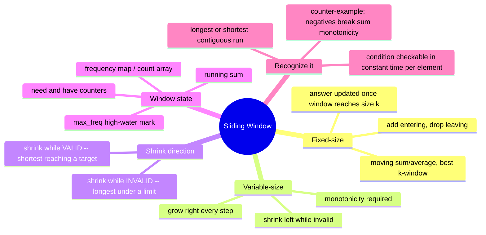

# 05 — Sliding Window · Cheat-sheet

## Concept map



*What to notice: the same grow/shrink skeleton serves both "longest"
and "shortest" problems — only the shrink condition and when you
record the answer flip.*

## Fixed vs variable window, side by side

| | Fixed-size | Variable-size |
| --- | --- | --- |
| Window length | constant `k`, given | changes every step |
| Loop shape | one `for`, add + drop each step | outer `for` grows, inner `while` shrinks |
| When to record | once window first reaches size `k` | after the shrink loop settles (usually) |
| Example | `maxWindowSum`, `movingAverages` | `longestUnique`, `minWindowCover` |
| Complexity | O(n), each index added & dropped once | O(n) amortized, `left` only moves forward |

```ts
// fixed
for (let r = 0; r < n; r++) {
  add(nums[r])
  if (r >= k - 1) {
    record()
    drop(nums[r - k + 1])
  }
}

// variable
let left = 0
for (let right = 0; right < n; right++) {
  add(nums[right])
  while (invalid()) { drop(nums[left]); left++ }
  record() // window [left, right] is valid here
}
```

## The monotonicity rule

**"When growing can't fix it, slide."** The shrink-while-invalid
template only works if invalidity is monotone: once a window is
invalid, adding more elements can't make it valid again — so the only
move is to drop from the left. If growing *could* fix an invalid
window, `left` might need to move backward, and the whole "each index
visited O(1) amortized" argument breaks.

- **Shrink while invalid** → longest window under some limit (window
  sum too big, too many distinct chars, replacement budget blown).
- **Shrink while (still) valid** → shortest window meeting some
  minimum (sum reaches a target, all required chars present) — here
  you shrink to find the *smallest* valid window, not to escape an
  invalid one.

**Decision note:** contiguous-subarray-sum problems need non-negative
(or all-positive) numbers for the sum to be monotone as the window
grows/shrinks. The moment negatives are allowed, "sum == target" stops
being monotone — use prefix sums + a hash map instead (module 04,
ex07), not a window.

## Window-state menu

| State | Update cost | Used by |
| --- | --- | --- |
| running sum | O(1) add/subtract | ex01, ex02, ex05, checkpoint |
| last-seen index / count map | O(1) per key | ex03 |
| `max_freq` high-water mark (never lowered) | O(1), safely stale | ex04 |
| need/have counters (`missing` total) | O(1) per key | ex07 |
| fixed-alphabet count array + `matches` | O(1), O(26) init | ex06 |
| diff map + `outOfBalance` (unbounded values) | O(1) per key | checkpoint |

## Gotchas

- Shrink with `while`, never `if`.
- Decide exactly when you record the answer — inside the grow step
  (fixed windows) vs. after the shrink loop (most variable windows) vs.
  *inside* the shrink loop (shortest-window variants, ex05).
- A "stale" running max (like ex04's `max_freq`) can be safe to leave
  un-decremented — re-derive why before assuming it always is.
- `right - left + 1`, not `right - left`.
- Validate `k` / window-length inputs — decide what an empty array or
  `k > length` means instead of trusting the loop bounds.

## Self-quiz

1. Why is the brute-force "check every contiguous range" approach
   O(n²) even when computing each range's answer looks cheap?
2. What's the difference between "shrink while invalid" and "shrink
   while valid" — which problem shape needs which?
3. In ex04, `max_freq` is never decreased on shrink. Why doesn't that
   ever cause the algorithm to accept a window that's actually
   invalid?
4. Why does `shortestSubarrayAtLeast` (ex05) require non-negative
   numbers, and what would you use instead if negatives were allowed?
5. In a fixed-size window, at what point in the loop do you record the
   answer, and why not earlier?
6. What makes ex06's `matches` counter O(1) per step instead of O(26)?
7. Give an example problem statement where growing an invalid window
   COULD fix it — why does that rule out the shrink-while-invalid
   template?
8. What's the total number of times `left` can advance across an
   entire variable-window scan of an n-element array, and why does
   that bound the whole algorithm to O(n)?

<details><summary>Answers</summary>

1. Because "compute cheaply" still means re-touching up to O(n)
   elements per start point (recomputing the sum, rebuilding the
   frequency map...) — O(n) start points × O(n) per-range work = O(n²).
2. "Shrink while invalid" repairs an invalid window to find the
   *longest* valid one; "shrink while valid" keeps shrinking an
   already-valid window to find the *shortest* one, stopping the
   moment it breaks.
3. `max_freq` can only ever be an overestimate of the window's true
   max frequency, so a window is never treated as valid unless it
   truly is — staleness only costs a missed unnecessary shrink, never
   a wrongly-accepted invalid window.
4. Non-negative numbers guarantee the window sum grows monotonically
   with the window's size, which the shrink-while-valid loop relies
   on. With negatives allowed, use prefix sums + a hash map (module
   04, ex07) instead.
5. After the window has grown to exactly size `k` (i.e., `r >= k -
   1`) — recording earlier would measure a too-small window.
6. It only inspects the two letters that just changed count (the
   entering and, once the window is full, the leaving character)
   instead of re-comparing all 26 counts every step.
7. Any "exactly equals target" condition over values that can be
   negative or zero — e.g. "subarray sums to exactly 0" with mixed
   signs; adding an element can turn an invalid window valid again, so
   `left` would need to move backward, which breaks the O(n)
   guarantee.
8. At most n times total — `left` only ever moves forward and can't
   exceed `right`, so across the whole scan its total movement is
   bounded by n, keeping the algorithm O(n) overall.

</details>

## Pattern-recognition drill

For each, name the pattern/structure before peeking at the answer:
sliding window (fixed or variable), two pointers, prefix sums, or hash
map / count.

1. "Find the length of the shortest subarray with sum at least S,
   given all positive integers."
2. "Given a sorted array, find two numbers that add up to a target."
3. "Find the number of subarrays whose sum equals exactly K, where the
   array may contain negative numbers."
4. "Find the longest substring with at most two distinct characters."
5. "Given an array, answer many 'what's the sum from index i to j?'
   queries efficiently."
6. "Find if any permutation of a short pattern string appears as a
   contiguous substring of a much longer string."
7. "Find the maximum average value over any contiguous subarray of a
   fixed length k."
8. "Given two sorted arrays, merge them into one sorted array."

<details><summary>Answers</summary>

1. Variable-size sliding window, shrink while (still) valid — like
   ex05.
2. Two pointers, opposite ends (sorted input is the cue).
3. Prefix sums + hash map — negatives rule out a window (module 04).
4. Variable-size sliding window with a count map (at most 2 distinct
   keys) — same shape as ex04/ex07.
5. Prefix sums — precompute once, answer each query in O(1) (module
   04).
6. Fixed-size sliding window + frequency compare — same shape as ex06.
7. Fixed-size sliding window — same shape as ex01.
8. Two pointers, same direction (one pointer per array, advance the
   smaller).

</details>
