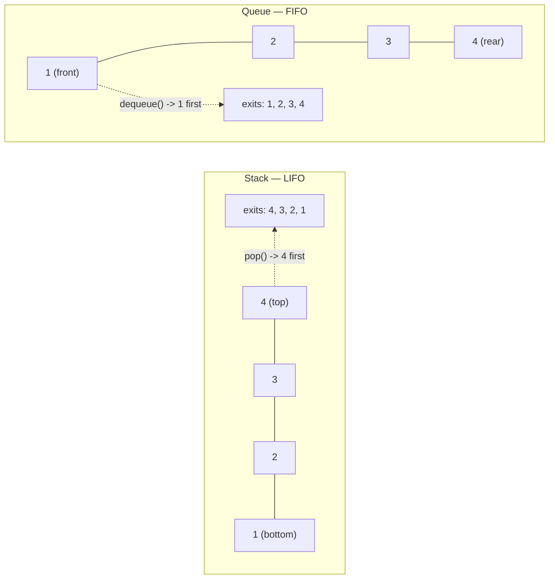
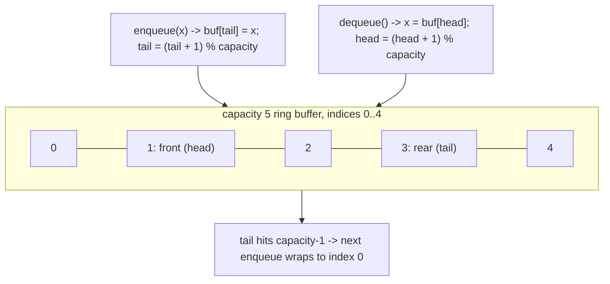

# 06 — Stacks & Queues

## Why this exists

Some problems only ever need to touch the MOST RECENTLY seen thing —
undo history, matching brackets, the call stack that unwinds a
recursive function. Others only ever need the OLDEST unhandled thing —
tickets processed in arrival order, levels of a tree explored one
layer at a time (BFS, coming in module 15). A plain array *can* do
either job, but restricting the API to "one end only" (stack) or "one
end in, the other end out" (queue) is what buys you a hard O(1)
guarantee per operation — no scanning, no shifting.

## Stack vs queue — same 4 elements, opposite exit order



*What to notice: the same 4 elements, pushed/enqueued in the same
order 1→2→3→4, come back out in exactly opposite orders — a stack
reverses arrival order, a queue preserves it.*

## Stack: array-backed, every op O(1)

A stack only ever touches the **top**. Back it with a pre-sized array
and a `top` index — `push` writes at `top` then increments it, `pop`
decrements then reads. No searching, no shifting, so every op is O(1).
When the backing array fills up, double its capacity (the amortized
O(1) resize from module 02 — the same trick, reused).

This is exactly how a real call stack works: each function call
pushes a frame (locals, return address); `return` pops it. Deep
recursion with no base case is a stack overflow in the literal sense.

| Op | Stack | Naive "just use the front" |
| --- | --- | --- |
| Insert | `push` — O(1) | insert at index 0 — O(n), shifts everything |
| Remove | `pop` — O(1) | remove index 0 — O(n), shifts everything |

## Queue: why the front is the problem

A queue needs FIFO: insert at the rear, remove from the front. If you
back it with a plain array and do `arr.shift()` to dequeue, every
remaining element slides down one slot — O(n) per dequeue, O(n²) over
n operations. The fix: never shift. Keep a fixed-capacity array and
two pointers, `head` and `tail`, that **wrap around** with modulo
arithmetic instead of the array physically moving.



*What to notice: `head` and `tail` only ever move forward — "forward"
just means `+1` then wraps back to 0 via `% capacity` once they run
off the end, so the same slots get reused instead of the array
sliding.*

`head === tail` is ambiguous — it means either empty or full. Track a
separate `count` (or `size`) field so `isEmpty`/`isFull` never have to
guess.

## How to recognize it

- "Undo", "most recent unresolved thing", "matches the nearest
  opening X" → **stack**.
- Well-nested / balanced symbols, or a call tree that unwinds in
  reverse insertion order → **stack**.
- "Process in arrival order", "first come first served", "layer by
  layer / shortest number of steps on an unweighted graph" (BFS,
  later) → **queue**.
- "For each element, the next/previous element that is greater/
  smaller" → **monotonic stack**.
- "How many days/steps until X happens" where X depends on comparing
  to future elements → **monotonic stack**.

## Monotonic stack: keep it sorted by evicting the losers

A monotonic stack stays increasing (or decreasing) top-to-bottom by
popping every element that the new value invalidates before pushing.
Because each element is pushed once and popped at most once, the
whole scan is O(n) — even though it *looks* like a nested loop.

**Template** (finds, for each index, the next index to its right with
a strictly greater value):

```ts
function nextGreaterIndex(nums: number[]): number[] {
  const result = new Array(nums.length).fill(-1)
  const stack: number[] = []          // store INDEXES, not values

  for (let i = 0; i < nums.length; i++) {
    // pop everything the current value beats — they just found their answer
    while (stack.length > 0 && nums[stack[stack.length - 1]!]! < nums[i]!) {
      const poppedIndex = stack.pop()!
      result[poppedIndex] = i
    }
    stack.push(i)
  }
  return result   // whatever's left on the stack never found a greater value
}
```

**Worked example** — "days until warmer" on `[73, 74, 75, 71, 69, 72]`
(stack holds indexes, shown as `i:temp`):

| i | temp | action | stack after | answer so far |
| --- | --- | --- | --- | --- |
| 0 | 73 | push 0 | `[0:73]` | `[?,?,?,?,?,?]` |
| 1 | 74 | pop 0 (74>73, gap 1), push 1 | `[1:74]` | `[1,?,?,?,?,?]` |
| 2 | 75 | pop 1 (75>74, gap 1), push 2 | `[2:75]` | `[1,1,?,?,?,?]` |
| 3 | 71 | push 3 (71<75) | `[2:75, 3:71]` | `[1,1,?,?,?,?]` |
| 4 | 69 | push 4 (69<71) | `[2:75, 3:71, 4:69]` | `[1,1,?,?,?,?]` |
| 5 | 72 | pop 4 (72>69, gap 1), pop 3 (72>71, gap 2), push 5 | `[2:75, 5:72]` | `[1,1,?,2,1,?]` |
| end | — | stack leftovers (indexes 2, 5) get 0 | — | `[1,1,0,2,1,0]` |

## Complexity — and why

| Structure | Push/enqueue | Pop/dequeue | Peek/front | Space |
| --- | --- | --- | --- | --- |
| Stack (array-backed) | O(1) amortized | O(1) | O(1) | O(n) |
| Circular queue | O(1) | O(1) | O(1) | O(capacity) |
| Monotonic stack scan | — | — | — | O(n) worst case |

The monotonic stack scan is O(n) **total**, not per element: every
index is pushed exactly once and popped at most once across the
entire run, so the sum of all while-loop iterations is bounded by n —
this is the amortized-cost argument from module 01 again.

## Common gotchas

- Peeking or popping an empty stack/queue — check `isEmpty`/`size`
  first, or catch the underflow error; never assume there's something
  there.
- A sentinel (a fake 0-height bar, a fake `-1`) can flush a monotonic
  stack at the end without a special-cased final loop — see ex07.
- Store **indexes**, not values, on a monotonic stack whenever you
  need "how far away" or need to write into a results array — you can
  always recover the value via `nums[index]`, but not the reverse.
- `head === tail` on a ring buffer is ambiguous (empty vs full) unless
  you track `count` separately.
- New actions must clear stale "future" state — e.g. typing after an
  undo should throw away the redo history, not let it resurrect.

## Try it now

→ `exercises/ex01-build-stack-queue.ts` through
`ex07-histogram-max-rect.ts`, then `checkpoint.ts`.
Check with `npm test -- 06`.
