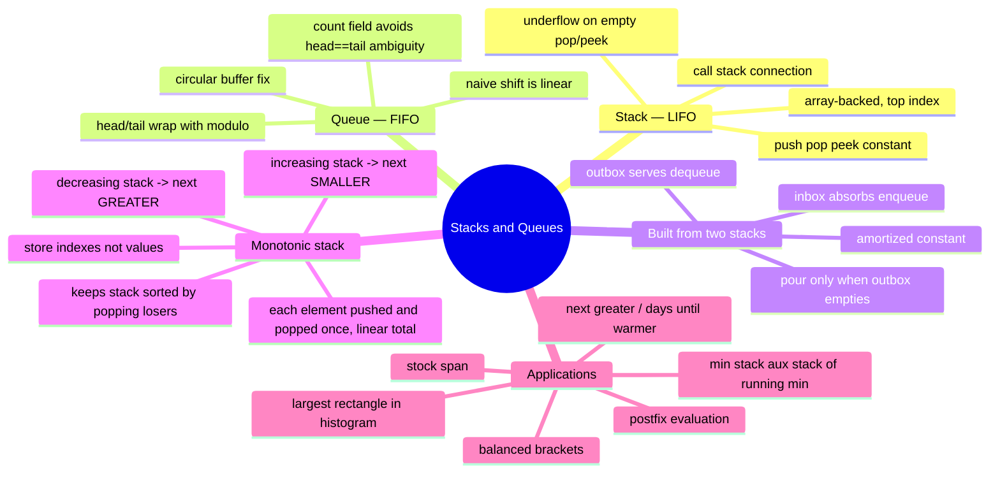

# 06 — Stacks & Queues · Cheat-sheet

## Concept map



*What to notice: everything under "Applications" is really one of the
three branches above in disguise — matching uses a plain stack,
running-aggregate tricks use an auxiliary stack, and "next
greater/smaller" problems all reduce to the same monotonic-stack scan.*

## Op comparison

| | Stack | Queue (array, naive) | Circular queue |
| --- | --- | --- | --- |
| Insert | `push` O(1) | `push` (rear) O(1) | `enqueue` O(1) |
| Remove | `pop` O(1) | `shift` (front) **O(n)** | `dequeue` O(1) |
| Peek | O(1) | O(1) | O(1) |
| Space | O(n) | O(n) | O(capacity), fixed |

## Ring-buffer index math

```
enqueue(x):  buf[tail] = x;  tail = (tail + 1) % capacity
dequeue():   x = buf[head];  head = (head + 1) % capacity
isFull():    count === capacity
isEmpty():   count === 0
```

`head === tail` alone is ambiguous (could mean empty OR full) — always
track `count` separately rather than trying to infer it from the
pointers.

## Monotonic stack template — increasing or decreasing?

Ask: "when I see a new value, do I discard stack entries that are now
*wrong*, and in which direction?"

- Want the **next greater** element for each spot → keep the stack
  **increasing** bottom-to-top; pop while `top < current`.
- Want the **next smaller** element for each spot → keep the stack
  **decreasing** bottom-to-top; pop while `top > current`.

```ts
const stack: number[] = []           // always store INDEXES
for (let i = 0; i < nums.length; i++) {
  while (stack.length > 0 && violatesOrder(nums[stack.at(-1)!]!, nums[i]!)) {
    const idx = stack.pop()!
    // nums[i] is idx's answer — record it here
  }
  stack.push(i)
}
// whatever's left on the stack never found an answer
```

**Store-index rule:** push indexes, not values. You always need to
know *how far away* the answer is, or *where* to write the result —
and `nums[index]` recovers the value for free, but not the reverse.

## Rules to remember

- Never shift a queue's elements to remove the front — that is exactly
  the O(n) bug a ring buffer exists to avoid.
- A stack built from a plain array only needs to touch the top; a
  queue built from two stacks pours the whole `inbox` into `outbox`
  only when `outbox` is empty — each element is poured once ever, so
  dequeue is amortized O(1).
- A monotonic stack's while-loop looks nested but is O(n) **total**:
  every index is pushed once and popped at most once.
- Any new mutating action must clear stale "future" state (typing
  after an undo must drop the redo history) — a correctness bug, not
  a performance one.
- A sentinel value (`0` for histogram heights, `-1` for indexes) can
  flush a monotonic stack at the end without a special final loop.

## Self-quiz

1. Why is `array.shift()` a bad way to dequeue, and what does a
   circular queue do instead?
2. What does `head === tail` mean on a ring buffer, and how do you
   disambiguate it?
3. In the two-stack queue, when exactly does a pour from `inbox` to
   `outbox` happen, and why is dequeue still "amortized" O(1) despite
   that pour sometimes costing O(n)?
4. Why does a monotonic stack run in O(n) total time even though it
   has a `while` loop inside a `for` loop?
5. To find, for each element, the next SMALLER element to its right —
   should the monotonic stack be increasing or decreasing?
6. Why store indexes on a monotonic stack instead of values?
7. In the largest-rectangle problem, why does appending a sentinel bar
   of height 0 remove the need for a separate cleanup loop?
8. In an undo/redo editor, what specifically must happen the moment
   the user types something new (not undoes/redoes)?

<details><summary>Answers</summary>

1. `shift()` moves every remaining element down one slot — O(n) per
   call. A circular queue instead moves a `head` pointer forward
   (wrapping via `% capacity`), so the removed slot is just reused
   later without anything physically moving.
2. It's ambiguous — either the queue is completely empty or
   completely full. Track a separate `count` field so you never have
   to guess.
3. Only when `outbox` is empty and a `dequeue`/`front` is requested.
   Each element is poured across exactly once in its whole lifetime,
   so the total pouring cost over n operations is O(n) — spread that
   over n operations and each is O(1) on average (amortized).
4. Because every index is pushed exactly once and popped at most
   once across the entire scan — the total number of pushes plus pops
   is bounded by `2n`, not `n²`.
5. Decreasing (pop while the stack's top is greater than the current
   value) — so what remains below each popped index is smaller.
6. You usually need the distance/position of the answer (e.g. "days
   until warmer") or a slot to write the answer into — `nums[index]`
   recovers the value for free, but a plain value can't recover its
   original position.
7. It guarantees every real bar still on the stack gets a
   "strictly shorter neighbor" to its right eventually, so the same
   pop-and-price logic that runs mid-scan also runs for the last few
   bars, without a separate copy of that logic after the loop.
8. Any pending redo history must be thrown away — once you've made a
   new edit, the states you could have redone into no longer make
   sense as "the future" of the document.

</details>

## Pattern-recognition drill

For each one-liner, name the pattern/structure before checking the
answer.

1. "Validate that every opening tag in this HTML snippet has a
   matching, correctly-nested closing tag."
2. "Print the average of every contiguous 5-element window in an
   array." *(decoy)*
3. "Support push, pop, and 'what's the minimum right now' — all in
   O(1)."
4. "Print tickets in the exact order customers pulled them, one
   window at a time."
5. "For each day's temperature, how many days until it's warmer?"
6. "Find the two numbers in a sorted array that sum to a target."
   *(decoy)*
7. "Evaluate `3 4 + 2 *` without ever parsing parentheses."
8. "Find the widest rectangle you can fit under a skyline of bars."

<details><summary>Answers</summary>

1. Stack (matching/nesting).
2. Sliding window (module 05) — no stack or queue involved.
3. Min stack (auxiliary stack tracking the running minimum).
4. Queue (FIFO, arrival order).
5. Monotonic stack (next-greater-style, "days until").
6. Two pointers (module 04) — sorted input is the giveaway, not a
   stack/queue.
7. Postfix evaluation with a stack.
8. Monotonic stack (largest rectangle in histogram).

</details>
