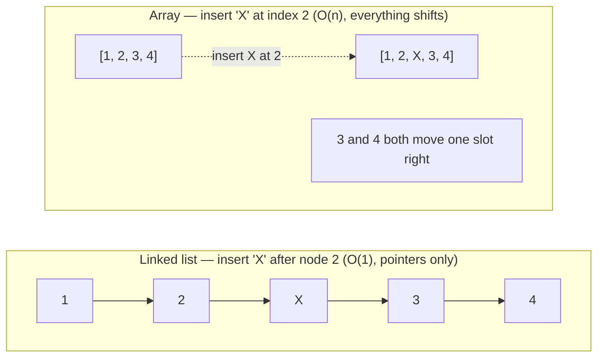
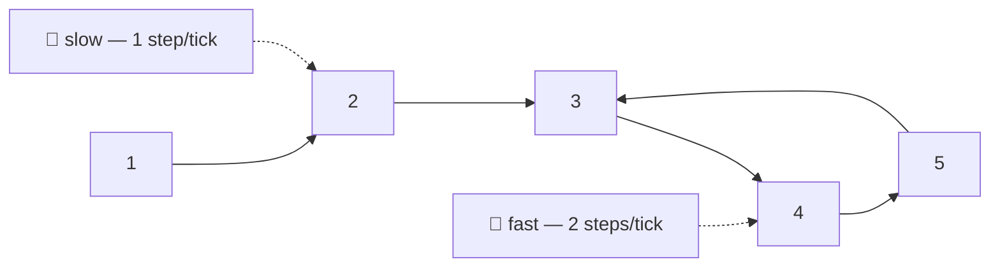

# 07 — Linked Lists

## Why this exists

An array pays for random access with expensive middle inserts: shove a
value into the middle and everything after it slides over, O(n). A
linked list flips the trade — inserting or deleting is O(1) **if you
already hold the node** — but it gives up O(1) indexing; to reach the
5th node you must walk there, one `next` pointer at a time.

Linked lists are also where a whole family of interview patterns live:
fast & slow pointers, in-place reversal, and the "O(1) removal given
the node" trick that makes an LRU cache possible.



*What to notice: the linked-list insert only touches two pointers
(node 2's `next`, and X's `next`); the array insert must physically
shift every element after the target — cheap for a list, expensive for
an array, no matter how far into the structure you insert.*

## Array vs linked list

| | Array | Linked list |
| --- | --- | --- |
| Indexed access `a[i]` | O(1) | O(n) — walk from head |
| Search by value | O(n) | O(n) |
| Insert/delete at front | O(n) (shift) | O(1) |
| Insert/delete at back | O(1) amortized | O(1) with a tail pointer |
| Insert/delete in the middle | O(n) (shift) | O(1) **given the node** |
| Extra memory per element | none | one (or two) pointers |
| Cache friendliness | high — contiguous | low — nodes scattered in memory |

## Pointer surgery rules

Every list bug is a pointer rewired in the wrong order or a pointer
you forgot to rewire. Three rules keep you safe:

1. **Draw it before you code it.** Boxes and arrows, current state and
   target state. If you can't draw the fix, you can't code it either.
2. **Order matters.** Save any pointer you're about to overwrite
   *before* you overwrite it — once you reassign `node.next`, the old
   value is gone unless you kept a reference to it.
3. **A dummy (sentinel) head removes edge cases.** "Delete the head",
   "insert before the head" — these need special-case code only
   because the head has no predecessor. Point a throwaway node at the
   real head and every operation becomes "the node before the target
   always exists."

## How to recognize it

- The problem hands you a chain of nodes (`ListNode`, `next` pointers)
  instead of an array.
- "Remove this node in O(1)" — only possible when you already hold a
  reference to it (arrays can't do this; lists can).
- "Find the middle" / "does this list loop back on itself?" → fast &
  slow pointers.
- "Reverse", "reorder", "merge" a list *without extra memory* → pointer
  rewiring, not copying into a new structure.
- LRU-style "move this to the front" / "evict the least recent" → a
  doubly linked list paired with a hash map.

## The template

```ts
// Walk with a trailing pointer — the classic shape for anything that
// needs to know "the node before the one I care about".
function walkAndFix<T>(head: ListNode<T> | null): ListNode<T> | null {
  const dummy = new ListNode<T>(undefined as unknown as T, head)
  let prev = dummy
  let cur = head

  while (cur) {
    // ...inspect / rewire cur here, using prev as "the node before cur"...
    prev = cur
    cur = cur.next
  }

  return dummy.next
}
```

## Fast & slow pointers

Two pointers walk the same list at different speeds — slow moves one
node per step, fast moves two. Three questions this answers:

- **Middle in one pass:** when fast falls off the end, slow is at the
  middle (no need to count the length first).
- **Cycle detection (Floyd's algorithm):** if the list loops, fast
  eventually laps slow and they land on the same node. If the list
  ends, fast hits `null` first — no cycle.
- **Cycle start:** once slow and fast meet inside the cycle, reset one
  pointer to `head` and advance both one step at a time. They meet
  again exactly at the cycle's start.



*What to notice: node 5's `next` points back to node 3, so the list
never ends — it loops. The hare (fast) covers ground twice as fast as
the tortoise (slow); inside a loop that means it must eventually catch
up to and land exactly on the tortoise.*

**Why the phase-2 math works (informal):** let `a` = distance from
`head` to the cycle start, `b` = distance from the cycle start to the
meeting point, and `c` = the rest of the cycle back to the start. When
slow and fast meet, slow has traveled `a + b`, and fast has traveled
exactly twice that, `2(a + b)`. Fast also traveled the full first loop
plus however many extra laps: `a + b + k(b + c)` for some integer `k`.
Setting those equal and simplifying gives `a = (k)(b + c) - b`, which
is a multiple of the cycle length offset by `-b` — in other words,
walking `a` steps from `head` lands you in the same place as walking
`a` steps from the meeting point. That's exactly what phase 2 does.

## Worked example: reversing 1 → 2 → 3 → null

Iterative reversal walks three pointers together: `prev` (already
reversed), `cur` (being processed), and a saved `next` (or the rest of
the list is lost the moment you rewire `cur.next`).

| Step | prev | cur | next (saved) | Action |
| --- | --- | --- | --- | --- |
| start | `null` | `1` | — | — |
| 1 | `null` | `1` | `2` | `cur.next = prev` → `1 → null`; advance |
| 2 | `1` | `2` | `3` | `cur.next = prev` → `2 → 1`; advance |
| 3 | `2` | `3` | `null` | `cur.next = prev` → `3 → 2`; advance |
| end | `3` | `null` | — | loop stops; return `prev` (new head) |

Result: `3 → 2 → 1 → null`.

## Complexity

Every operation covered in this module — reverse, find-middle,
cycle-detect, merge, remove-nth, reorder — is **O(n) time, O(1) extra
space**, because each is a single pointer-walk over the list with a
constant number of tracked pointers. The doubly linked list's
`removeNode`/`pushFront`/`pushBack` are O(1) because sentinels remove
every "am I at the boundary?" branch. WHY: a linked list only supports
sequential access, so anything that must see every node costs at least
O(n) — but it never needs O(n) *extra memory* to rearrange nodes,
because "rearranging" means rewiring existing pointers, not copying.

## Common gotchas

- **Losing the rest of the list.** Overwrite `cur.next` before saving
  it, and everything after `cur` is unreachable garbage.
- **Off-by-one around a dummy head.** `dummy.next` is the real head;
  don't return `dummy` itself, and don't forget to initialize
  `dummy.next = head`.
- **Forgetting to null the new tail.** After a reversal or a splice,
  the node that is now last must have `next === null`, or you've built
  a list that silently loops (and `toArray`/tests will hang).
- **Fast & slow starting position.** Starting fast at `head` vs
  `head.next` changes which "middle" you land on for even-length
  lists — pin the convention (this module: fast starts at `head`,
  loop while `fast && fast.next`, giving the *second* middle).
- **Mutating during a search.** If you're walking to find something and
  also rewiring pointers in the same pass, make sure you advance your
  walk pointer using a value saved *before* the rewire.

## Try it now

→ `exercises/ex01-build-singly-list.ts` through
`ex07-lru-cache.ts`, then `checkpoint.ts`.
Check with `npm test -- 07`.
