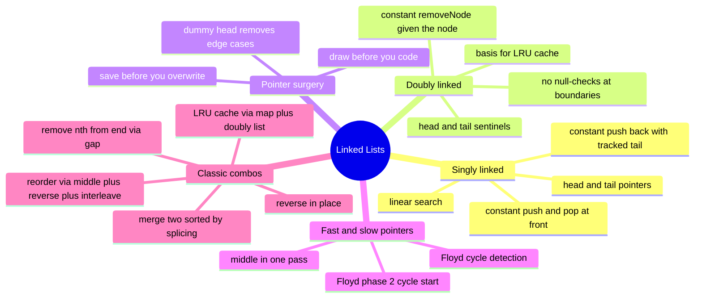

# 07 — Linked Lists · Cheat-sheet

## Concept map

*What to notice: everything under "Classic combos" is built by
combining branches above it — reorder alone uses three separate ideas
from earlier in the tree.*

## Array vs linked list (condensed)

| | Array | Linked list |
| --- | --- | --- |
| Index `a[i]` | O(1) | O(n) |
| Insert/delete at front | O(n) | O(1) |
| Insert/delete given the node | O(n) | O(1) |
| Cache friendliness | high | low |

## Pointer-surgery checklist

1. Draw current state and target state before writing code.
2. Save any pointer you're about to overwrite — first.
3. Use a dummy/sentinel head when the head itself might change.
4. After the operation, confirm the new tail's `next` is `null`.

## Dummy-node rule

Use a dummy head whenever the head node itself might be removed,
replaced, or is otherwise a special case (`removeNthFromEnd`,
`mergeSorted`). Return `dummy.next`, never `dummy`.

## Fast/slow recipes

| Goal | Setup | Loop condition | Result |
| --- | --- | --- | --- |
| Middle (2nd for even) | `slow = fast = head` | `while (fast && fast.next)` | `slow` |
| Has cycle | `slow = fast = head` | same, check `slow === fast` inside | `boolean` |
| Cycle start | after slow/fast meet | reset one to `head`, step both by 1 | meeting node |
| kth from end | `fast` starts `k` ahead of `slow` | `while (fast)` (or `fast.next`) | `slow` at target |

## LRU cache anatomy (in words)

- A **hash map** `key -> node` gives O(1) lookup by key.
- A **doubly linked list with sentinels** gives O(1) reordering: the
  front is "most recently used", the back is "least recently used".
- `get(key)`: look up the node, unlink it, push it to the front, return
  its value.
- `put(key, value)`: if the key exists, unlink and refresh it; if the
  cache is full, pop the back (evict) and delete it from the map; push
  the new/updated entry to the front.
- The map and the list always agree on membership — every node in the
  list has exactly one map entry pointing at it, and vice versa.

## Self-quiz

1. Why is inserting into the middle of an array O(n) but O(1) for a
   linked list (given the node)?
2. What three pointers does an iterative reversal need to track at
   each step, and why does losing one of them break the list?
3. In `fast = head; while (fast && fast.next)`, why does `slow` land on
   the *second* middle for an even-length list?
4. What problem does a dummy head solve, and what do you return at the
   end instead of the dummy itself?
5. After Floyd's phase 1 finds a meeting point, what do you do in
   phase 2 to find the cycle's start — and why does resetting one
   pointer to `head` work?
6. Why does a doubly linked list need sentinels at BOTH ends, not just
   one, to remove all null-checks?
7. Why can't a hash map alone implement an LRU cache's eviction order,
   and why can't a plain doubly linked list alone implement its O(1)
   lookup?
8. `mergeSorted` is told to splice existing nodes, not allocate new
   ones. What would go wrong (functionally, not just wastefully) if
   you allocated new nodes with the same values instead?

Answers

1. An array's elements are contiguous, so inserting in the middle
   requires shifting every element after it one slot over. A linked
   list only rewires the pointers immediately around the insertion
   point — no other node moves.
2. `prev`, `cur`, and a saved `next` (read from `cur.next` before
   overwriting it). Skip saving `next` and `cur.next = prev` severs
   the link to the rest of the list before you've moved on to it.
3. Fast covers 2 nodes per tick, slow covers 1. Starting both at
   `head` and stopping when `fast` or `fast.next` is `null` means for
   `n` even, fast takes `n/2` ticks and slow ends up at index `n/2`
   (0-indexed) — the *second* of the two middle nodes.
4. It removes the "the head itself might need to change" special
   case, since `dummy.next` always points at the real head (or the
   next real head after a removal). Return `dummy.next`, not `dummy`.
5. Reset one pointer to `head`; advance both pointers one step at a
   time until they meet — that meeting point is the cycle's start.
   It works because the distance from `head` to the cycle start equals
   the remaining distance around the cycle from the phase-1 meeting
   point back to the start (see LESSON.md's derivation).
6. A single sentinel still leaves one boundary (the real head's `prev`
   or the real tail's `next`) as `null`, so operations at that end
   still need a branch. Two sentinels mean every real node — including
   the first and last — always has non-null neighbors on both sides.
7. A hash map has no notion of order, so it can't tell you which entry
   is least recently used without an O(n) scan. A plain linked list
   has no O(1) way to find the node for a given key without an O(n)
   search. Pairing them gives O(1) for both jobs at once.
8. Node identity would break: any code elsewhere holding a reference
   to an original node (or relying on `===` comparisons, as this
   module's tests do) would no longer see it in the merged list, even
   though the *values* look correct.

## Pattern-recognition drill

For each, name the pattern/structure before checking the answer.

1. "Given the head of a list, return `true` if it contains a cycle."
2. "You're given a node in the middle of a list (not the head) and
   asked to delete it in O(1) — but you have no reference to the
   previous node."
3. "Design a cache that evicts the least recently used item when full,
   with O(1) get and put."
4. "Reverse a linked list in groups of k."
5. "Given a sorted array, find a pair of numbers that sum to a target."
   *(decoy — check the cue before reaching for a list pattern)*
6. "Find the node where two singly linked lists intersect."
7. "Given the head of a list, return the middle node."

Answers

1. Fast & slow pointers (Floyd's cycle detection).
2. Not a real O(1) deletion of the given node from the list — the
   trick is to copy the NEXT node's value into this node, then delete
   the next node instead (only works because you're not deleting the
   true tail). Worth naming as its own gotcha: "delete this node" cues
   sometimes hide a values-not-nodes trick.
3. LRU cache pattern: hash map + doubly linked list with sentinels.
4. Iterative/recursive reversal, applied per k-sized chunk — the
   ex02 template, repeated with a boundary check every k nodes.
5. Decoy: "sorted array" + "pair sum" is two pointers (module 04), not
   a linked-list pattern at all — the cue is the data structure named
   in the problem, not just the word "pair".
6. Two pointers that each traverse both lists in turn (switch to the
   other list's head on reaching `null`) — they meet at the
   intersection or both reach `null` together. A cousin of fast/slow:
   two pointers forced to travel equal total distance.
7. Fast & slow pointers (middle-of-list variant).

