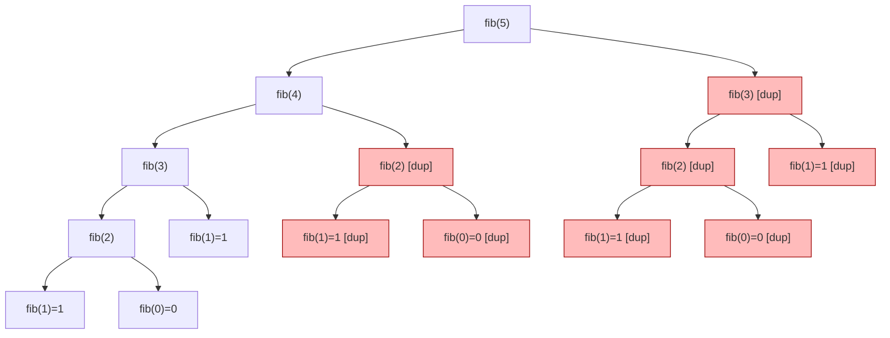
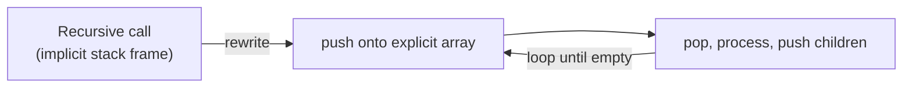
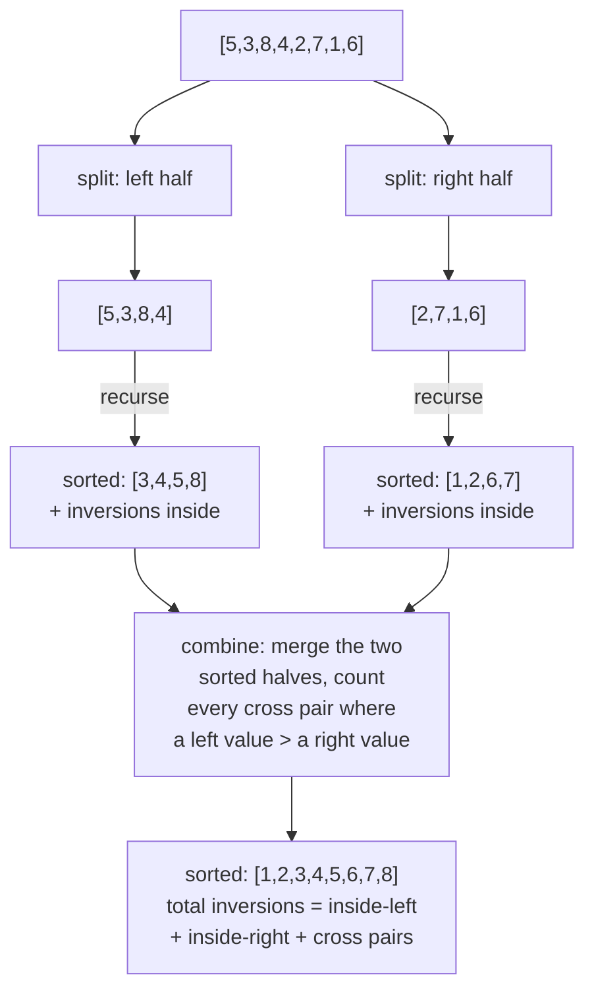

# 08 — Recursion & Divide and Conquer

## Why this exists

Some problems are defined in terms of smaller versions of themselves:
"the sum of a list" is "the first element plus the sum of the rest."
Recursion lets your code mirror that definition directly, instead of
manually managing loop counters and intermediate state. The naive
alternative — an explicit loop with hand-rolled bookkeeping — works for
flat, linear problems, but falls apart on tree-shaped or nested data
(file systems, parsed expressions, game trees) where "the rest" isn't
one obvious next step. Recursion is also the gateway to three huge
topics ahead: tree traversal (module 11), backtracking (module 14), and
dynamic programming (module 18) — all of them are recursion with extra
rules bolted on.

This module also teaches **divide and conquer**: a specific recursive
strategy — split the problem, solve the pieces, combine the results —
that beats brute force on problems like counting inversions and fast
exponentiation.

## The call tree of `fib(5)`



*What to notice: `fib(3)`, `fib(2)`, `fib(1)`, and `fib(0)` (flagged in
red) are recomputed from scratch every time they reappear — the naive
call tree does exponential work re-deriving values it already knew.
That waste is exactly what memoization (below) collapses.*

## The three rules

Every correct recursive function follows three rules, in this order of
importance:

1. **Base case first.** The smallest input(s) that can be answered
   directly, with no further recursive call. Write this line before
   anything else.
2. **Progress toward it.** Every recursive call must move strictly
   closer to a base case (smaller `n`, a shorter list, a smaller
   nested structure). If it doesn't shrink, it doesn't terminate.
3. **Trust the recursive call — the "leap of faith."** When you write
   `return n + sum(rest)`, do NOT mentally re-simulate what `sum(rest)`
   does. Assume it already correctly computes "the sum of everything
   after the first element" — that's the whole point of induction: if
   the base case is right, and each step correctly builds on a
   *trusted* smaller answer, the whole thing is right. Chasing the
   call tree by hand for every problem is how recursion becomes
   confusing; trusting the contract is how it becomes easy.

## The call stack: what actually happens

Each recursive call pushes a new **stack frame** — its own copy of
parameters and local variables — onto the call stack. Nothing in that
frame is discarded until the call returns. So:

- **Stack depth = space complexity.** A recursion that goes `n` calls
  deep before hitting a base case uses O(n) extra space, even if it
  does no other bookkeeping.
- **Stack overflow is real and language-specific.** Node's default
  stack tolerates roughly a few thousand to ~10,000 simple frames
  (exact number depends on how much each frame holds) before throwing
  `RangeError: Maximum call stack size exceeded`. There is no
  guaranteed minimum — never assume "my input is small enough."
- Tail-shaped recursion (the recursive call is the very last thing
  that happens) is NOT automatically optimized away in JavaScript —
  unlike some languages, V8 does not do tail-call elimination. Deep
  recursion is a real risk here, not a theoretical one.

## Recursion ↔ iteration

Any recursion can be rewritten as a loop plus an **explicit stack**
(an array you push/pop yourself) that stands in for the call stack the
runtime would have built. You reach for this when:

- the input can be deep enough to overflow the real call stack, or
- you want manual control over memory/order that recursion hides.



*What to notice: the shape doesn't change — you still "visit, then
handle children" — only WHERE the pending work lives changes, from the
runtime's hidden call stack to an array you control.*

## Divide and conquer

A specific recursive strategy: **split** the input into smaller pieces,
**solve** each piece (recursively — trust it!), **combine** the partial
results into the answer for the whole input.



*What to notice: the "combine" step is where the real work and the
real payoff happen — merging two already-sorted halves lets you count
every cross-pair inversion in one linear pass, instead of comparing
every pair (O(n²)).*

## How to recognize it

- The problem statement defines something in terms of a smaller version
  of itself ("the depth of a tree is 1 + the depth of its tallest
  subtree").
- The data is naturally nested or tree-shaped (nested lists/objects,
  file systems, parsed expressions) — there's no single "next index" to
  loop over.
- You can describe an operation as "split in half, solve each half,
  combine" — and combining the two solved halves is cheaper than
  solving the whole problem directly (merge sort, counting inversions,
  fast exponentiation).
- The same expensive sub-computation would be repeated many times if
  you did it naively — a cue that memoization (caching by input) will
  matter, even before you learn the full DP framework in module 18.

## The template

```ts
// Straight recursion
function solve(input: Shrinkable): Answer {
  if (isBaseCase(input)) return baseAnswer(input)          // 1. base case
  const smaller = shrink(input)                            // 2. progress
  const partial = solve(smaller)                           // 3. trust it
  return combine(input, partial)
}

// Divide and conquer
function solveDC(input: T[]): Result {
  if (input.length <= 1) return trivialResult(input)        // base case
  const mid = Math.floor(input.length / 2)
  const left = solveDC(input.slice(0, mid))                 // divide + trust
  const right = solveDC(input.slice(mid))                   // divide + trust
  return combine(left, right)                                // conquer
}
```

## Worked example: `fib(5)` with and without memoization

| Call | Naive: times computed | Memoized: times computed |
| --- | --- | --- |
| `fib(5)` | 1 | 1 |
| `fib(4)` | 1 | 1 |
| `fib(3)` | 2 | 1 (cached on 2nd ask) |
| `fib(2)` | 3 | 1 (cached on 2nd, 3rd ask) |
| `fib(1)` | 5 | 1 (cached after) |
| `fib(0)` | 3 | 1 (cached after) |
| **Total calls** | **15** | **6** |

*What to notice: naive `fib(5)` makes 15 calls; memoized makes exactly
6 — one per distinct value from `fib(0)` to `fib(5)`. The gap only
widens as `n` grows (naive is exponential, memoized is linear). Module
18 turns this into the full dynamic-programming framework.*

## Complexity

- **Straight recursion** (one call per step, e.g. `factorial`): O(n)
  time, O(n) space — the space is the stack depth, not extra data
  structures you allocated.
- **Naive tree recursion** (two+ un-cached calls per step, e.g. naive
  fib): time blows up exponentially (O(2ⁿ)-ish) because the same
  sub-answers are recomputed; space is still only O(n) — the *depth*
  of the deepest path, not the total call count.
- **Memoized recursion**: time drops to O(distinct sub-answers), space
  adds O(distinct sub-answers) for the cache.
- **Divide and conquer** (split in half, linear combine): time is
  O(n log n) — log n levels of splitting, O(n) work to combine at each
  level. WHY: halving n takes log₂(n) steps to reach a base case, and
  each of those log n levels touches every element once during combine.

## Common gotchas

- **Missing or wrong base case** → infinite recursion → stack overflow.
  Always write and test the base case first.
- **Work before vs. after the recursive call matters.** Code before the
  call runs on the way DOWN (root to leaves); code after it runs on the
  way BACK UP (leaves to root). Printing before vs. after a call
  produces reversed output — this trips almost everyone up once.
- **Shrinking the wrong thing.** `n - 1` shrinks toward 0; slicing
  `arr.slice(1)` shrinks toward `[]`. Make sure what you pass to the
  recursive call is provably smaller by the same measure your base
  case checks.
- **Mutating shared state across calls.** If two recursive branches
  both mutate the same outer array/object without restoring it, one
  branch's changes leak into the other's "clean" attempt. This becomes
  critical in backtracking (module 14) — get in the habit now of either
  passing fresh copies or explicitly undoing mutations after a call
  returns.
- **`arr.slice()` divide-and-conquer is simple but not free** — each
  slice copies, adding O(n) per level (O(n log n) total, usually fine,
  but worth knowing it's there).

## Try it now

→ `exercises/ex01-recursion-warmups.ts` through
`exercises/ex06-recursion-to-iteration.ts`, then `checkpoint.ts`.
Check with `npm test -- 08`.
