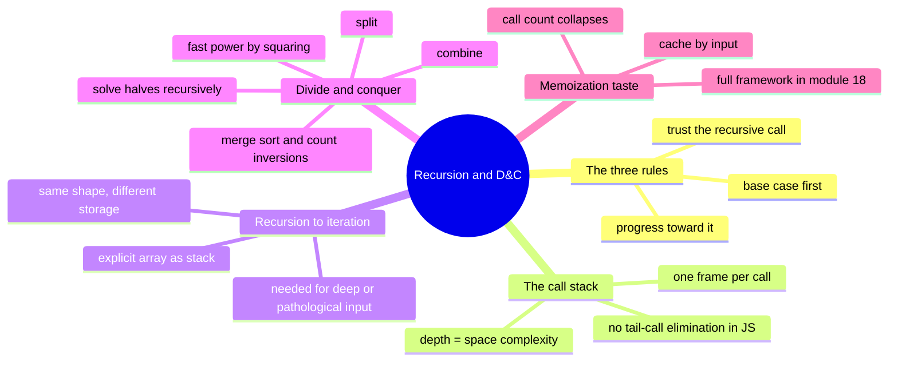

# 08 — Recursion & Divide and Conquer · Cheat-sheet

## Concept map



*What to notice: every branch reduces to the same three rules — the
call stack, D&C, and memoization are all consequences of trusting a
correctly-shrinking recursive call.*

## The three rules

1. **Base case first** — the smallest input(s), answered directly.
2. **Progress toward it** — every call must shrink strictly closer to
   a base case.
3. **Trust the recursive call** — the leap of faith. Don't mentally
   re-simulate it; assume its contract holds.

## Call-stack cost table

| Shape | Time | Space (stack depth) | Example |
| --- | --- | --- | --- |
| Straight recursion (1 call/step) | O(n) | O(n) | `factorial` |
| Naive tree recursion (2+ un-cached calls/step) | exponential | O(n) | naive `fib` |
| Memoized recursion | O(distinct sub-answers) | O(distinct sub-answers) | memoized `fib` |
| Divide and conquer (halve + linear combine) | O(n log n) | O(log n) | merge-count inversions |

## Divide & conquer template

```ts
function solveDC(input: T[]): Result {
  if (input.length <= 1) return trivialResult(input)   // base case
  const mid = Math.floor(input.length / 2)
  const left = solveDC(input.slice(0, mid))             // divide + trust
  const right = solveDC(input.slice(mid))                // divide + trust
  return combine(left, right)                             // conquer
}
```

## Recursion -> iteration recipe

1. Identify what each recursive call needs "remembered" for later
   (its pending work) — that's what goes on the explicit stack.
2. Push the starting input.
3. Loop while the stack isn't empty: pop, handle a base case
   directly, or push the next piece(s) of work for a branch.
4. Reach for this when input can be deep enough to overflow the real
   call stack, or when you need manual control the call stack hides.

## When memo will matter — a teaser

| Signal in the problem | Memo likely matters? |
| --- | --- |
| Each call recurses on strictly disjoint, non-overlapping pieces (e.g. merge sort's two halves) | No — no repeated work to cache |
| The same sub-input can be reached via multiple different call paths (e.g. `fib(n-1)` and `fib(n-2)` both eventually call `fib(n-3)`) | Yes — cache by input |
| Naive call count grows exponentially with input size | Yes — strong signal |
| The recursive definition is "the answer for n depends on the answer for smaller values, over and over" | Yes — this is dynamic programming's shape (full framework: module 18) |

## Gotchas

- Missing or wrong base case -> infinite recursion -> stack overflow.
- Code before the recursive call runs top-down; code after it runs
  bottom-up — this flips output order if you're not careful.
- Make sure what shrinks in the recursive call is the SAME thing the
  base case checks.
- Don't mutate shared state across sibling recursive branches without
  restoring it — this becomes critical in backtracking (module 14).
- JS does not eliminate tail calls — deep linear recursion can still
  overflow even when it "looks like" a loop.

## Self-quiz

1. What are the three rules every recursive function must follow, in
   order of importance?
2. Why does naive `fib(n)` take exponential time but only O(n) stack
   space?
3. What's the difference between work done "before" vs. "after" the
   recursive call, in terms of when it executes?
4. When would you rewrite a recursive function iteratively, and what
   do you use to replace the call stack?
5. In divide and conquer, which step usually does the real algorithmic
   work: the split, the recursive solve, or the combine? Give an
   example.
6. Why does exponentiation by squaring take O(log n) calls instead of
   O(n)?
7. What signal in a recursive definition tells you memoization will
   help?
8. What's the space cost of a straight (one-call-per-step) recursion
   of depth n, even if it allocates no other data structures?

<details><summary>Answers</summary>

1. Base case first; progress toward it; trust the recursive call
   (leap of faith).
2. Because the same sub-calls (like `fib(3)`) are recomputed many
   times (exponential call *count*), but the deepest single path from
   root to a base case is only n calls long (linear stack *depth*).
3. "Before" code runs on the way down, root to leaves, in call order;
   "after" code runs on the way back up, leaves to root, in reverse
   order.
4. When the input can be deep enough to overflow the real call stack
   (or you need manual control); replace it with a loop plus an
   explicit array acting as the stack.
5. Usually the combine step — e.g. merging two sorted halves while
   counting cross-pair inversions in one linear pass.
6. Because it halves n each call instead of subtracting 1 — it takes
   log2(n) halvings to reach the base case.
7. The same sub-input is reachable via multiple different call paths
   (overlapping subproblems), so naive recursion redoes the same work
   repeatedly.
8. O(n) — one stack frame per call, even with no extra arrays/maps
   allocated.

</details>

## Pattern-recognition drill

For each one-liner, name the pattern/structure BEFORE peeking at the
answer: plain recursion, divide and conquer, recursion-to-iteration
(explicit stack), memoization, or "just a loop — no recursion needed."

1. "Compute the sum of a plain `for` loop over a flat array of 100
   numbers."
2. "Given an arbitrarily nested array of numbers, find the maximum
   value at any depth."
3. "Sort an array and, in the process, report how many swaps a
   bubble sort would need — computed efficiently, not by simulating
   bubble sort."
4. "Compute `2^n mod p` for `n` up to a billion, quickly."
5. "Traverse a file tree that could be 100,000 levels deep in the
   worst case (user-supplied, untrusted structure), without crashing."
6. "Compute the nth value of a sequence defined as `f(n) = f(n-1) +
   f(n-2) + f(n-3)`, for n up to 10,000, without timing out."

<details><summary>Answers</summary>

1. Just a loop — flat, linear, no self-similar substructure to recurse
   on.
2. Plain recursion on shape — a number is a leaf, an array is a
   branch (this module's ex04 pattern).
3. Divide and conquer — this is exactly counting inversions via a
   merge-sort combine step, in disguise.
4. Divide and conquer — exponentiation by squaring (`power_mod`),
   O(log n) instead of O(n) multiplications.
5. Recursion-to-iteration — depth is untrusted/unbounded, so an
   explicit stack avoids a call-stack overflow.
6. Memoization — the naive recursive definition recomputes the same
   `f(k)` many times; caching collapses exponential work to O(n).

</details>
