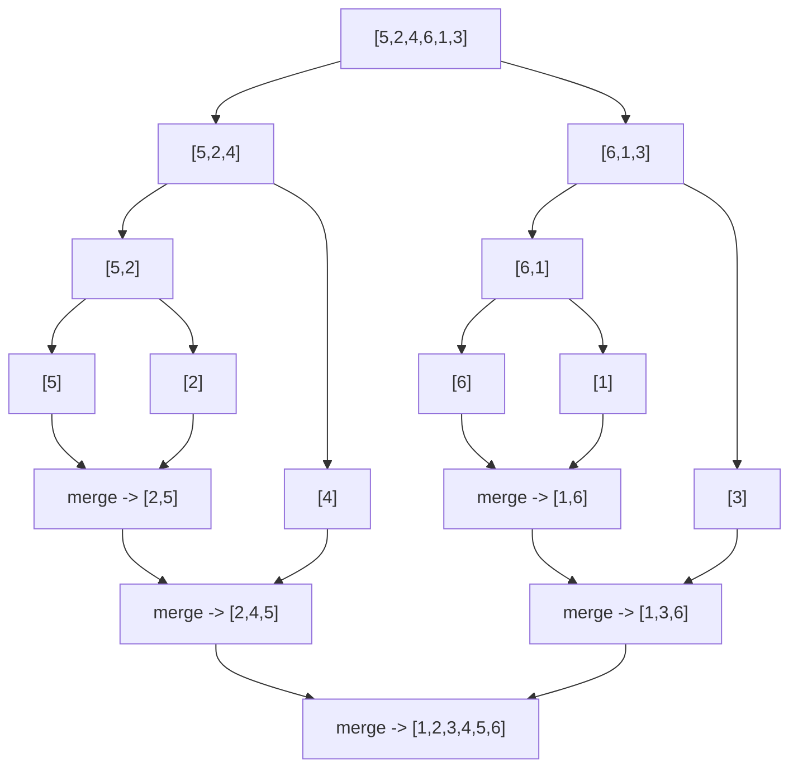
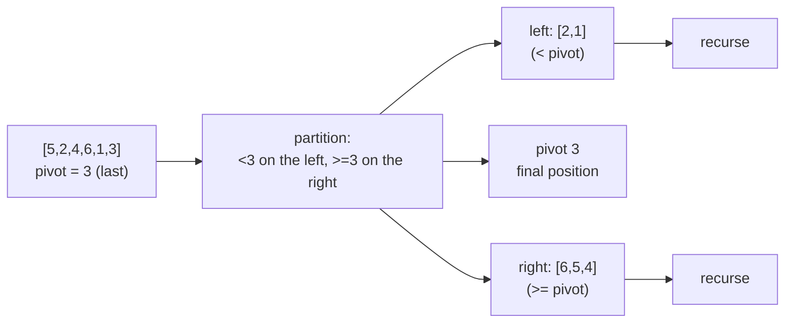

# 09 — Sorting

## Why this exists

Sorted data is a superpower: once an array is ordered, binary search
finds things in O(log n), two pointers can scan opposite ends toward
each other, and greedy sweeps become correct. Sorting is the "unlock"
step behind a huge share of interview problems — and it's also a
family of algorithms you need to know cold, because "just call the
built-in sort" isn't always the whole answer (you may need a custom
order, a stable order, or a sub-linear-space trick like quickselect).

The naive way to sort by hand is **bubble sort** — repeatedly swap
adjacent out-of-order pairs — at O(n²) time and O(1) space. Everything
in this module either beats that bound or explains exactly when O(n²)
is still the right choice.

## Elementary sorts: insertion & selection

Both are O(n²) worst case, but for different reasons:

- **Selection sort**: scan the unsorted suffix for the minimum, swap
  it to the front, repeat. Always scans everything — not adaptive.
  Its one virtue: only O(n) swaps total, which matters if a swap is
  expensive (e.g. sorting large records in place).
- **Insertion sort**: grow a sorted prefix one element at a time,
  shifting bigger elements right to make room for the next one. It is
  **adaptive** — a nearly-sorted array costs close to O(n), because
  most elements need zero or one shift.

Insertion sort is genuinely the right choice for: small n (the
constant factor is tiny, so it beats merge/quick sort below ~10-20
elements — this is why real-world sorts switch to it for small
sub-arrays), and nearly-sorted data (e.g. appending a few new records
to an already-sorted list).

## Merge sort: split, then merge back in order

Split the array in half recursively until every piece is a single
element (trivially sorted), then merge sorted pairs back together,
one level at a time.



*What to notice: the tree has log n levels (each split halves the
size), and merging back together at each level touches every element
once — O(n) work per level x O(log n) levels = O(n log n) total, and
that total is the SAME for every input, best case or worst.*

**Template** (the shape to memorize):

```ts
function sort(items: T[]): T[] {
  if (items.length <= 1) return items      // base case: trivially sorted
  const mid = Math.floor(items.length / 2)
  const left = sort(items.slice(0, mid))    // divide
  const right = sort(items.slice(mid))
  return merge(left, right)                 // conquer: merge two sorted halves
}
```

The `merge` step walks two sorted arrays with two pointers, always
taking the smaller front element — see the Stability section for why
the tie-breaking direction matters.

## Quick sort: partition around a pivot

Pick a pivot, rearrange the array so everything smaller is to its
left and everything bigger is to its right (the pivot is now in its
final sorted position), then recurse on each side. Unlike merge sort,
quick sort sorts **in place**.

**Lomuto partition**, traced on `[5, 2, 4, 6, 1, 3]` with pivot = last
element (`3`):

| step | array state | i | j | action |
| --- | --- | --- | --- | --- |
| start | `[5, 2, 4, 6, 1, 3]` | 0 | 0 | `nums[j]=5 >= pivot(3)`, skip |
| 1 | `[5, 2, 4, 6, 1, 3]` | 0 | 1 | `nums[j]=2 < 3`: swap(i,j), i=1 |
| 2 | `[2, 5, 4, 6, 1, 3]` | 1 | 2 | `nums[j]=4 >= 3`, skip |
| 3 | `[2, 5, 4, 6, 1, 3]` | 1 | 3 | `nums[j]=6 >= 3`, skip |
| 4 | `[2, 5, 4, 6, 1, 3]` | 1 | 4 | `nums[j]=1 < 3`: swap(i,j), i=2 |
| 5 | `[2, 1, 4, 6, 5, 3]` | 2 | 5 (=hi, stop) | swap(i, hi) to place the pivot |
| end | `[2, 1, 3, 6, 5, 4]` | — | — | pivot `3` is now at index 2, its final spot |



*What to notice: after one partition pass the pivot never moves again
— only its neighbors on each side still need sorting, which is why
quick sort needs no extra merge step.*

**Pivot choice matters.** A fixed pivot (always first or always last)
is worst-case O(n²) on already-sorted or reverse-sorted input — exactly
the input you'll see most in practice. A **randomized** pivot makes
that worst case astronomically unlikely. Recursing into the smaller
partition first (and looping over the larger one, instead of making a
second recursive call) also caps the call stack at O(log n) even on
an unlucky run.

## Comparison table

| Algorithm | Best | Average | Worst | Space | Stable? | In-place? |
| --- | --- | --- | --- | --- | --- | --- |
| Insertion sort | O(n) | O(n²) | O(n²) | O(1)* | Yes | Yes |
| Selection sort | O(n²) | O(n²) | O(n²) | O(1) | No** | Yes |
| Merge sort | O(n log n) | O(n log n) | O(n log n) | O(n) | Yes | No |
| Quick sort | O(n log n) | O(n log n) | O(n²) | O(log n) | No | Yes |
| Counting sort | O(n + k) | O(n + k) | O(n + k) | O(n + k) | Yes | No |

\* O(1) extra space if sorting truly in place; this module's exercises
return copies, which costs O(n).
\** selection sort can be made stable with extra care, but the classic
swap-based version is not (a swap can leapfrog an equal element).

## Stability: why it matters

A sort is **stable** if elements that compare equal keep their
original relative order. It matters whenever you sort by one key but
the rest of the record should stay ordered by something else.

Worked example — sort by `score` only, but stability preserves the
original (name) order among ties:

| name | score | after sort by score (stable) |
| --- | --- | --- |
| Ann | 90 | Bo (90) |
| Bo | 90 | Ann (90) |
| Cy | 80 | Cy (80) |

A correct **stable** sort keeps `Bo` before `Ann` only if `Bo` came
first originally — swap their input order and the stable output
swaps too, but always in original-order-among-ties. Merge sort is
stable "for free" (the merge step takes from the left run on ties);
a naive quick sort is not (partitioning swaps elements past each
other). This is exactly the trick the checkpoint's `rankPlayers` (score
→ wins → joined, each a tie-breaker for the last) depends on.

## Beyond comparisons: counting sort

Comparison sorts (merge, quick, insertion, selection) can never beat
O(n log n) in the worst case — this is the **Ω(n log n) comparison
lower bound**: with n items there are n! possible orderings, and each
comparison only splits the possibilities in half, so you need at
least log₂(n!) ≈ n log n comparisons to identify the right one. But
if you know more about your data than "I can compare two of them" —
say, every value is an integer in a known small range — you can
beat that bound. **Counting sort** counts how many times each value
appears, then places every item directly at its final index using
those counts (turned into prefix sums for stability). No comparisons
at all: O(n + k) for k = the value range. The Dutch national flag
partition (three pointers: low/mid/high) is the same idea specialized
to exactly 3 values, done in one pass with O(1) space instead of a
counting array.

## Quickselect: the kth largest without a full sort

To find just the kth largest element, sorting the whole array is
wasteful — O(n log n) when O(n) suffices. **Quickselect** reuses quick
sort's partition step but throws away the side that can't contain the
answer, recursing into only one side each time:

| step | range | pivot lands at | target index | next |
| --- | --- | --- | --- | --- |
| find 2nd largest of `[3,2,1,5,6,4]` (target index = 6-2 = 4) | `[0,5]` | say index 2 | 4 | target > 2, search `[3,5]` |
| | `[3,5]` | say index 4 | 4 | **found**: `arr[4]` |

Each round the search range shrinks (geometrically, on average), so
total work is O(n) + O(n/2) + O(n/4) + ... = O(n) average — the same
"recurse into one side only" idea makes topK selection in the
checkpoint O(n + k log k) instead of O(n log n).

## How to recognize it

- "Sort... but keep ties in their original order" / "multi-key sort"
  → **stability** matters — use a stable sort or a stable comparator.
- "kth largest/smallest", "median of a stream", "top K without
  sorting everything" → **quickselect** (or a heap — module 12).
- "custom order", "compare by a derived rule (not just <)" →
  **comparator**.
- "values in a small/bounded range" (grades 0-100, ages, digit/byte
  values) → **counting sort** (or radix sort, built from repeated
  counting sort passes — not covered here).
- "sort, then two pointers / binary search / greedy" → sorting is the
  setup step, not the whole problem — look past it to what comes next.
- Already-sorted or nearly-sorted input mentioned explicitly →
  insertion sort's adaptivity, or a red flag for quick sort's
  fixed-pivot worst case.

## Common gotchas

- **Comparator sign convention**: negative means `a` before `b`,
  positive means `a` after `b`, `0` means equal. Getting the sign
  backwards silently reverses your sort instead of erroring.
- **Comparator consistency**: your comparator must define a true total
  order (transitive, consistent) or the sort's result is undefined —
  a classic bug is comparing by one field but forgetting a tie-break,
  which makes ties "randomly" ordered.
- **Mutates vs. copies**: in this course, `mergeSort`/`insertionSort`/
  `selectionSort`/`countingSort` return NEW arrays; `quickSort` and
  `sortColors` sort IN PLACE and return nothing. Read each signature —
  mixing this up is the #1 source of "why didn't my array change"
  bugs.
- **Quick sort on sorted input**: a fixed pivot (first or last
  element, no randomization) degrades to O(n²) time AND O(n) recursion
  depth on already-sorted input — exactly the input that shows up
  constantly in real data.
- **Off-by-one at the pivot's final index**: after partitioning,
  the pivot is placed and must be EXCLUDED from both recursive calls
  (`partition(...,lo, p-1)` and `partition(...,p+1, hi)`), or you'll
  recurse forever on a range that still contains the pivot.
- **Counting sort's range**: `maxValue` must be an actual upper bound
  on every value, and it drives BOTH the time and the space cost — it
  is only a good choice when that range is small relative to n.

## Try it now

→ `exercises/ex01-insertion-selection.ts` through
`exercises/ex06-comparator-problems.ts`, then `checkpoint.ts`.
Check with `npm test -- 09` (or `npm test -- 09 -t ex03` for a single
exercise).
