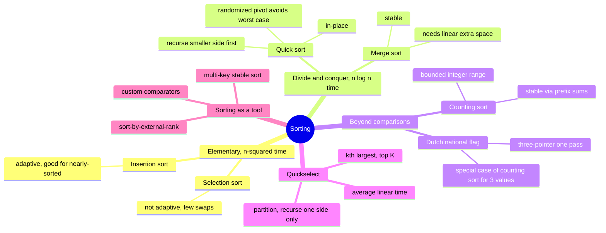
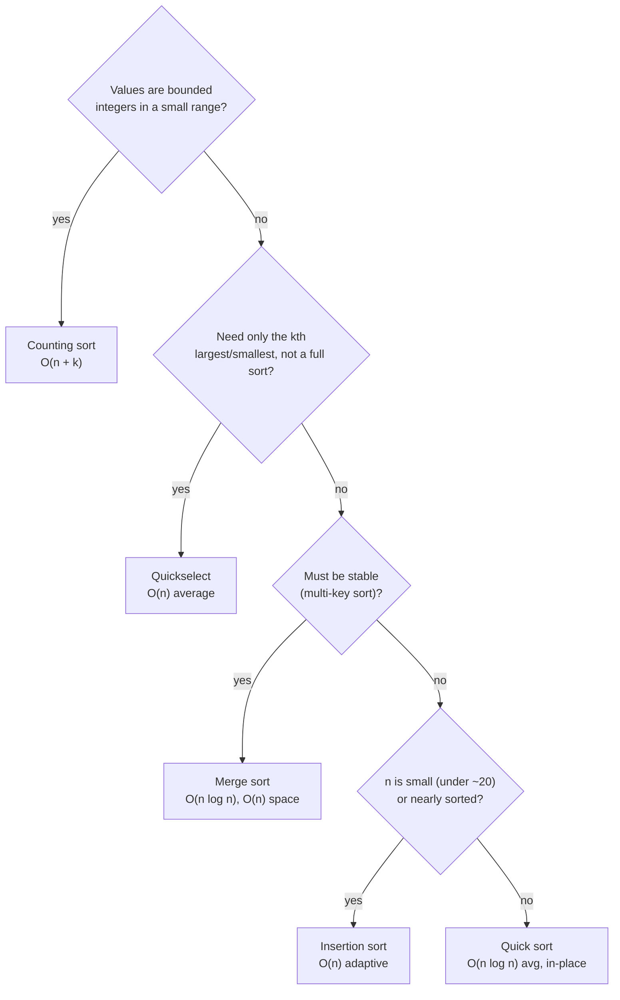

# 09 — Sorting · Cheat-sheet

## Concept map



*What to notice: the branches move from "always O(n^2)", to "always
O(n log n)", to "beats O(n log n) by using extra info about the
data" — pick the branch based on what you know about the input.*

## Comparison table (the centerpiece)

| Algorithm | Best | Average | Worst | Space | Stable? | In-place? |
| --- | --- | --- | --- | --- | --- | --- |
| Insertion sort | O(n) | O(n^2) | O(n^2) | O(1)* | Yes | Yes |
| Selection sort | O(n^2) | O(n^2) | O(n^2) | O(1) | No | Yes |
| Merge sort | O(n log n) | O(n log n) | O(n log n) | O(n) | Yes | No |
| Quick sort | O(n log n) | O(n log n) | O(n^2) | O(log n) | No | Yes |
| Counting sort | O(n + k) | O(n + k) | O(n + k) | O(n + k) | Yes | No |

\* O(1) if truly in place; this module's `insertionSort` returns a copy (O(n)).

## Stability rule

A sort is stable when equal elements keep their original relative
order. Need it whenever you sort by one key but want ties to fall
back to "whatever order they were already in" — or, more generally,
whenever you chain multiple sort passes / compare multiple keys
(score, then wins, then joined) and want each earlier pass's order to
survive as the final tie-break.

## Quickselect template

```ts
function quickselect(arr: number[], targetIndex: number, lo: number, hi: number): number {
  while (true) {
    if (lo === hi) return arr[lo]
    const p = partition(arr, lo, hi)      // same partition as quick sort
    if (p === targetIndex) return arr[p]
    if (p < targetIndex) lo = p + 1       // answer is in the right side
    else hi = p - 1                       // answer is in the left side
  }
}
```

The only difference from quick sort: recurse (or loop) into ONE side
only, never both — that's what turns O(n log n) into O(n) average.

## Comparator recipes

| Goal | Comparator |
| --- | --- |
| Ascending numbers | `(a, b) => a - b` |
| Descending numbers | `(a, b) => b - a` |
| By a derived key | `(a, b) => keyOf(a) - keyOf(b)` |
| Multi-key (score desc, then wins desc, then joined asc) | `(a,b) => (b.score-a.score) \|\| (b.wins-a.wins) \|\| (a.joined-b.joined)` |
| Sort-by-external-rank, unknowns last | look up rank in a `Map`; unranked goes to a "last" bucket |
| Concatenation puzzles | compare `a+b` vs `b+a` as strings |

## Which sort when



*What to notice: "bounded small range" beats everything else when it
applies — check it first, before reaching for a comparison sort.*

## Self-quiz

1. Why can no comparison-based sort beat O(n log n) in the worst case?
2. Selection sort always does O(n^2) comparisons — so why would anyone
   still choose it over insertion sort?
3. What makes merge sort's merge step stable? What would break
   stability if you changed one comparison operator?
4. Why does a fixed (non-randomized) pivot make quick sort slow on
   already-sorted input specifically?
5. In quickselect, why is the average case O(n) instead of
   O(n log n) like quick sort?
6. When is counting sort a bad choice even though it's O(n + k)?
7. `sortColors` claims O(1) space — what would break that claim if you
   implemented it with a counts array instead of three pointers?
8. You need to sort 10 million user records by (country, then
   last-purchase-date, then name) — which algorithm, and why does
   stability matter here?

<details><summary>Answers</summary>

1. There are n! possible orderings; each comparison narrows the
   possibilities by at most half, so you need at least log base 2 of
   n! (about n log n) comparisons to pin down the right one.
2. It does far fewer swaps (O(n) total) than insertion sort's worst
   case — worth it when a swap is expensive (e.g. large records) even
   though comparisons are the same order.
3. Taking from the left run whenever the comparator returns <= 0
   (equal counts as "left first"). Using strict < instead (or taking
   from the right on ties) breaks stability — equal elements could
   swap order across the merge.
4. A fixed pivot (e.g. always the first element) partitions
   already-sorted input into a 1-vs-(n-1) split every time instead of
   roughly half-and-half, giving O(n) levels of O(n) work = O(n^2), and
   O(n) recursion depth.
5. Quick sort recurses into BOTH sides after partitioning; quickselect
   throws away the side that can't contain the target and recurses
   into only one, so the total work is n + n/2 + n/4 + ... = O(n)
   instead of n * log n.
6. When the range k is large relative to n (e.g. sorting 1,000 floats
   spread across a range of a billion) — the O(k) counting array
   dominates and a comparison sort would be faster.
7. A counts array of size 3 is still O(1) space technically (constant
   size), but it requires two passes (count, then place) instead of
   one — the "one pass" property, not the space bound, is what breaks.
8. Merge sort (or any stable sort) — chain the sort by a single
   stable multi-key comparator (or three passes, least-significant-key
   first) so that, e.g., two same-country same-date records keep their
   prior (name-sorted) relative order instead of being shuffled.

</details>

## Pattern-recognition drill

For each prompt, name the pattern/algorithm before checking the
answer.

1. "Given a stream of exam scores from 0 to 100, report how many
   students got each letter grade."
2. "Find the median of an unsorted array without sorting the whole
   thing."
3. "Sort a list of events by start time; if two events start at the
   same time, keep them in the order they were entered."
4. "Given a small list of student records, order them alphabetically —
   performance doesn't matter, there are only 12 students."
5. "You're given a list of package weights (0-3 only: light, medium,
   heavy) and need to group them by weight class in one pass."
6. "Given n unsorted numbers, print them in sorted order — no other
   constraints." (decoy: several algorithms qualify — what's the
   default answer and why?)

<details><summary>Answers</summary>

1. Counting sort (bounded range 0-100 — count into buckets, no
   comparisons needed).
2. Quickselect (median = the n/2-th order statistic; average O(n),
   no full sort).
3. A stable sort (merge sort, or any sort explicitly documented
   stable) — the tie-break requirement is the giveaway.
4. Insertion sort — n is tiny, so the O(n^2) constant factor loses to
   simplicity, and it would win anyway if the data were nearly sorted.
5. Dutch national flag if there are only 3 categories (one pass, three
   pointers); counting sort generalizes to more categories.
6. Quick sort or merge sort (both O(n log n), no extra constraints
   given) — quick sort is the common default for its O(log n) space
   and in-place property, unless stability is needed, in which case
   merge sort.

</details>
