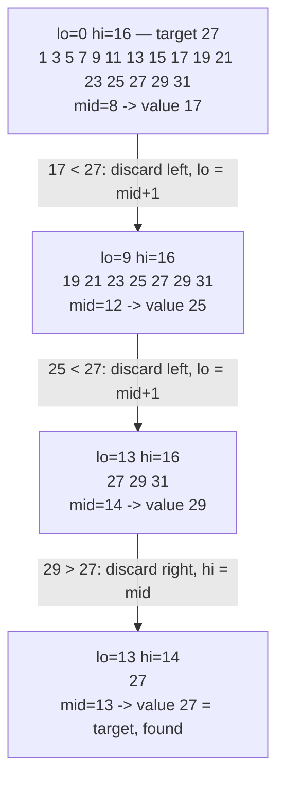
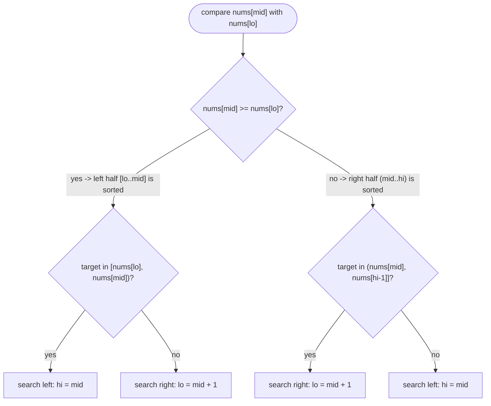
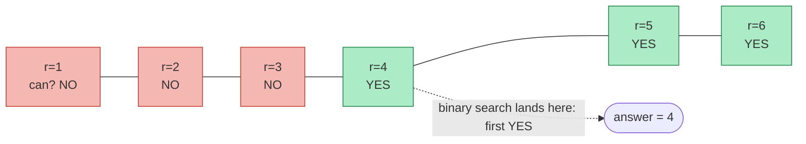

# 10 — Binary Search

## Why this exists

If you know a range is sorted (or, more generally, that some yes/no
question about it flips exactly once as you scan across it), you never
need to check every element. Ask about the middle, and the answer
throws away half the range. Linear scan is O(n); asking "is it in the
left half or the right half?" repeatedly is O(log n) — for a billion
elements, that's ~30 questions instead of a billion.

Binary search is really two ideas in one: a search technique over a
sorted **array**, and — the bigger idea — a search technique over any
**monotone predicate**, even when there's no array at all. Both use
the exact same loop.

## The halving, traced



*What to notice: every comparison throws away one whole half of the
remaining range — after 3 comparisons on 16 elements, 3 remain; a
4th finds it. `log2(16) = 4`, matching the step count exactly.*

## How to recognize it

- **Sorted array + "find/insert/count a value"** → the classic
  template or a boundary search (`lowerBound`/`upperBound`).
- **"Sorted, but rotated at an unknown point"** → rotated search — one
  half around `mid` is still sorted, that's enough.
- **"Minimize the maximum ___", "smallest capacity/speed/size such
  that ___ finishes/fits/succeeds"** → search on the answer. The
  numbers in the problem (piles, weights...) feed a predicate; they
  are not what you binary-search.
- **"Each row/column of a grid is sorted"** → matrix search, treat the
  grid as one flat sorted sequence.
- **"Find a local max/min", array not sorted, but neighbors differ**
  → peak search — the monotone guarantee is "a peak exists uphill,"
  not sortedness.
- **Counter-cue:** an unsorted array with no monotone structure at all
  (just "find this value among unrelated items") is a plain lookup —
  reach for a hash set, not binary search, unless sorting first is
  worth its O(n log n) cost.

## THE template (pin this one, use it everywhere)

```ts
function binarySearchTemplate(nums: number[], target: number): number {
  let lo = 0
  let hi = nums.length // half-open: hi is one PAST the last valid index

  while (lo < hi) {
    const mid = lo + Math.floor((hi - lo) / 2) // avoids overflow, floors toward lo
    if (nums[mid]! < target) {
      lo = mid + 1 // mid is proven too small — exclude it
    } else {
      hi = mid // mid might be the answer — keep it in range
    }
  }

  // lo === hi now: the first index where nums[index] >= target
  return lo < nums.length && nums[lo] === target ? lo : -1
}
```

Why **this** template and not the classic `lo <= hi` / `mid ± 1` one:

- **Half-open `[lo, hi)`** means "everything from `lo` to `hi`,
  excluding `hi`" — the same convention as `array.slice(lo, hi)` and
  `for (let i = lo; i < hi; i++)`. `hi = nums.length` reads naturally
  as "one past the end," not "the last index" (no `- 1` to forget).
- **`while (lo < hi)`**, not `lo <= hi`. The loop ends exactly when the
  range is empty (`lo === hi`), so there's no dangling "did I check
  the last element?" case and no separate post-loop comparison to get
  wrong.
- Every branch **shrinks the range** (`lo = mid + 1` strictly raises
  `lo`; `hi = mid` strictly lowers `hi` because `mid < hi` always holds
  when `lo < hi`). A range that shrinks every iteration can never loop
  forever — that's the whole infinite-loop defense.
- `mid = lo + Math.floor((hi - lo) / 2)` (not `(lo + hi) / 2`) avoids
  the classic C/Java overflow bug. JS numbers don't overflow the same
  way, but the habit transfers to every language — treat it as the
  default.

This loop answers one specific question: **"what is the first index
where the condition `nums[i] >= target` is true?"** Exact-match search
is a thin wrapper around that question — find the first index `>=`
target, then check whether the value actually sitting there equals it.
Boundary search, rotated search, and search-on-answer are the *same*
loop asking a different condition. Learn the loop once.

## Boundary searches

Two related questions, both answered by the same halving loop with a
different condition:

- **`lowerBound(nums, x)`** — first index where `nums[i] >= x` (this
  is the classic template above, verbatim).
- **`upperBound(nums, x)`** — first index where `nums[i] > x`. Same
  loop, condition swaps `>=` for `>`.

`countOccurrences(nums, x) = upperBound(nums, x) - lowerBound(nums, x)`
— no scanning required, just two O(log n) calls.

Worked example on `[1, 3, 3, 3, 5, 5, 8]`, `x = 3`:

| step | lo | hi | mid | nums[mid] | condition (`>= 3`) | action |
| - | - | - | - | - | - | - |
| lowerBound | 0 | 7 | 3 | 3 | true | hi = 3 |
| | 0 | 3 | 1 | 3 | true | hi = 1 |
| | 0 | 1 | 0 | 1 | false | lo = 1 |
| | 1 | 1 | — | — | loop ends | **lowerBound = 1** |

| step | lo | hi | mid | nums[mid] | condition (`> 3`) | action |
| - | - | - | - | - | - | - |
| upperBound | 0 | 7 | 3 | 3 | false | lo = 4 |
| | 4 | 7 | 5 | 5 | true | hi = 5 |
| | 4 | 5 | 4 | 5 | true | hi = 4 |
| | 4 | 4 | — | — | loop ends | **upperBound = 4** |

`countOccurrences = 4 - 1 = 3` — matches the three `3`s at indices 1–3.

## Rotated arrays: which half is sorted?

A rotated sorted array isn't sorted end to end, but **one of the two
halves around any `mid` always is** — that's the property binary
search needs.



*What to notice: you never ask "is the WHOLE array sorted here" — only
"is THIS half sorted," which is always answerable by comparing the two
ends of that half. Once you know the sorted half, a plain range check
tells you whether `target` could be hiding in it.*

`minInRotated` is the simpler cousin: compare `nums[mid]` against
`nums[hi - 1]` (the current last element) — if `nums[mid] > nums[hi-1]`
the minimum is to the right of `mid`, otherwise it's `mid` or to its
left. No target involved, just "which side holds the rotation point."

## Search on the answer — the big idea

Binary search doesn't need an array. It needs a **numeric range**
`[lo, hi]` and a predicate `can(x)` that is **monotone**: false for
every value below some threshold, true for every value at or above it
(or the mirror image). If that holds, the threshold itself is
findable in O(log(range)) calls to `can`, even though nothing was ever
sorted — because "sorted" was never really the requirement.
"Monotone" is.

How to recognize it: phrases like **"minimize the maximum ___"**,
**"smallest capacity/speed/size such that ___ finishes in time"**,
**"maximum ___ such that it's still possible to ___"**. The array in
the problem (piles, weights, distances...) is not what you search —
it's an *input to the predicate*. The thing you binary-search is an
imaginary number line of candidate answers.



*What to notice: `can(x)` is never called on every value — the point
of binary search is finding this exact flip point in O(log(hi - lo))
calls, not O(hi - lo).*

Template:

```ts
function searchOnAnswer(lo: number, hi: number, can: (x: number) => boolean): number {
  // invariant: can(hi) is true (hi is always a feasible answer)
  while (lo < hi) {
    const mid = lo + Math.floor((hi - lo) / 2)
    if (can(mid)) {
      hi = mid // mid works — it might be the smallest that does
    } else {
      lo = mid + 1 // mid doesn't work — the answer is strictly bigger
    }
  }
  return lo
}
```

It's the exact same loop as the array template — `can(mid)` just
replaces `nums[mid] >= target`.

## Worked example: minimum processing rate (5-step framework)

"Given `piles` of jobs and `h` hours, one machine processes one pile
at a time at an integer rate `r` (`ceil(pile / r)` hours per pile),
find the smallest `r` that finishes every pile within `h` hours total."

1. **Understand & restate.** Pick a rate `r`. Total time is the sum of
   `ceil(pile / r)` over all piles. We want the smallest `r` with total
   time `<= h`.
2. **Brute force.** Try `r = 1, 2, 3, ...` until total time fits.
   Worst case `r` is as large as `max(piles)`, and each check costs
   O(n) → O(n · max(piles)). Fine for small inputs, terrible for large
   piles.
3. **Find the bottleneck.** We're re-deriving "is `r` big enough?"
   from scratch for every candidate `r`, in increasing order, when we
   only need the *first* `r` that works.
4. **Apply a pattern.** Is "big enough" monotone in `r`? Yes — a
   bigger rate never increases total time. That's search-on-answer:
   `lo = 1` (slowest legal rate), `hi = max(piles)` (guaranteed
   feasible: one hour per pile), `can(r)` = "total time at rate `r` is
   `<= h`". Binary search the first `r` with `can(r) = true`.
5. **Verify.** Trace `piles = [5, 9, 4], h = 6`, `lo=1, hi=9`:

| lo | hi | mid | total time at mid | can(mid)? | action |
| - | - | - | - | - | - |
| 1 | 9 | 5 | ⌈5/5⌉+⌈9/5⌉+⌈4/5⌉ = 1+2+1 = 4 | 4 ≤ 6, yes | hi = 5 |
| 1 | 5 | 3 | 2+3+2 = 7 | 7 > 6, no | lo = 4 |
| 4 | 5 | 4 | 2+3+1 = 6 | 6 ≤ 6, yes | hi = 4 |
| 4 | 4 | — | loop ends | | **answer = 4** |

Complexity: O(n log(max(piles))) time — each of the O(log(max(piles)))
candidate rates costs an O(n) pass to sum the total time; O(1) extra
space.

## Complexity

Every variant here is **O(log n) time, O(1) space** for the search
itself (iterative — no call stack). Search-on-answer costs
O(log(range) · cost of one `can` check) — the range being searched and
the array being scanned by the predicate are two different things with
two different sizes; don't conflate them.

## Common gotchas

- **Overflow, honestly:** JS/TS numbers are IEEE-754 doubles — safe
  integers up to 2^53, so `lo + hi` won't silently wrap the way it can
  in fixed-width 32-bit languages. `lo + Math.floor((hi - lo) / 2)` is
  still the habit to keep, because it's correct everywhere, and
  because mixing `hi = nums.length` (half-open) with `hi = nums.length
  - 1` (closed) math is the #1 source of real bugs here — pick one
  convention per function and never blend them.
- **`noUncheckedIndexedAccess` is on** — `nums[mid]` has type
  `number | undefined`. Inside the loop, `mid` is always a valid index
  by construction (`lo < hi <= nums.length`), so a non-null assertion
  (`nums[mid]!`) is honest; don't scatter them defensively elsewhere.
- The predicate for search-on-answer must be **actually monotone**
  over the searched range — if "bigger `x`" can flip `can(x)` from
  true back to false, binary search silently returns garbage with no
  error. Write out the monotonicity argument in one sentence before
  coding (see the checklist in SUMMARY.md).
- Rotated-array bugs cluster at **rotation by 0** (the array is fully
  sorted — the "which half is sorted" logic must still work, not just
  the general case) and at duplicate values (the classic decision
  rule needs strictly distinct values to be unambiguous — say so, or
  handle it, in the docstring per exercise).
- First/last occurrence via boundaries: it's tempting to write one
  loop and mutate the comparison based on a flag — resist it. Two
  clear calls (`lowerBound`/`upperBound`) beat one clever one.

## Try it now

→ `exercises/ex01-classic-search.ts` through
`exercises/ex07-peak-element.ts`, then `checkpoint.ts`.
Check with `npm test -- 10`.
