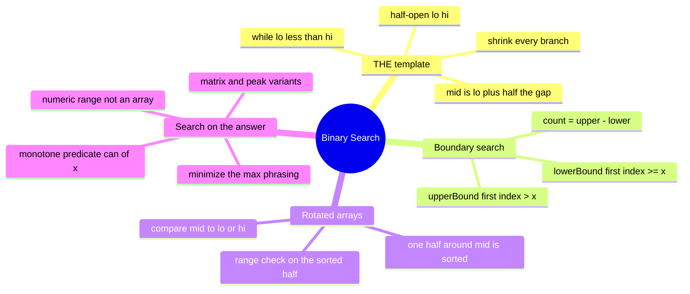

# 10 — Binary Search · Cheat-sheet

## Concept map



*What to notice: every branch is the same loop with a different
condition — the four branches on the left are four ways to choose
that condition, not four different algorithms.*

## THE template, line by line

```ts
let lo = 0
let hi = nums.length        // half-open: hi is one PAST the last index
while (lo < hi) {            // loop ends exactly when the range is empty
  const mid = lo + Math.floor((hi - lo) / 2)   // floors toward lo, no overflow habit
  if (/* mid fails the condition */) {
    lo = mid + 1             // mid is proven wrong — exclude it
  } else {
    hi = mid                 // mid might be the answer — keep it
  }
}
// lo === hi: the first index where "the condition" is true
```

Swap only the condition inside the `if` — everything else is fixed.
That condition is: `nums[mid] >= target` (lower bound / exact search),
`nums[mid] > target` (upper bound), `can(mid)` (search on the answer),
or a "which half is sorted, is target in it" check (rotated arrays).

## Boundary recipes

| Question | Condition | Result when found | Result when absent |
| --- | --- | --- | --- |
| First index `>= x` | `nums[mid] >= x` | that index | insertion point |
| First index `> x` | `nums[mid] > x` | just past the last `x` | insertion point |
| Count of `x` | — | `upperBound(x) - lowerBound(x)` | `0` |
| Exact match | `nums[mid] >= target` | check `nums[lo] === target` | `-1` |

## Rotated array decision rule

1. Compare `nums[mid]` to `nums[lo]`.
2. `nums[mid] >= nums[lo]` → **left half `[lo..mid]` is sorted**. Is
   `target` in `[nums[lo], nums[mid])`? Yes → search left
   (`hi = mid`). No → search right (`lo = mid + 1`).
3. Otherwise → **right half `(mid..hi)` is sorted**. Is `target` in
   `(nums[mid], nums[hi-1]]`? Yes → search right. No → search left.
4. Minimum-only (no target): compare `nums[mid]` to `nums[hi]`
   instead — bigger means the rotation point (and the minimum) is to
   the right of `mid`.

## Search-on-answer checklist

Before coding, answer three questions out loud:

1. **Range** — what are the smallest and largest values the answer
   could possibly be? (`lo` = the most extreme value that's always
   feasible or never feasible; `hi` = the other end.)
2. **Predicate** — what one-line `can(x)` question decides feasibility
   at a candidate `x`? How much does one call cost?
3. **Monotone proof** — one sentence: "as `x` increases, `can(x)` can
   only go from false to true, never back," and why that's true for
   THIS problem. If you can't finish that sentence, binary search does
   not apply here.

Cue phrases: "**minimize the maximum** ___", "**smallest**
capacity/speed/size such that ___ **finishes in time**", "**maximum**
___ such that it's still possible to ___". The array in the problem
statement is the predicate's INPUT, not what you search.

## Overflow note

JS/TS numbers are IEEE-754 doubles (safe integers to 2^53) — `lo + hi`
won't silently wrap the way it can in fixed-width 32-bit languages.
Use `lo + Math.floor((hi - lo) / 2)` anyway: it's correct in every
language, and consistency beats "this language happens to be safe
today."

## Self-quiz

1. Why does `while (lo < hi)` avoid both the infinite-loop bug and the
   off-by-one bug that `while (lo <= hi)` templates are prone to?
2. What does the loop's `lo === hi` value mean, in one sentence?
3. Write `upperBound`'s condition, given `lowerBound`'s is
   `nums[mid] >= x`.
4. In a rotated array, `nums[mid] >= nums[lo]`. Which half is
   guaranteed sorted, and what's the next check?
5. What are the three things you must state before applying
   search-on-answer to a new problem?
6. Why is "minimum capacity so shipping finishes within d days" a
   search-on-answer problem, but "minimum days needed at a FIXED
   capacity" isn't (name the one-pass method that replaces it)?
7. For 2D matrix search, what's the formula converting a flat index
   `mid` into `(row, col)`?
8. `findPeak`'s array isn't sorted. What guarantee replaces
   "sortedness" to make binary search valid there?

<details><summary>Answers</summary>

1. The loop only ends when the range `[lo, hi)` is truly empty, so
   there's no leftover "did I check the last candidate?" case, and
   every branch strictly shrinks the range so it can't loop forever.
2. It's the first index where "the condition" is true (or
   `nums.length` if the condition is never true).
3. `nums[mid] > x` (the only change from `lowerBound`).
4. The left half `[lo..mid]` is sorted; check whether `target` falls
   in `[nums[lo], nums[mid])` to decide whether to keep the left half
   or move to the right.
5. The candidate range (`lo`/`hi`), the one-line predicate `can(x)`,
   and a one-sentence proof that `can` is monotone over that range.
6. Minimizing capacity has no closed form — you must try candidates,
   so it needs search. Minimizing group count at a fixed capacity is
   answered directly by one greedy pass (pack until full, start a new
   group) — no candidates to try, so binary search would be pointless
   there.
7. `row = Math.floor(mid / cols)`, `col = mid % cols`.
8. That a peak always exists in the direction you're walking uphill
   toward (`nums[mid] < nums[mid + 1]` guarantees a peak somewhere to
   the right) — not that the array is sorted.

</details>

## Pattern-recognition drill

For each, name the technique: exact/boundary search, rotated search,
search-on-answer, matrix search, peak search, or "not binary search."

1. "Find the smallest divisor of an array such that the sum of
   ceil(num/divisor) is at most a threshold."
2. "An array was sorted, then rotated at an unknown pivot — find a
   target value."
3. "Given a sorted array of exam scores, count how many scored exactly
   85."
4. "Split a sequence of book pages among k binders, minimizing the
   most pages any one binder holds."
5. "Find any local maximum in an array where neighbors are always
   different."
6. "A list of unsorted, unrelated customer IDs — find one equal to a
   given ID."
7. "Rows and columns of a grid are each sorted, and every row starts
   higher than the previous row ended — does a value exist?"
8. "Given the exact day a bug was introduced is unknown, but a
   `checkBuild(n)` function tells you if build `n` has the bug, and
   the bug persists in every later build — find the first bad build."

<details><summary>Answers</summary>

1. Search on the answer (feasibility predicate over a numeric range,
   "smallest ... such that ... at most" cue).
2. Rotated search (which-half-is-sorted decision rule).
3. Boundary search (`upperBound - lowerBound`).
4. Search on the answer — "minimize the maximum," the split/capacity
   family (same predicate as `splitMinLargest`/`minCapacity`).
5. Peak search (monotone-uphill guarantee, not sortedness).
6. Not binary search — unsorted and unrelated, no monotone structure
   to exploit; needs a linear scan or a hash set.
7. Matrix search (flat index space over one sorted sequence).
8. Search-on-answer over an injected predicate, no array at all (the
   `firstBadBuild` shape).

</details>
