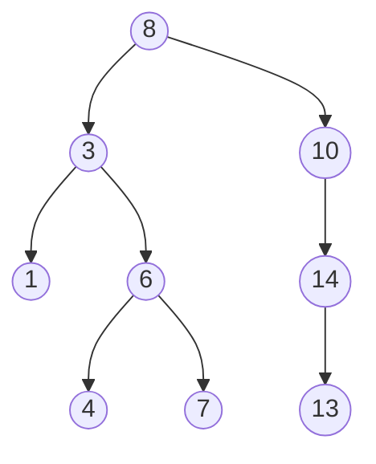
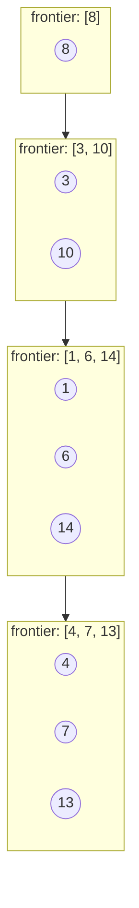
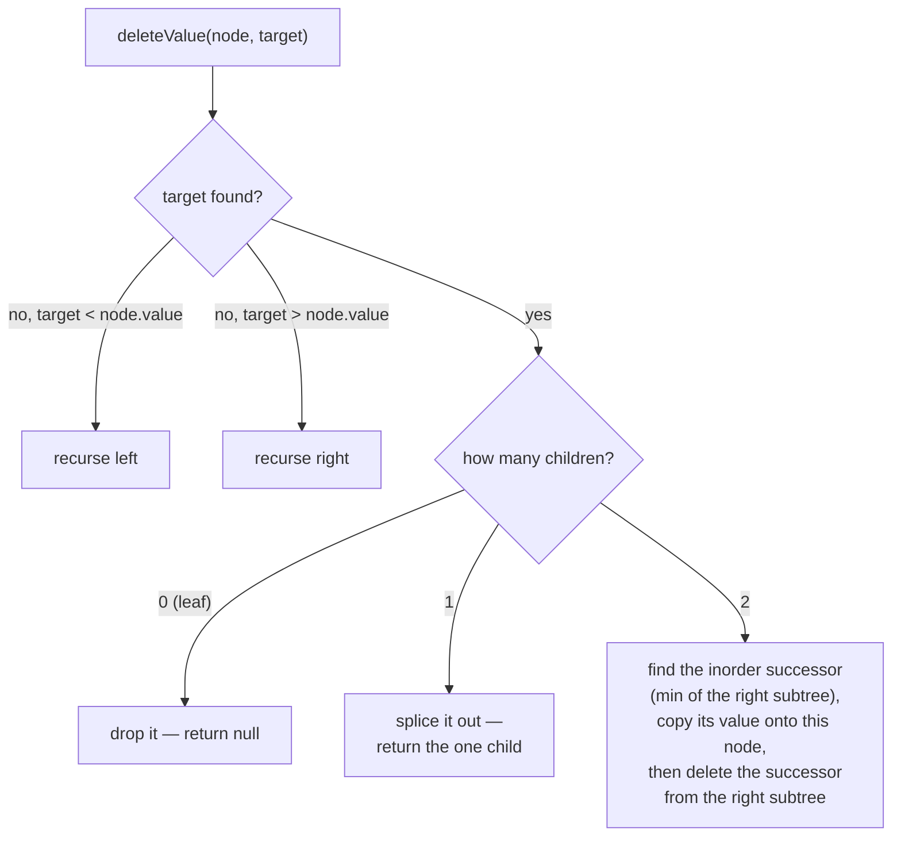

# 11 — Trees & BSTs

## Why this exists

Hierarchies are everywhere: file systems, the DOM, org charts, decision
trees. A **tree** models "one parent, many children" directly, so
questions like "how deep is this?" or "what's below X?" become natural
recursion instead of index arithmetic.

A **binary search tree** (BST) adds an ordering rule on top, and that
rule buys you something a hash map can't give you: O(log n) search
*and* sorted order *and* range queries, all from the same structure. A
hash map answers "is X here?" in O(1) but has no idea what's next in
order or what falls between two values — a BST answers all three in
O(h), where h is the tree's height.

## Vocabulary

| Term | Meaning |
| --- | --- |
| root | the single top node; every other node descends from it |
| leaf | a node with no children |
| depth (of a node) | number of edges from the root down to that node |
| height (of a node) | number of edges on the longest path down to a leaf below it |
| balanced | for every node, its left and right subtree heights differ by at most 1 |
| complete | every level is full except possibly the last, which fills left to right |

## The four traversal orders

Same tree, four different visit orders. The difference is entirely
**when** you visit the current node relative to its children.



*What to notice: this is one fixed tree — everything below reads off
the same shape, just in a different order.*

| Order | Visit node relative to children | Result on this tree |
| --- | --- | --- |
| preorder | before both | 8, 3, 1, 6, 4, 7, 10, 14, 13 |
| inorder | between left and right | 1, 3, 4, 6, 7, 8, 10, 13, 14 |
| postorder | after both | 1, 4, 7, 6, 3, 13, 14, 10, 8 |
| level order (BFS) | by depth, left to right | [8], [3, 10], [1, 6, 14], [4, 7, 13] |

Notice inorder on *this* tree comes out sorted — that's not a
coincidence, it's the BST invariant (more below).

## DFS recursively: trust the subtree

Module 08's leap of faith applies directly: **assume the recursive
call already correctly processes the subtree**, and write the current
node's step around that assumption. You never trace the whole
recursion by hand — you trust it.

```ts
function preorder(node: TreeNode | null, out: number[]): void {
  if (node === null) return          // base case: empty subtree
  out.push(node.value)               // visit BEFORE children
  preorder(node.left, out)
  preorder(node.right, out)
}

function inorder(node: TreeNode | null, out: number[]): void {
  if (node === null) return
  inorder(node.left, out)
  out.push(node.value)               // visit BETWEEN children
  inorder(node.right, out)
}

function postorder(node: TreeNode | null, out: number[]): void {
  if (node === null) return
  postorder(node.left, out)
  postorder(node.right, out)
  out.push(node.value)               // visit AFTER children
}
```

The three functions are identical except for one line's position.
That's the whole idea of "traversal order."

## DFS iteratively, and BFS

Recursion uses the **call stack** for you. You can make that stack
explicit and drop the recursion:

```ts
function inorderIterative(root: TreeNode | null): number[] {
  const out: number[] = []
  const stack: TreeNode[] = []
  let current = root
  while (current !== null || stack.length > 0) {
    while (current !== null) {       // walk all the way left
      stack.push(current)
      current = current.left
    }
    current = stack.pop() as TreeNode  // visit
    out.push(current.value)
    current = current.right            // then go right
  }
  return out
}
```

BFS ("per level") needs a **queue**, not a stack — first node
discovered is the first one expanded, so whole levels finish before
the next one starts:

```ts
function levelOrder(root: TreeNode | null): number[][] {
  if (root === null) return []
  const levels: number[][] = []
  let frontier: TreeNode[] = [root]
  while (frontier.length > 0) {
    levels.push(frontier.map((n) => n.value))
    const next: TreeNode[] = []
    for (const node of frontier) {
      if (node.left !== null) next.push(node.left)
      if (node.right !== null) next.push(node.right)
    }
    frontier = next
  }
  return levels
}
```



*What to notice: the whole frontier moves down one level at a time —
that's what "level order" means, and why it needs a queue (FIFO), not
a stack.*

## BSTs: the ordering invariant

**The BST invariant:** for every node, *every* value in its left
subtree is less than the node's value, and *every* value in its right
subtree is greater — not just the immediate children. A node can have
a left child that's smaller and still break the invariant two levels
down. This is the classic trap in `is_valid_bst`-style problems:
checking only parent-vs-child passes trees that are NOT valid BSTs.
The fix is to carry a `(min, max)` bound down the recursion and
tighten it at every step (see SUMMARY.md for the template).

**Insert / search / min / max** all follow the same shape: at each
node, compare the target to `node.value` and go left or right — never
both. That single comparison per level is why these are O(h).

**Delete** is the one with real cases, because removing a node must
not break the invariant for whoever is left behind:



*What to notice: the two-children case never actually "deletes" the
node in place — it borrows a value from the successor and turns the
problem into deleting THAT (easier, 0-or-1-child) node instead.*

## How to recognize it

- "for every level" / "row by row" / "shortest hierarchy path" →
  **BFS** (queue, level order).
- "path from root" / "combine an answer from both children" / "is
  this tree ___ (balanced, symmetric, same as...)" → **DFS**
  (recursive, trust the subtree).
- "give me sorted order from a tree" / "kth smallest" / "sum of a
  range of values" → **inorder traversal / BST ordering** — the tree
  IS the sorted structure, no separate sort step needed.
- "search / insert / delete keeping order" with no rebalancing
  mentioned → plain **BST** operations, O(h).

## Complexity

Every BST operation above is O(h), where h is the tree's height —
**not** O(n) or O(log n) directly, it depends entirely on shape:

- balanced tree: h = O(log n) → fast.
- degenerate tree (inserted in sorted order, so it's really a linked
  list): h = O(n) → every "BST" op degrades to linear.

Self-balancing trees (AVL, red-black) guarantee O(log n) height by
rebalancing on every insert/delete — how they do that is out of scope
here, but knowing *why* they exist (to bound h) is the point.

Traversals and metrics that visit every node are O(n) time; their
space cost is the recursion stack (or explicit stack/queue), which is
O(h) for DFS and O(n) in the worst case for BFS (the widest level of
a tree can hold up to ~n/2 nodes).

## Common gotchas

- **Validate with bounds, not with children.** Comparing a node only
  to its immediate children misses violations further down — always
  thread `(min, max)` through the recursion.
- **Null children everywhere.** Every recursive function needs a
  `node === null` base case; forgetting one is the #1 source of
  crashes in this module.
- **Recursion depth on skewed trees.** A tree built from sorted input
  degenerates to a linked list — recursive DFS on a 10,000-node
  skewed tree recurses 10,000 deep. It's fine for this course's test
  sizes, but it's *why* iterative traversal and self-balancing trees
  exist in real systems.
- **Duplicates.** This module's BST ignores duplicate inserts —
  decide and document that choice; other codebases push duplicates
  right by convention instead.

## Try it now

→ `exercises/ex01-build-bst.ts` through `ex08-construct-tree.ts`, then
`checkpoint.ts`. Check with `npm test -- 11`.
