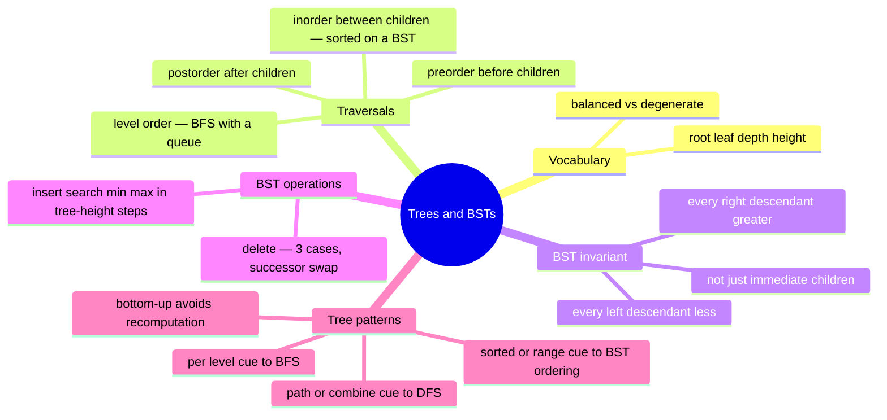

# 11 — Trees & BSTs · Cheat-sheet

## Traversal table

| Order | Visit vs. children | Typical use | Iterative tool |
| --- | --- | --- | --- |
| preorder | before both | copy/serialize a tree (root first) | explicit stack |
| inorder | between left and right | sorted order on a BST | explicit stack |
| postorder | after both | delete/free a tree (children first) | explicit stack (two-stack trick) |
| level order | by depth, left to right | "per level" questions, shortest steps | queue (BFS) |

## BST operation costs

| Operation | Balanced tree | Skewed (degenerate) tree |
| --- | --- | --- |
| search / insert / delete | O(log n) | O(n) |
| min / max | O(log n) | O(n) |
| inorder traversal | O(n) always | O(n) always |

All of these are really "O(h)" — the table just plugs in h = log n
(balanced) vs. h = n (skewed, effectively a linked list).

## The validate-with-bounds template

```ts
function isValidBst(node: TreeNode | null, min: number | null, max: number | null): boolean {
  if (node === null) return true
  if (min !== null && node.value <= min) return false
  if (max !== null && node.value >= max) return false
  return isValidBst(node.left, min, node.value) && isValidBst(node.right, node.value, max)
}
// call as isValidBst(root, null, null)
```

Comparing a node only to its immediate children is the classic bug —
it misses a grandchild that violates the invariant two levels down.

## Which traversal when

- Need every node, order doesn't matter -> any DFS order, pick preorder.
- Need sorted order out of a BST -> inorder.
- Need to rebuild/delete matching a dependency order (children before
  parent) -> postorder.
- Need "per level," "shortest," or "row by row" -> BFS / level order.
- Need to combine info from both children into a parent's answer
  (depth, balance, diameter, symmetry) -> DFS, bottom-up.

## Mindmap



*What to notice: every later problem in this module is one of these
four branches applied to a specific question — recognizing which
branch is the whole skill.*

## Self-quiz

1. What's the difference between a node's depth and its height?
2. Why does inorder traversal come out sorted specifically on a BST
   (not on an arbitrary binary tree)?
3. Why is checking only `node.value` against its immediate children
   not enough to validate a BST?
4. Which of the three BST delete cases needs the inorder successor,
   and why can't you just delete the node directly in that case?
5. What data structure powers BFS, and why does DFS's iterative
   version need a different one?
6. Why is a naive `isBalanced` that calls a separate height function
   at every node O(n^2) on a skewed tree, and what fixes it?
7. `lca_bst`/`lcaBst` walks from the root using ordering, in O(h)
   time. Why doesn't the general-tree LCA (checkpoint's
   `commonManager`) get to do that?
8. Balanced height is O(log n); skewed height is O(n). What real-world
   structures (mentioned but out of scope) exist specifically to
   prevent the skewed case?

<details><summary>Answers</summary>

1. Depth counts edges from the ROOT down to a node; height counts
   edges from a node down to its deepest leaf. They're measured in
   opposite directions.
2. Inorder visits left-subtree, node, right-subtree — and the BST
   invariant guarantees everything in the left subtree is smaller and
   everything in the right is bigger, so that visit order is exactly
   ascending order. A plain binary tree has no such guarantee.
3. The invariant is global — every node in an entire subtree must
   satisfy the bound, not just direct children. A node two levels down
   can violate an ancestor's bound while still looking fine next to
   its own parent.
4. The two-children case. Removing the node directly would leave two
   orphaned subtrees with nowhere valid to reattach; copying up the
   inorder successor's value and deleting THAT (0- or 1-child) node
   instead keeps the invariant intact with a much simpler delete.
5. BFS uses a queue (FIFO — process discovery order) so whole levels
   finish before the next starts. DFS naturally uses a stack (LIFO,
   which recursion gives you for free) so it dives all the way down
   one branch before backtracking.
6. Because at every one of the n nodes, it re-walks that node's entire
   subtree to measure height — on a skewed tree, that's O(n) work
   repeated n times. The fix is a single bottom-up pass where each
   node's height is computed once and reused by its parent (a -1
   sentinel signals "already found unbalanced" without extra work).
7. A BST's ordering tells you which side a value is on without
   looking — so you can pick one direction to descend. A general tree
   has no such rule, so you must search both subtrees and combine
   what each one reports (the two-value DFS).
8. Self-balancing trees (AVL, red-black) — they rebalance on every
   insert/delete to guarantee O(log n) height, at the cost of extra
   bookkeeping on every write.

</details>

## Pattern-recognition drill

For each one-liner, name the pattern/structure before peeking.

1. "Return the values you'd see looking at the tree from the right."
2. "Find the smallest value greater than or equal to X in a sorted
   structure with fast insert/delete."
3. "Given a tree's root-first and left-root-right traversal, rebuild
   the tree."
4. "Is this tree a mirror image of itself?"
5. "Sum every value between lo and hi in a large sorted tree — don't
   touch values you can prove are out of range."
6. "Group every node's value by how many steps it is from the root."
7. "Two nodes somewhere in a tree — find their nearest shared
   ancestor, given no ordering to exploit."
8. "A tree built from already-sorted input has every operation degrade
   to O(n) — why?"

<details><summary>Answers</summary>

1. **BFS / level order** — keep the last node visited at each level
   (right side view).
2. **BST** — a BST supports insert/delete/search AND sorted-order
   queries in O(log n) balanced, something a hash set can't do.
3. **DFS reconstruction from preorder + inorder** — preorder gives
   roots, inorder gives the left/right split at each root.
4. **DFS, mirrored pair of pointers** — recurse on (left, right)
   walking inward as reflections of each other.
5. **BST range sum with pruning** — the ordering lets you skip an
   entire out-of-range subtree in O(1) instead of visiting it.
6. **BFS / level order** — the frontier at each iteration IS "one step
   further from the root."
7. **General-tree LCA, two-value DFS** — search both children; a node
   where both sides report a find is the split point.
8. It **degenerates into a linked list** — sorted input inserted in
   order always goes the same direction (all-left or all-right), so
   height h = n instead of O(log n), and every "O(h)" operation
   becomes O(n).

</details>
