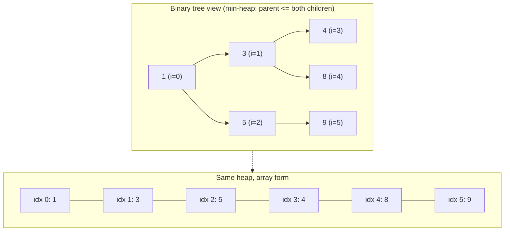
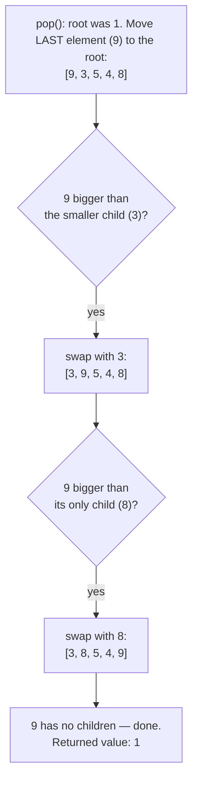

# 12 — Heaps & Priority Queues

## Why this exists

Sometimes you don't need everything sorted — you just need "give me
the smallest (or largest) RIGHT NOW, and keep taking them" as new
items keep arriving. Sorting the whole collection every time something
changes is O(n log n) per change. A **heap** answers "what's smallest"
in O(1) and both inserts and removals in O(log n) — it stays "mostly
ordered" instead of "fully ordered", which is exactly the amount of
order this question needs.

## The shape: a complete binary tree, packed into an array

A heap is a **complete binary tree** (every level full except
possibly the last, which fills left to right) stored with no pointers
at all — just an array, using arithmetic to find parents and children.

*What to notice: index `i`'s parent is `(i-1)/2` (rounded down), and
its children are `2i+1` and `2i+2` — index 1's children are 3 and 4,
matching the tree above. Completeness is what makes this arithmetic
work; there are never "holes" to skip over.*

## The heap property — NOT sorted, and that's the point

A **min-heap** only guarantees: every parent is `<=` both of its
children. It says nothing about how left compares to right, or how
deep nodes compare to shallow ones on a different branch. `[1, 3, 5,
4, 8, 9]` is a valid heap even though it isn't sorted — that looseness
is exactly why insert/remove only cost O(log n) instead of O(n).

| | Sorted array | Heap |
| --- | --- | --- |
| Find the min | O(1) | O(1) |
| Remove the min | O(n) (shift everything) | O(log n) |
| Insert | O(n) (shift to keep sorted) | O(log n) |
| "Is element 5 bigger than element 2?" | yes, always | not defined |

## Sift up (push) and sift down (pop)

**Push**: append the new value at the end (keeps the tree complete),
then **sift up** — swap it with its parent while it's smaller, until
the property holds again.

**Pop**: the min is always the root. Move the *last* element into the
root's spot (keeps the tree complete), discard the old root, then
**sift down** — swap the new root with its smaller child while it's
bigger than that child.

*What to notice: sift-down always compares against the SMALLER child
(never the bigger one) — swapping with the bigger child could put
something larger above something smaller, breaking the property you
just tried to restore.*

## Heapify: building a heap from an array in O(n)

You could build a heap by pushing every element one at a time —
O(n log n). Bottom-up **heapify** is faster: starting from the last
*parent* (skip the leaves — they're already valid 1-node heaps) and
working back to the root, sift each node down.

**Why this is O(n), not O(n log n):** a sift-down's cost is bounded by
that node's *height* (distance to the farthest leaf below it), not by
n. In a complete tree, half the nodes are leaves (height 0, free),
a quarter are height 1, an eighth are height 2, and so on — most
nodes are near the bottom and barely move. Summing `(count at height
h) * h` over the whole tree converges to O(n), because it's a
geometric-ish series, not n copies of `log n`. Pushing one at a time
doesn't get this discount: every insert can travel all the way from a
leaf to the root.

## How to recognize it

- **"kth largest / kth smallest"** → heap of size k (see the inversion
  below — it's easy to get backwards).
- **"top k", "k most frequent", "k closest"** → same size-k heap
  trick.
- **"merge k sorted ___"** → a heap holding one "next candidate" per
  source.
- **"running median" / "streaming median"** → two balanced heaps.
- **"schedule by priority", "who's next", "most urgent first"** → a
  priority queue is just a heap with a job title.

**The k-size-heap trick (the inversion that trips everyone):** to find
the top-k **LARGEST** values, keep a **MIN**-heap of size k. That
feels backwards until you ask *what does the heap need to do cheaply?*
— evict the *weakest* member of your current top-k club the instant a
stronger candidate shows up. The weakest member of a "largest" club is
the *smallest* one, so you need fast access to the min → min-heap.
Symmetrically: top-k **SMALLEST** → **MAX**-heap of size k (evict the
largest candidate).

## Worked example: top-3 of a stream

Stream: `7, 2, 9, 4, 1, 8, 3`. Keep a **min-heap of size 3** (top-3
*largest* — so min-heap, per the inversion above). Rule: push the new
value; if the heap now holds more than 3, pop the min.

| Step | New value | Heap before | Action | Heap after |
| --- | --- | --- | --- | --- |
| 1 | 7 | `{}` | push (size 1 <= 3) | `{7}` |
| 2 | 2 | `{7}` | push (size 2 <= 3) | `{2, 7}` |
| 3 | 9 | `{2, 7}` | push (size 3 <= 3) | `{2, 7, 9}` |
| 4 | 4 | `{2, 7, 9}` | push, size 4 > 3 → pop min (2) | `{4, 7, 9}` |
| 5 | 1 | `{4, 7, 9}` | push, size 4 > 3 → pop min (1) | `{4, 7, 9}` |
| 6 | 8 | `{4, 7, 9}` | push, size 4 > 3 → pop min (4) | `{7, 8, 9}` |
| 7 | 3 | `{7, 8, 9}` | push, size 4 > 3 → pop min (3) | `{7, 8, 9}` |

Final heap `{7, 8, 9}` — exactly the true top 3 of the stream. The
root (7) is always the *smallest of the current top-k*, i.e. the
answer to "what's the kth largest so far?"

## Complexity

| Operation | Time | Why |
| --- | --- | --- |
| peek (min) | O(1) | it's always the root |
| push | O(log n) | sift up travels at most the tree's height |
| pop | O(log n) | sift down travels at most the tree's height |
| heapify (build from array) | O(n) | most nodes are near the leaves — see above |
| heap sort | O(n log n) | n pops, each O(log n) |

Space is O(n) to hold the elements, O(1) extra for push/pop/peek (no
recursion needed — the loops above are iterative).

## Common gotchas

- **Min vs max**: every heap here is a min-heap by default. To get
  max-heap behavior, either negate the values going in and out, or
  (nicer) flip the comparator (`(a, b) => b - a` instead of
  `(a, b) => a - b`).
- **Heaps of tuples/pairs**: when you heap records instead of raw
  numbers (frequency counts, points, patients), decide the FULL
  ordering up front, including tie-breaks — `(severity desc, timestamp
  asc)` — and bake it into one comparator. An incomplete comparator
  makes tie order arbitrary and non-reproducible.
- **Lazy deletion** (mention only): removing an *arbitrary* element
  from the middle of a heap (not the root) is expensive to do
  correctly. A common trick is to mark it "deleted" and skip it lazily
  when it eventually surfaces at the root, instead of paying to find
  and patch the middle of the tree immediately.

## Try it now

→ `exercises/ex01-build-min-heap.ts` through `ex07-merge-k-sorted.ts`,
then `checkpoint.ts`. Check with `npm test -- 12`.
