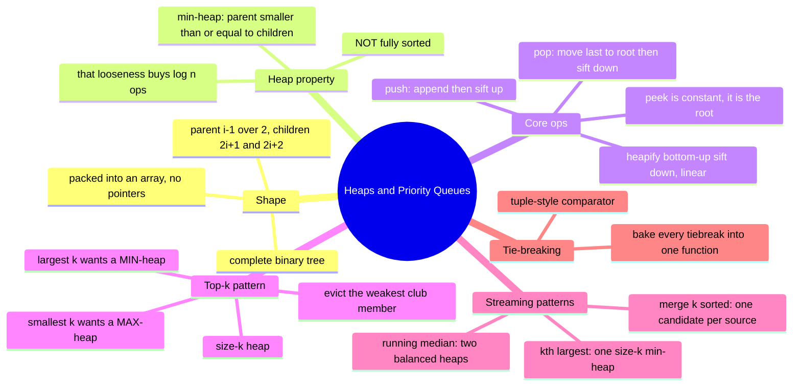

# 12 — Heaps & Priority Queues · Cheat-sheet

## Concept map



*What to notice: everything under "Streaming patterns" is really the
same size-k / two-heap idea from "Top-k pattern", just applied to a
live stream instead of a fixed batch.*

## Index math (array-packed complete binary tree)

| From index `i` | Formula |
| --- | --- |
| Parent | `(i - 1) >> 1` (integer division by 2, rounded down) |
| Left child | `2 * i + 1` |
| Right child | `2 * i + 2` |
| Root | `0` |

## Op-cost table

| Operation | Time | Space |
| --- | --- | --- |
| `peek()` | O(1) | O(1) |
| `push(val)` | O(log n) | O(1) amortized |
| `pop()` | O(log n) | O(1) |
| `MinHeap.heapify(nums)` | O(n) | O(n) |
| Heap sort (n pops) | O(n log n) | O(1) extra (in-place variant) |
| Size-k top-k scan | O(n log k) | O(k) |
| Two-heap running median | O(log n) per add, O(1) per read | O(n) |
| Merge k sorted (n total elements) | O(n log k) | O(k) |

## The top-k inversion rule

> Want the k **LARGEST** → keep a **MIN**-heap of size k.
> Want the k **SMALLEST** → keep a **MAX**-heap of size k.

Why: the heap's job is to cheaply find and evict the *weakest* member
of your current top-k club whenever a stronger candidate shows up. The
weakest member of a "largest" club is the smallest value in it — so
you need O(log k) access to the *minimum*, which is what a min-heap
gives you for free at the root.

## Tuple-key tie-breaking

When two entries compare equal on the primary key, decide the
tiebreak up front and encode BOTH into one comparator:

```ts
// severity descending, then timestamp ascending (earlier arrival wins ties)
const byUrgency = (a: PatientRecord, b: PatientRecord): number =>
  b.severity - a.severity || a.timestamp - b.timestamp
```

The `||` chain reads as "compare by the first key; if that's a tie
(`0`), fall through to the next key."

## JS/TS heap API notes

JavaScript has **no built-in heap or priority queue** — there's no
`heapq` or `PriorityQueue` in the standard library. This module builds
one from scratch (`ex01`); from `ex03` on, exercises get a small
generic `MinHeap<T>` provided in the exercise file (comparator-based,
so it heaps anything: numbers, tuples, records). Outside this course,
`Array.prototype.sort` is the common sledgehammer for "just sort it",
and npm packages (`heap-js`, `tinyqueue`) exist for real projects.

| If you need... | Reach for |
| --- | --- |
| Min-heap of numbers | `new MinHeap<number>((a, b) => a - b)` |
| Max-heap of numbers | `new MinHeap<number>((a, b) => b - a)` |
| Heap of records with a tiebreak | `new MinHeap<T>((a, b) => primary \|\| secondary)` |

## Gotchas

- Min vs max is just the comparator's sign — don't rebuild the whole
  heap class for a max-heap.
- A heap is *partially* ordered — never assume left-to-right or
  top-to-bottom order beyond "parent <= children".
- Heapify one array in O(n); don't push elements one at a time into an
  empty heap if you already have all of them (that's O(n log n)).
- Removing an arbitrary (non-root) element cheaply needs lazy deletion
  or a position-tracking index — plain heaps don't support it directly.

## Self-quiz

1. For index `i`, what are the formulas for its parent and its two
   children?
2. Why is bottom-up `heapify` O(n) instead of O(n log n)?
3. You need the 5 smallest of a huge stream. Min-heap or max-heap of
   size 5, and why?
4. What's the difference between "the heap is valid" and "the array is
   sorted"?
5. Why does `pop()` move the *last* element to the root instead of,
   say, the second-smallest child?
6. You're heaping `{ name, score }` records by score, highest first,
   ties broken by earliest `submittedAt`. Write the comparator.
7. What's the time complexity of merging k sorted lists with a
   size-k heap, in terms of total elements n and list count k?
8. Why does sift-down always compare against the smaller child, never
   the larger one?

<details><summary>Answers</summary>

1. Parent: `(i - 1) >> 1`. Left child: `2i + 1`. Right child: `2i + 2`.
2. Most nodes sit near the leaves, where a sift-down only travels a
   short distance; summing `(nodes at height h) * h` over the tree
   converges to O(n), unlike pushing one at a time (each insert can
   travel the full height).
3. Max-heap of size 5 — you want to cheaply evict the *largest* of
   your current 5 candidates whenever a smaller value shows up.
4. A valid heap only guarantees each parent <= its children; a sorted
   array guarantees a total order across every pair of elements. Every
   sorted array is a valid heap, but not vice versa.
5. Moving the last element keeps the tree *complete* (no gaps) in O(1)
   — any other choice would leave a hole that breaks the array-index
   math for parents/children.
6. `(a, b) => b.score - a.score || a.submittedAt - b.submittedAt`.
7. O(n log k) — each of the n elements is pushed and popped once, and
   the heap never holds more than k entries at a time.
8. Swapping with the larger child could place a bigger value above a
   smaller one somewhere in the tree, which breaks the very property
   sift-down is supposed to restore.

</details>

## Pattern-recognition drill

For each prompt, name the pattern/structure before peeking.

1. "Return the 4 highest-scoring submissions out of a huge stream of
   incoming scores."
2. "Merge 500 already-sorted result shards into one sorted list."
3. "Track the median response time of a service as requests keep
   arriving."
4. "Find the 3rd smallest value in an already-sorted array."
   (decoy — think about what "already sorted" buys you)
5. "Process jobs in order of priority, where new jobs can arrive at
   any time."
6. "From a list of cities, find the 10 closest to a given
   coordinate."
7. "Find the single largest value in an unsorted array."
   (decoy — think about what tool this actually needs)
8. "Count how often each word appears in a huge log, then report the
   top 20 most common words."

<details><summary>Answers</summary>

1. Size-k **min-heap** (top-k largest → min-heap trick).
2. **Heap of k candidates**, one per shard (merge-k-sorted pattern).
3. **Two balanced heaps** (running median).
4. Decoy — it's sorted, so just index `arr[2]`. No heap needed.
5. **Priority queue** (heap), directly — this is the textbook use
   case, not a "top-k of a fixed batch" variant.
6. Size-k **max-heap** keyed by distance (k closest → max-heap trick).
7. Decoy — a single pass tracking one running max is O(n) and needs no
   heap at all.
8. Count with a map, then a size-20 **min-heap** keyed by frequency
   (top-k frequent pattern).

</details>
