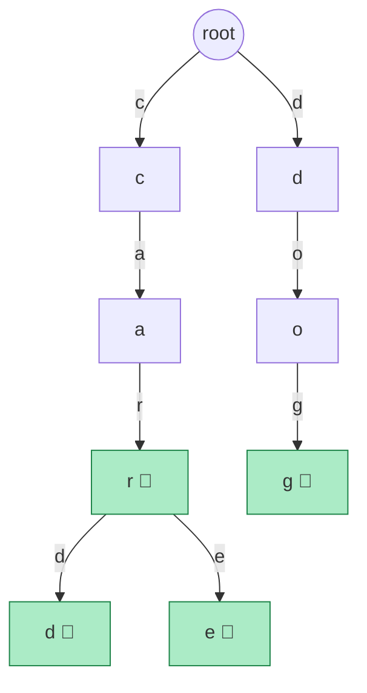
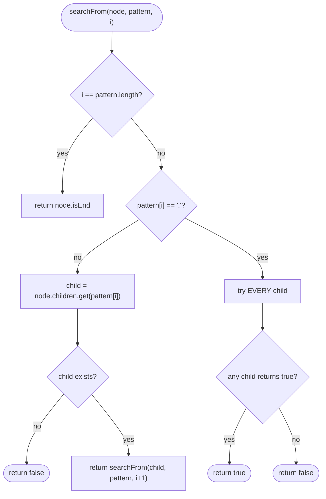

# 13 — Tries

## Why this exists

A hash set of words answers one question well: "is this exact string
here?" — O(L) where L is the word's length. But ask it "what words
start with `pre`?" and it has no better move than scanning every
stored word and checking each one's prefix: O(n · L). The hash map
doesn't know that `prefix`, `prep`, and `pretzel` share anything —
every entry is an independent, unrelated key.

A **trie** (prefix tree) shares prefixes structurally: words that
start the same way share the same nodes. Insert, exact search, and
prefix search are all O(L) — independent of how many words are
stored. That's the headline: n can be a million words and a prefix
query still only costs as much as the prefix is long.

## Anatomy



*What to notice: `"car"`, `"card"`, and `"care"` share the same
`c → a → r` spine — the branching only starts where the words
actually differ. The 🏁 flag marks "a word ends here," which is a
separate bit from "this node exists" (`"car"` is a real word AND a
prefix of `"card"`; both facts live on the same node).*

Each node is:

- a map from character → child node (`children`), and
- an `isEnd` flag: does a stored word end exactly here?

`children` as a hash map (`Map<string, TrieNode>`) works for any
alphabet and stays memory-light when most nodes have few children.
The classic alternative — a fixed-size array (`children[26]` for
lowercase English) — trades that flexibility for O(1) *guaranteed*
child lookup with no hashing, at the cost of allocating 26 slots per
node even when a node has one child. This course uses the map; know
the array trade-off exists for when the alphabet is small and fixed.

## Operations

- **insert(word)** — walk from the root, one character at a time,
  creating a child node whenever the next character has no edge yet.
  Mark the final node's `isEnd = true`.
- **search(word)** (exact match) — walk the same path. If any
  character has no edge, the word isn't there — return `false`. If
  you reach the end of the word, return the last node's `isEnd`
  (walking the whole path isn't enough — `"car"` being walkable
  doesn't mean `"car"` was ever inserted as its own word if only
  `"card"` was).
- **startsWith(prefix)** — same walk, but you don't care about
  `isEnd` at all — reaching the end of the prefix means *some* word
  extends it (or equals it).

All three are **O(L)** in the length of the word/prefix — the walk
touches exactly one node per character, and a hash-map lookup per
step is O(1) expected. Total words stored (n) never enters the cost.

## How to recognize it

- The problem statement says **"prefix"**, **"starts with"**, or
  **"autocomplete"**.
- You need many **exact-match AND prefix** queries against the same
  fixed-ish dictionary of strings.
- **Wildcard matching over a whole dictionary** (one unknown
  character standing in for any character) — a hash set can't help;
  you need to branch.
- The problem is fundamentally about **character-by-character
  matching** with heavy prefix sharing — spell-checkers, IP routing
  tables (longest prefix match), word games.
- **Decoy:** "is this exact string in the set?" with no prefix or
  wildcard angle anywhere — that's a plain hash set, a trie buys
  nothing extra and costs more memory.

## The template

```typescript
class TrieNode {
  children: Map<string, TrieNode> = new Map();
  isEnd = false;
}

class Trie {
  private root = new TrieNode();

  insert(word: string): void {
    let node = this.root;
    for (const ch of word) {
      if (!node.children.has(ch)) {
        node.children.set(ch, new TrieNode());
      }
      node = node.children.get(ch)!;
    }
    node.isEnd = true;
  }

  private walk(prefix: string): TrieNode | null {
    let node = this.root;
    for (const ch of prefix) {
      const next = node.children.get(ch);
      if (!next) return null;
      node = next;
    }
    return node;
  }

  search(word: string): boolean {
    const node = this.walk(word);
    return node !== null && node.isEnd;
  }

  startsWith(prefix: string): boolean {
    return this.walk(prefix) !== null;
  }
}
```

Almost every trie exercise is a variation on `walk`: follow
characters one at a time, bail out the moment a character is
missing, then decide what "found" means at the end (`isEnd`? just
"node exists"? collect everything under this node?).

## Worked example: inserting `"care"` after `"car"`

Start from a trie that already contains `"car"` (root → c → a → r🏁).
Insert `"care"`:

| step | current node | next char | edge exists? | action |
| ---- | ------------- | --------- | ------------- | ------ |
| 1 | root | `c` | yes | move to `c` |
| 2 | `c` | `a` | yes | move to `a` |
| 3 | `a` | `r` | yes | move to `r` (already 🏁 from `"car"`) |
| 4 | `r` | `e` | no | create child `e`, move to it |
| 5 | `e` | (end of word) | — | mark `e.isEnd = true` |

Only **one new node** (`e`) was created — three of the four
characters were already there from `"car"`. `r.isEnd` stays `true`
(`"car"` is still a word), and now `e.isEnd` is also `true`
(`"care"` is a second, longer word sharing the same spine).

## Wildcard search

`WordDictionary.search(pattern)` treats `.` as "match any single
character here." A plain walk breaks the moment it hits a `.` — there
could be several children to try. The fix: **DFS that branches** at
every `.`, trying every child, and returns `true` if *any* branch
succeeds.



*What to notice: a literal character is a single deterministic step
(cheap), but a `.` fans out into up to "alphabet size" recursive
calls — worst case (all dots) degenerates toward exploring the whole
trie, not O(L) anymore.*

## Complexity

- `insert` / `search` / `startsWith`: **O(L)** time, where L is the
  word/prefix length — one hash-map step per character. Space: O(L)
  new nodes in the worst case (no shared prefix), O(1) extra when the
  prefix already exists.
- Wildcard `search`: **O(L)** when there are no dots (same as exact
  search); worst case (all dots, or dots early with a wide alphabet)
  is **O(alphabet^L)** — you're exploring a whole subtree. In
  practice it's bounded by the number of matching nodes actually
  reachable, which is far smaller than the full trie.
- Space overall: a trie of n words of average length L uses up to
  O(n · L) nodes, but shared prefixes shrink that a lot in practice —
  it's a real trade-off against a hash set's O(n · L) with no
  sharing at all.

## Common gotchas

- **`isEnd` vs. "has children."** A node can have children AND be a
  word's end (`"car"` inside `"card"`) — check `isEnd`, never
  "does this node have no children" as a stand-in for "is this a
  word."
- **Counting words vs. counting nodes.** The number of trie nodes is
  not the number of stored words — shared prefixes mean nodes are
  reused. If you need "how many words," track it explicitly (a
  pass-through counter, or count `isEnd` flags).
- **Memory footprint honesty.** A trie is not automatically more
  memory-efficient than a hash set — with little prefix sharing
  (random strings, few common prefixes) it can use *more* memory per
  word (one node object per character) than a hash set's one entry
  per whole word. The win is prefix *queries*, not raw storage.
- **Empty string policy.** Decide up front: does `insert('')` mark
  the root itself as a word? Does `startsWith('')` return `true` even
  on an empty trie? This module pins both to `true`/allowed — walking
  zero characters trivially "reaches" the root.
- **Case sensitivity.** A trie is exact per character — `"Car"` and
  `"car"` are different paths unless you normalize case before
  inserting. This module treats input as already-normalized
  (case-sensitive as given).

## Try it now

→ `exercises/ex01-build-trie.ts` through
`exercises/ex05-unique-prefixes.ts`, then `checkpoint.ts`.
Check with `npm test -- 13`.
