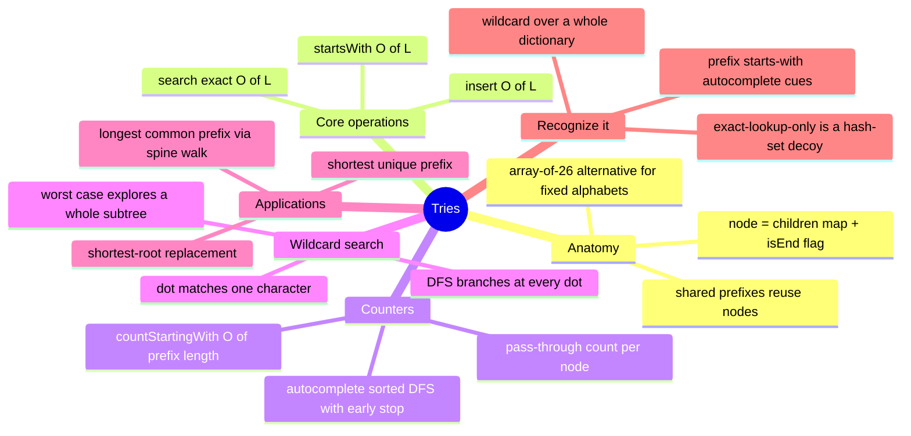

# 13 — Tries · Cheat-sheet

## Concept map



*What to notice: everything under "core operations" and "counters" is
the SAME walk (root to some node) — only what you read off the node at
the end changes (a boolean, a count, or a collected list).*

## Op costs: L = word/prefix length, n = words stored

| operation | cost | why n doesn't matter |
| --- | --- | --- |
| `insert(word)` | O(L) | one node created/visited per character |
| `search(word)` | O(L) | one hash-map lookup per character, then check `isEnd` |
| `startsWith(prefix)` | O(L) | same walk, skip the `isEnd` check |
| `countStartingWith(prefix)` | O(P) | read one pre-computed counter |
| `autocomplete(prefix, k)` | O(P + result size) | DFS bounded by `k`, not by `n` |
| wildcard `search(pattern)` | O(L) no dots; O(alphabet^dots) worst case | DFS must branch at each `.` |

## Trie vs. hash map vs. sorted array

| | exact lookup | prefix query | memory |
| --- | --- | --- | --- |
| **Trie** | O(L) | O(L) direct | one node per unique character position; can beat OR lose to a hash set depending on prefix sharing |
| **Hash map/set** | O(L) expected | O(n · L) — must scan every key | O(n · L), one entry per whole word |
| **Sorted array** | O(L · log n) (binary search) | O(L · log n) to find the range + O(matches) to read it | O(n · L), tightest of the three, but requires re-sorting on insert |

*What to notice: only the trie makes prefix queries structurally cheap
— the other two either scan everything or pay a search-then-scan cost
that's still proportional to how many matches there are, plus the
`log n`.*

## Wildcard-DFS template

```ts
function searchFrom(node: TrieNode, pattern: string, i: number): boolean {
  if (i === pattern.length) return node.isEnd

  const ch = pattern[i]!
  if (ch !== '.') {
    const next = node.children.get(ch)
    return next !== undefined && searchFrom(next, pattern, i + 1)
  }

  for (const child of node.children.values()) {
    if (searchFrom(child, pattern, i + 1)) return true
  }
  return false
}
```

## Rules to remember

- `isEnd` is a flag on a node, not the absence of children — `"car"`
  can be both a complete word AND a prefix of `"card"` at once.
- A pass-through counter (bumped on every node visited during insert)
  turns "how many words share this prefix" into a single field read.
- Sorted-order autocomplete falls out for free from a DFS that visits
  children in sorted key order and checks `isEnd` before descending.
- Wildcard search is exact-search's DFS cousin: a literal character is
  one deterministic step; a `.` is "try every child."
- "Shortest matching root" (replace-roots) = walk until the FIRST
  `isEnd`, because any longer match sits strictly further down the
  same path.
- "Shortest unique prefix" = walk until the counter hits 1; duplicates
  never hit 1, even at the full word.

## Gotchas

- Confusing "has no children" with "is not a word" — always check
  `isEnd` explicitly.
- Node count ≠ word count — shared prefixes mean fewer nodes than
  words stored; track a real counter if you need "how many words."
- Assuming a trie always saves memory — with little prefix overlap it
  can cost MORE than a hash set (one object per character vs. one
  entry per word).
- Forgetting the empty-string edge cases: this module pins
  `startsWith('')` to always `true`, and `insert('')` as allowed
  (marks the root itself as a word end).
- A `while`/DFS that doesn't stop early on wildcard search degrades to
  exploring the whole trie even when only a handful of results exist.

## Self-quiz

1. Why is `search("car")` allowed to be `false` even though
   `startsWith("car")` is `true`?
2. What's the time complexity of `insert`/`search`/`startsWith`, and
   why does it NOT depend on how many words are already stored?
3. What field turns "count words starting with this prefix" from an
   O(n) scan into an O(prefix length) read?
4. Why does a DFS that checks `isEnd` before descending into children
   naturally produce alphabetically-sorted results?
5. In wildcard search, why is a `.` so much more expensive than a
   literal character?
6. When does a trie lose to a plain hash set on memory, despite
   sharing structure?

<details><summary>Answers</summary>

1. `isEnd` is a separate flag from "this path exists." If only
   `"card"` was inserted, walking `"car"` succeeds (the nodes exist)
   but `"car"` itself was never marked as a complete word.
2. O(L), L = word/prefix length — the walk visits exactly one node
   per character, with an O(1)-expected hash-map lookup at each step;
   the total number of words stored never enters the walk.
3. A pass-through counter on each node, incremented for every word
   that visits it during insertion.
4. Because it visits children in sorted key order and records a word
   (if `isEnd`) before descending further — a shorter match is always
   found before any of its own extensions, matching how strings
   compare (a prefix sorts before its own extension).
5. A literal character is one deterministic hash-map lookup. A `.`
   has to try EVERY child recursively, since any of them could lead
   to a match — it turns one step into a fan-out.
6. When words share little or no prefix (e.g. random strings) — each
   trie node is a small object holding one character's worth of
   information, which can cost more per word than a hash set's single
   whole-word entry.

</details>

## Pattern-recognition drill

For each prompt, name the pattern/structure before checking the
answer.

1. "Given a dictionary and a stream of typed characters, return every
   word that could still match as the user types."
2. "Support adding words and querying them with `.` as a wildcard for
   any one letter."
3. "Given a list of contact names, is `'Ann'` one of them?" (nothing
   about prefixes)
4. "For every product SKU in a list, find the shortest code that
   uniquely identifies it among the others."
5. "Find the longest prefix shared by every filename in a directory
   listing."
6. "Given a router's list of network prefixes, find the most specific
   (longest) one that matches an incoming IP."

<details><summary>Answers</summary>

1. Trie + prefix search — classic autocomplete, structurally a
   `startsWith`/DFS-collect query.
2. Trie + wildcard DFS (the `WordDictionary` pattern).
3. **Decoy** — plain hash set. No prefix or wildcard angle; a trie
   would only add overhead here.
4. Trie with a pass-through counter — shortest-unique-prefix.
5. Trie spine walk (or the sort-and-compare-endpoints shortcut) —
   longest-common-prefix.
6. Trie walk keeping track of the deepest `isEnd` seen so far
   (longest-prefix-match — the same shape as ex04's shortest-root
   walk, but keeping the LAST end marker instead of the first).

</details>
