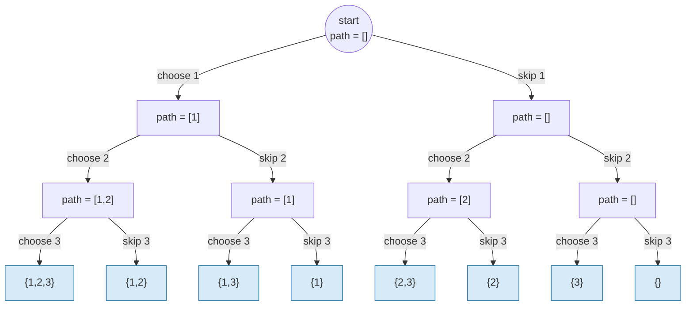
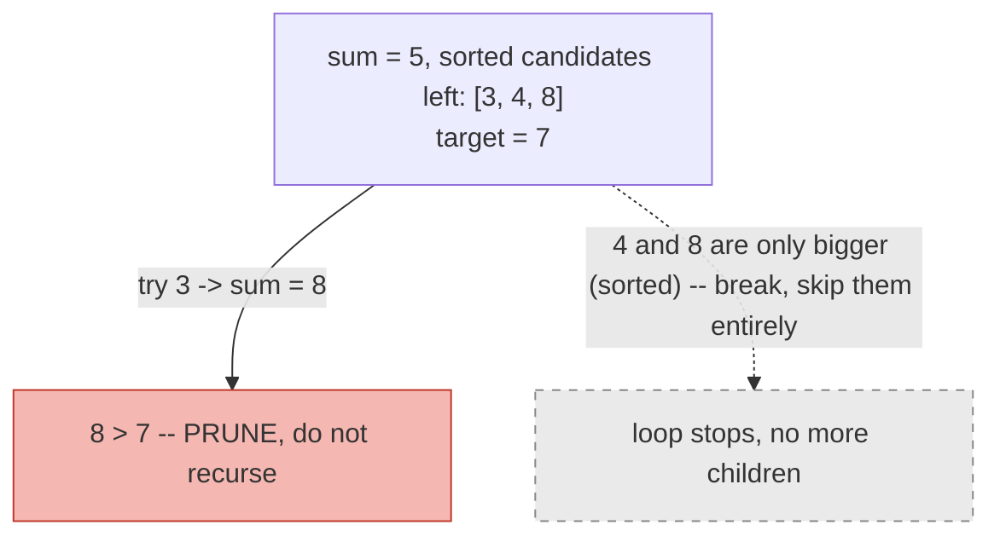

# 14 — Backtracking

## Why this exists

Some problems don't ask for one answer — they ask for **every** valid
answer: every subset, every way to partition a string, every board
where N queens don't attack each other. You can't loop your way
through "every subset of a set" the way you loop through an array —
the number of subsets is 2ⁿ, and there's no index that walks you
through them in order.

The brute-force instinct still works, though: try a choice, see where
it leads, and if it leads nowhere (or you've explored it fully), undo
the choice and try the next one. That's it. That's backtracking — DFS
over a **decision tree** where each node is a partial answer and each
edge is one choice, with an explicit **undo** step so the same path
array can be reused for every branch instead of copying it everywhere.

Compare it to module 08's call tree: same recursive shape, but now the
tree isn't just "recurse smaller" — it's "make a choice, recurse,
un-make the choice, make the next choice."

## The decision tree: subsets of `[1, 2, 3]`

At each element, decide **include** or **exclude**. Three elements →
three levels of decisions → 2³ = 8 leaves, each one a complete subset.



*What to notice: every root-to-leaf path is one subset, and the 8
leaves are exactly the 8 subsets of `{1,2,3}` — the tree's shape (2
choices, 3 levels) is where the 2ⁿ complexity comes from directly.*

## The template

Every backtracking function has the same three-beat rhythm:
**choose → explore → unchoose**.

```ts
function backtrack(path: number[], /* other state */): void {
  if (/* path is a complete answer */) {
    results.push([...path]) // COPY — see the gotcha below
    return
  }

  for (const choice of choicesAvailableHere()) {
    if (!isValid(choice)) continue // pruning hook — see below

    path.push(choice) // 1. choose
    backtrack(path /* , updated state */) // 2. explore
    path.pop() // 3. unchoose
  }
}
```

The same `path` array is mutated and restored on every branch — that's
what makes this O(n) space per branch instead of O(n) *copies* per
branch. The only place a full copy happens is the instant you record a
complete answer.

## The three classic shapes

The `for` loop's **range of choices** is what turns this one template
into subsets, combinations, or permutations.

| Shape | What varies each call | Loop range | Order matters? | Reuse element? |
| --- | --- | --- | --- | --- |
| **Subsets** | include / exclude *this* element | fixed: next index only | no (each element decided once) | no |
| **Combinations** | which index starts the next pick | `for i = start..n`, recurse with `start = i + 1` (or `i` if reuse allowed) | no — `[1,2]` and `[2,1]` are the same answer | only if the problem says so (e.g. combination sum) |
| **Permutations** | which *unused* element goes next | `for i = 0..n`, skip used elements | yes — order is the answer | no — each element used exactly once |

- **Subsets**: decide each element's fate once, in index order — the
  include/exclude tree above.
- **Combinations**: a `start` index stops you from re-picking anything
  before it, so `[1,2]` is only ever generated once (not also as
  `[2,1]`).
- **Permutations**: track *which elements are already used* (a
  `used[]` array, or a `Set`) instead of a start index, because every
  element is eligible at every position — order is exactly what you're
  generating.

## Handling duplicates: skip-same-choice-at-same-level

Sort first. Then, inside the loop, skip a choice if it's equal to the
**previous choice tried at this same recursion level** (`i > start &&
nums[i] === nums[i - 1]`). This is different from "skip if this value
is already in the path" — it only blocks re-trying an *identical
sibling branch*, not reusing the value deeper in the tree.

Worked example — `subsetsWithDup([1, 2, 2])` (already sorted):

| Call (`start`, `path`) | `i` tried | value | skip? | why |
| --- | --- | --- | --- | --- |
| `(0, [])` | 0 | 1 | no | first choice at this level |
| `(1, [1])` | 1 | 2 | no | first choice at this level |
| `(2, [1,2])` | 2 | 2 | no | first choice at this level (different level than the row below) |
| `(1, [1])` | 2 | 2 | **yes** | `i(2) > start(1)` and `nums[2] === nums[1]` — same level already tried a `2` at index 1 |
| `(0, [])` | 1 | 2 | no | first choice at this level (this branch skipped index 0, so it's a fresh level) |
| `(0, [])` | 2 | 2 | **yes** | `i(2) > start(0)` and `nums[2] === nums[1]` — same level already tried a `2` at index 1 |

Result: `{}, {1}, {1,2}, {1,2,2}, {2}, {2,2}` — six subsets, not the
twelve you'd get without the skip (no duplicate `{2}` or `{1,2}`
entries).

## Pruning

Backtracking explores an exponential tree — pruning cuts whole
branches before you recurse into them, which is often the difference
between "instant" and "times out." Two tools cover almost every case:

- **Sort + break**: if candidates are sorted ascending and the running
  sum already exceeds the target, every later candidate is even
  bigger — `break` the loop instead of just `continue`-ing past this
  one candidate.
- **Constraint sets**: for placement problems (N-queens), track "used
  columns/diagonals" as sets so `isValid` is O(1) instead of rescanning
  the whole board.



*What to notice: the sort turns one failed candidate into proof that
every remaining sibling would also fail — a single `break` prunes a
whole suffix of the tree, not just one branch.*

## How to recognize it

- The problem says "all combinations", "all permutations", "all ways
  to place / partition / arrange", or "generate every...".
- It asks you to build up a partial answer element by element, where
  an early wrong choice can only be discovered later (you can't just
  pick greedily).
- The input size is small (roughly n ≤ 20, or a small board/grid) —
  that's the tell that an exponential/factorial search is *intended*,
  not a bug.
- **Counter-example:** "how many ways" (a count, not the ways
  themselves) on a problem with **overlapping subproblems** (the same
  sub-state reached via different choice orders) is usually DP, not
  backtracking — see module 18. If enumerating the states themselves
  is exponential but the *count* has polynomial-many distinct
  sub-states, you're leaving performance on the table by not memoizing.

## Complexity honesty

Subsets: 2ⁿ leaves (each element in/out). Permutations: n! leaves
(every ordering of n elements). Combinations / combination-sum: bounded
by C(n, k) or by how many ways sums can be built — still exponential
in the worst case. This is *expected and fine* — the problem is asking
for every answer, and there are exponentially many. The skill isn't
avoiding the exponential (you can't), it's (a) not doing *extra*
exponential work on top (e.g. re-copying paths unnecessarily) and (b)
pruning branches that provably can't lead anywhere.

## Common gotchas

- **Forgetting to copy the path when recording**: `results.push(path)`
  pushes a *reference* — every future mutation of `path` changes
  already-recorded answers. Always `results.push([...path])` (or
  `path.slice()`).
- **Unchoose symmetry**: whatever you did in "choose" must be undone
  exactly in "unchoose" — `path.push`/`path.pop`, mark
  `visited[cell] = true`/reset it, add to a used-set/delete from it.
  A missing or mismatched undo corrupts every sibling branch after the
  first.
- **Duplicate handling: level vs. branch confusion**. The skip rule
  (`i > start && nums[i] === nums[i-1]`) compares **siblings at the
  same call** — it does *not* mean "never reuse this value deeper in
  the recursion." Mixing these up either under- or over-prunes.
- **Off-by-one on `start`**: `start = i + 1` forbids reuse (combinations,
  standard subsets); `start = i` allows reuse (combination sum with
  repeats). Using the wrong one silently changes what you're
  generating.
- Empty input: decide (and test) what "all ways" means for `n = 0` or
  an empty array — usually one empty answer (`[[]]`), not zero answers.

## Try it now

→ `exercises/ex01-subsets-drill.ts` through
`exercises/ex07-n-queens.ts`, then `checkpoint.ts`.
Check with `npm test -- 14`.
