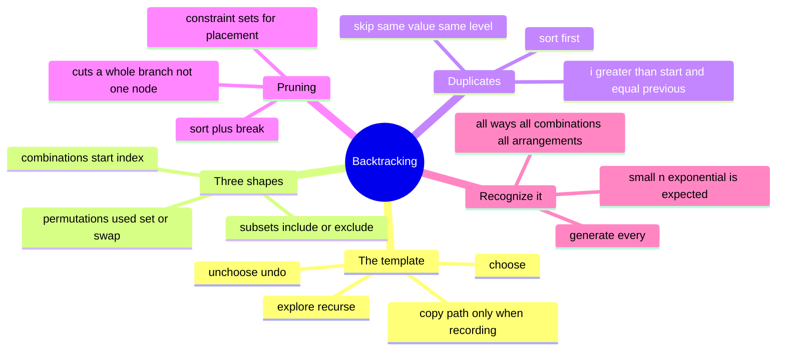

# 14 — Backtracking · Cheat-sheet

## Concept map



*What to notice: everything hangs off one template — the three shapes,
the duplicate rule, and pruning are all just variations on
choose/explore/unchoose, not separate algorithms.*

## THE template

```ts
function backtrack(path: T[]): void {
  if (isComplete(path)) {
    results.push([...path]) // COPY, never push the live array
    return
  }
  for (const choice of choicesAt(path)) {
    if (!isValid(choice)) continue // prune here
    path.push(choice) // choose
    backtrack(path) // explore
    path.pop() // unchoose
  }
}
```

## The three shapes

| Shape | Loop range | Reuse element? | Order matters? |
| --- | --- | --- | --- |
| Subsets | `start..n` | no | no |
| Combinations | `start..n`, recurse `i` (reuse) or `i+1` (no reuse) | only if the problem allows | no |
| Permutations | `0..n`, skip used | no | yes |

## Duplicate-skip rule

Sort first. Then: `if (i > start && nums[i] === nums[i - 1]) continue`
(subsets/combinations) — skips a repeated **sibling choice at the same
level**, not a repeated value deeper in the tree. For permutations,
use a value -> remaining-count map instead of a `used[]` array, so
duplicate values never occupy two different "slots."

## Pruning menu

- **Sort + break**: running total already too big → break (not
  continue) — every later, larger candidate is too big too.
- **Constraint sets**: O(1) validity checks (columns/diagonals) instead
  of O(n) rescans.

## Copy-the-path rule

`results.push(path)` stores a reference — every later
`path.push`/`path.pop` mutates the "recorded" answer too. Always
`results.push([...path])`.

## Rules to remember

- Choose and unchoose must be exact opposites — whatever `choose`
  mutates (path, a `visited` cell, a used-set), `unchoose` restores.
- `start = i + 1` forbids reuse; `start = i` allows it.
- Exponential/factorial output size is expected for "generate all X" —
  the goal is not avoiding the blowup, it's not adding extra work on
  top of it, and pruning branches that provably can't work.
- Empty input usually means ONE answer (the empty one), not zero
  answers — pin it with a test.

## Self-quiz

1. What are the three beats of the backtracking template, in order?
2. Why does `results.push(path)` (no spread) corrupt earlier answers?
3. What loop-range change turns the subsets template into the
   combinations template? What turns combinations into "with reuse"?
4. Why do permutations use a `used[]`/set instead of a `start` index?
5. State the duplicate-skip condition. What's the difference between
   skipping "the same value at the same level" vs. "the same value
   anywhere in the path"?
6. In combination-sum pruning, why is `break` correct but `continue`
   wastes work — what property of the candidates does it depend on?
7. Why does N-queens use `row - col` and `row + col` as diagonal
   identities instead of literally comparing cell positions?
8. A problem asks for the **number of ways** to reach a target, and
   the same sub-target is reachable via many different choice orders.
   Is plain backtracking the right tool? What should you reach for
   instead (name the module)?

<details><summary>Answers</summary>

1. Choose (make a choice, mutate state), explore (recurse), unchoose
   (undo the mutation exactly).
2. `path` is a live, mutated array — every subsequent `push`/`pop`
   changes what's already sitting in `results`, since it's the same
   object reference, not a snapshot.
3. Subsets → combinations: no real change, both use a `start` index
   loop (they're the same shape; "subsets" is just "combinations of
   every size"). Combinations → with-reuse: recurse with `i` instead
   of `i + 1`.
4. Because order is the answer — every element must be eligible at
   every position, not just the ones after some index, so "used" has
   to be tracked per-element, not per-position.
5. `i > start && nums[i] === nums[i - 1]` (sorted array). "Same level"
   means two sibling calls from the same parent (candidate branches
   being considered together) — skipping there avoids generating the
   identical subset/combination twice. It says nothing about reusing a
   value deeper in the recursion, which is normal and expected.
6. `break` is correct because candidates are sorted ascending — once
   one candidate overshoots, every later (bigger) one would too, so
   there's nothing left to check in that loop. It depends on the sort;
   without it, only `continue` would be safe.
7. Two cells share a `\` diagonal iff `row - col` is equal for both,
   and share a `/` diagonal iff `row + col` is equal — checking a set
   membership on those two derived numbers is O(1), versus O(n)
   rescanning every placed queen's actual (row, col).
8. No — overlapping sub-targets reached multiple ways is the signature
   of dynamic programming (memoize the count per sub-target instead of
   re-exploring it from scratch). That's module 18.

</details>

## Pattern-recognition drill

For each, name the pattern/structure (or say "not this module" and
where it belongs) before checking the answer.

1. "Return every way to split a rope of length n into pieces of
   integer length, order doesn't matter."
2. "Given a set of unique stickers, list every possible way to arrange
   all of them in a row."
3. "Given a board with some cells blocked, count the number of
   distinct paths from top-left to bottom-right, moving only right or
   down." *(decoy)*
4. "List every way to choose 3 toppings from a menu of 10, ignoring
   order."
5. "Place K non-attacking rooks on an n x n chessboard; list every
   placement."
6. "Given coins of a few denominations, list every distinct multiset
   of coins that sums to a target amount (unlimited supply of each)."
7. "Given a phone number's digits, list every text the digits could
   spell using an old T9 keypad."
8. "Given a set of numbers, find the MINIMUM number of them needed to
   reach a target sum." *(decoy)*

<details><summary>Answers</summary>

1. Subsets/combinations shape over cut positions (like partitioning) —
   backtracking.
2. Permutations shape — backtracking.
3. NOT this module — "count the paths," with heavily overlapping
   subproblems (many cell-pairs reachable multiple ways) is dynamic
   programming (grid paths, coming in module 19), even though it
   *sounds* like "generate paths."
4. Combinations shape (`n choose k`, no reuse) — backtracking.
5. Placement search with column/row constraint sets, very close to
   N-queens — backtracking.
6. Combination-sum shape (reuse allowed) — backtracking.
7. Fixed per-position choice sets (the phone-letters shape) —
   backtracking.
8. NOT this module — "minimum count to reach a target" (not "list every
   way") is a coin-change-style DP (module 18), since the answer is a
   single optimal count, not an enumeration, and sub-targets overlap
   heavily.

</details>
