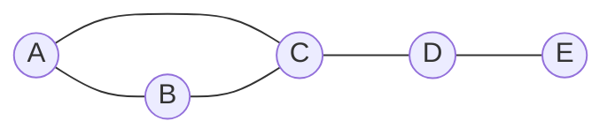
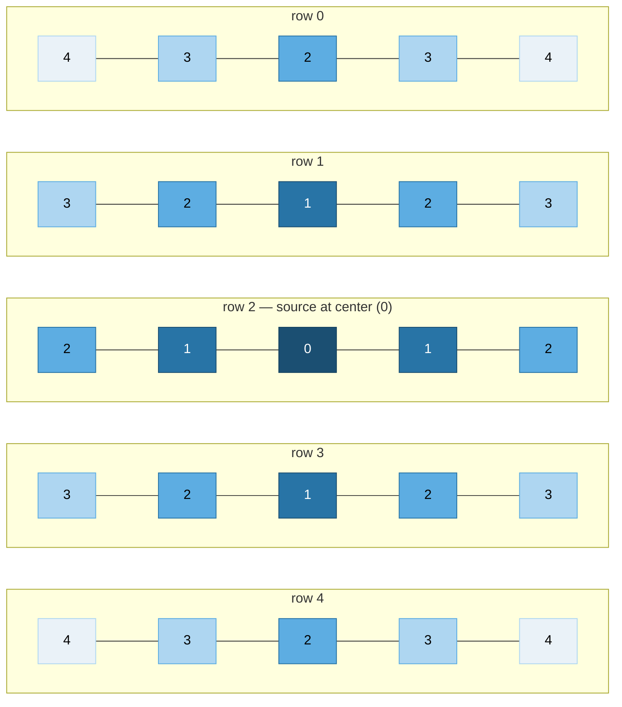

# 15 — Graphs I: Traversal

## Why this exists

Trees were graphs with training wheels: exactly one path between any
two nodes, no cycles, a clear root. Most real relationships aren't
that tidy — roads loop back on themselves, web pages link to each
other in both directions, friendships form clusters, dependencies can
(if you're unlucky) form a cycle you need to detect. A **graph** is
just nodes plus the relationships between them, with no promise of a
single path or an acyclic shape.

Traversal is still the first question you ask of any graph: **what
can I reach, and how fast?** DFS and BFS answer that — you already
know both algorithms from trees (module 11). The only new rule is a
**visited set**, because a graph can lead you back to a node you've
already seen, and without tracking that you loop forever.

The naive alternative — re-scanning the whole node/edge list from
scratch to answer "is X reachable from Y" for every query — costs
O(n) or worse per query. One traversal computes reachability for
**every** node in O(n + e) total, once.

## Representations

The same graph can be stored three ways. All three describe *identical*
connections — this is a graph with 5 nodes (`A`–`E`) and edges
`A–B, A–C, B–C, C–D, D–E`:



*What to notice: this picture has no notion of "row" or "index" — the
adjacency list and matrix below are just two different ways of writing
the same five dots and five lines down as data.*

**Adjacency list** — a Map from node to its neighbor list. This course's
convention: nodes are ints (`0..n-1`) or strings; every node gets an
entry, even if its list is empty.

```
Map {
  A -> [B, C]
  B -> [A, C]
  C -> [A, B, D]
  D -> [C, E]
  E -> [D]
}
```

**Adjacency matrix** — an n×n grid; `matrix[u][v] = 1` means an edge
`u -> v`.

|     | A | B | C | D | E |
| --- | - | - | - | - | - |
| A   | 0 | 1 | 1 | 0 | 0 |
| B   | 1 | 0 | 1 | 0 | 0 |
| C   | 1 | 1 | 0 | 1 | 0 |
| D   | 0 | 0 | 1 | 0 | 1 |
| E   | 0 | 0 | 0 | 1 | 0 |

| | Adjacency list | Adjacency matrix |
| --- | --- | --- |
| Space | O(n + e) | O(n²) always, even for sparse graphs |
| "Are u, v connected?" | O(degree(u)) — scan u's list | O(1) — direct lookup |
| "All neighbors of u?" | O(degree(u)) — already the list | O(n) — scan a whole row |
| Best for | most real graphs (sparse: e << n²) | dense graphs, or when O(1) edge lookup matters more than space |

Most interview and real-world graphs are sparse (e is closer to n than
n²), so **adjacency list is the default** — that's what every exercise
in this module uses.

## A grid IS a graph

You don't need to build a Map to treat a grid as a graph. Cells are
nodes; `grid[row][col]` and `grid[row+1][col]` are connected by an
implicit edge if they're adjacent. Neighbors are computed with a
`DIRS` constant instead of looked up in a list:

```ts
const DIRS: [number, number][] = [
  [1, 0], [-1, 0], [0, 1], [0, -1], // down, up, right, left
]

function neighbors(row: number, col: number, rows: number, cols: number): [number, number][] {
  const result: [number, number][] = []
  for (const [dr, dc] of DIRS) {
    const r = row + dr, c = col + dc
    if (r >= 0 && r < rows && c >= 0 && c < cols) result.push([r, c])
  }
  return result
}
```

This one mental move — **"cells are nodes, adjacency is a formula, not
a list"** — unlocks island counting, flood fill, maze shortest-paths,
and half of LeetCode's grid problems. No adjacency list is ever
materialized for a grid; `visited` becomes a same-shaped 2D array (or
a `Set` of `"row,col"` strings) instead of a Map.

## DFS and BFS

Same shapes as tree traversal, plus one new rule.

**DFS** (recursive or iterative with an explicit stack) — go as deep as
possible before backtracking. Good for "does a path exist," "how many
components," "explore everything reachable."

**BFS** (queue) — explore in rings of increasing distance from the
source. The ONLY algorithm that guarantees **shortest path by number of
edges** on an unweighted graph.

```ts
// DFS — recursive
function dfs(adj: Map<number, number[]>, node: number, visited: Set<number>): void {
  if (visited.has(node)) return
  visited.add(node)
  for (const next of adj.get(node) ?? []) dfs(adj, next, visited)
}

// BFS — queue, visited marked on ENQUEUE
function bfs(adj: Map<number, number[]>, start: number): number[] {
  const order: number[] = []
  const visited = new Set<number>([start]) // mark on enqueue
  const queue: number[] = [start]
  let head = 0
  while (head < queue.length) {
    const node = queue[head++]!
    order.push(node)
    for (const next of adj.get(node) ?? []) {
      if (visited.has(next)) continue
      visited.add(next) // mark HERE, at enqueue time
      queue.push(next)
    }
  }
  return order
}
```

**The one rule that differs from trees: a `visited` set.** A tree has
no cycles, so you never re-visit a node by accident. A graph can hand
you back to a node you've already processed via a different path —
without `visited`, DFS/BFS never terminates.

## BFS wavefront on a grid

Starting from the center of an open 5×5 grid, BFS visits cells in
rings of increasing distance — like a wave spreading outward.



*What to notice: every cell's number is its BFS distance from the
center — the numbers form perfect rings (0, then a ring of 1s, then a
ring of 2s...) because BFS finishes an entire distance level before
starting the next one. That's exactly why BFS gives shortest paths on
an unweighted graph and DFS does not: DFS could easily reach the
bottom-right corner before it reaches a cell one step away.*

## How to recognize it

- "Shortest path" / "fewest steps" / "minimum moves" on an **unweighted**
  graph or grid → **BFS, and only BFS.** DFS can find *a* path but not
  the shortest one.
- "Any path exists" / "all cells/nodes reachable" / "count regions or
  components" → DFS or BFS, either works — pick whichever you find
  easier to write for the shape of the problem (DFS is usually shorter
  code for grids; BFS for level-by-level questions).
- "Spreads simultaneously from several places at once" (infection,
  rotting, multiple sources) → **multi-source BFS**: seed the queue
  with every source before the first step, so all fronts expand
  together and naturally meet in the middle.
- A weighted graph ("cost", "distance", "time" that varies per edge)
  is a **different tool** — that's Dijkstra, module 16. Plain BFS on a
  weighted graph gives the wrong answer.

## Worked example: island count

Grid (`1` = land, `0` = water), islands are 4-directionally connected
land:

```
1 1 0 0
1 0 0 1
0 0 1 0
0 0 0 0
```

Scan cells left-to-right, top-to-bottom. On an unvisited `1`, start a
DFS that "sinks" every connected land cell (marks it visited) and
counts once:

| Step | Cell scanned | Action | Islands so far |
| --- | --- | --- | --- |
| 1 | (0,0) = 1, unvisited | new island; DFS sinks (0,0),(0,1),(1,0) | 1 |
| 2 | (0,1)..(1,0) | already sunk by step 1's DFS | 1 |
| 3 | (1,3) = 1, unvisited | new island; DFS sinks (1,3) only (no 4-directional land neighbors) | 2 |
| 4 | (2,2) = 1, unvisited | new island; DFS sinks (2,2) only | 3 |
| 5 | remaining cells | all water or already visited | 3 |

Result: **3 islands** (sizes 3, 1, 1). `maxIslandArea` would return 3.

## Complexity

Both DFS and BFS visit every node once and every edge once (or twice,
for undirected — once from each endpoint): **O(n + e) time**. Space is
O(n) for the `visited` set/array plus O(n) worst case for the stack
(DFS recursion or explicit stack) or queue (BFS) — a graph that's one
long chain visits all n nodes before returning. On a `rows × cols`
grid, n = rows·cols and e ≈ 4n, so this is O(rows · cols) time and
space.

**Why:** every node is enqueued/pushed at most once (guarded by
`visited`), and every edge is examined at most once per endpoint when
scanning that node's neighbor list — there's no way to do less work
than "look at every node and every edge" if the answer depends on
reachability through all of them.

## Common gotchas

- **Forgetting `visited` entirely** → infinite loop the instant the
  graph has a cycle (or a grid, which always "cycles" back through
  4-directional moves).
- **Marking visited on DEQUEUE instead of ENQUEUE (BFS)** — the classic
  bug. If you check-and-mark only when a node is popped off the queue,
  the *same* node can be pushed multiple times by different neighbors
  before any of those pushes get processed, wasting work and (worse)
  corrupting distance/level tracking. Always mark the moment you push.
- **Recursion depth on big grids** — a 300×300 grid has up to 90,000
  cells in one connected island; naive recursive DFS can blow the call
  stack. Prefer iterative DFS (explicit stack) or BFS for large grids,
  or be deliberate about recursion if you keep it recursive.
- **Treating a directed edge list as undirected (or vice versa)** —
  forgetting to add both `u -> v` and `v -> u` when the problem means
  "undirected" silently turns half your edges one-way, breaking
  reachability and component counts.
- **Grid bounds checked in the wrong order** — check `row`/`col` are
  in range *before* indexing `grid[row][col]`, not after; with
  `noUncheckedIndexedAccess`, an out-of-range read is `undefined`, not
  a crash, which can silently produce wrong answers instead of an
  obvious error.

## Try it now

→ `exercises/ex01-graph-repr.ts` through `exercises/ex07-bipartite-check.ts`,
then `checkpoint.ts`.
Check with `npm test -- 15`.
