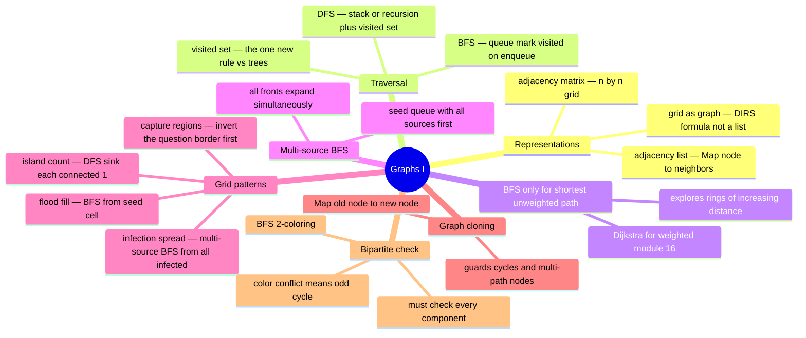

# 15 — Graphs I: Traversal · Cheat-sheet

## Representation comparison

| | Adjacency list | Adjacency matrix |
| --- | --- | --- |
| Space | O(n + e) | O(n²) always |
| "Does edge u→v exist?" | O(degree(u)) — scan list | O(1) — direct lookup |
| "All neighbors of u?" | O(degree(u)) — already the list | O(n) — scan whole row |
| Best for | sparse graphs (most real graphs) | dense graphs or O(1) edge queries |

**Course convention:** adjacency list as `Map<node, number[]>`. Nodes are ints `0..n-1`.

## DFS vs BFS decision table

| Question | Algorithm | Why |
| --- | --- | --- |
| Does any path exist? | DFS or BFS (either) | Just need reachability |
| Count connected components | DFS or BFS (either) | One traversal per unvisited node |
| **Shortest path (unweighted)** | **BFS, and ONLY BFS** | Explores in rings — finishes whole level before next |
| Weighted shortest path | Dijkstra (module 16) | BFS gives wrong answer with varying edge costs |
| Spreads from many sources at once | Multi-source BFS | Seed queue with ALL sources before first step |
| 2-color / bipartite check | BFS (easier to track levels) | Color conflict = odd cycle = not bipartite |
| Explore / clone entire graph | DFS or BFS (either) | Hash map guards cycles |

## Grid-as-graph recipe

No adjacency list needed. Cells are nodes; neighbors are computed with `DIRS`:

```ts
const DIRS: [number, number][] = [[1,0],[-1,0],[0,1],[0,-1]]

for (const [dr, dc] of DIRS) {
  const nr = r + dr, nc = c + dc
  if (nr >= 0 && nr < rows && nc >= 0 && nc < cols) {
    // (nr, nc) is a valid neighbor
  }
}
```

`visited` is a `boolean[][]` of the same shape (or a `Set<string>` of `"r,c"` keys).

## Multi-source BFS recipe

Seed the queue with EVERY source cell before the first step — they expand together.

```ts
const queue: [number, number][] = []
for (let r = 0; r < rows; r++)
  for (let c = 0; c < cols; c++)
    if (isSource(grid[r]![c])) queue.push([r, c])
// Now BFS as normal — all fronts expand simultaneously
```

## The enqueue-time visited rule (critical BFS gotcha)

**Mark a node visited the moment you ENQUEUE it, not when you dequeue it.**

If you mark on dequeue: the same node gets enqueued multiple times by different neighbors before any of those pops run. Result: duplicates in BFS order and wrong distance tracking.

```ts
// CORRECT
const visited = new Set([start])   // mark on enqueue
queue.push(start)
while (...) {
  const node = queue.shift()!
  for (const next of neighbors(node)) {
    if (visited.has(next)) continue
    visited.add(next)    // <— HERE, before pushing
    queue.push(next)
  }
}
```

## Mindmap



*What to notice: BFS shortest-path is a branch on its own because it is the ONLY correct approach for unweighted graphs — not a preference but a correctness requirement.*

## Self-quiz

1. What is the one rule that DFS/BFS on a graph needs that tree traversal does not?
2. Two identical-looking BFS implementations, but one marks visited on dequeue. What goes wrong?
3. Why does BFS give shortest paths and DFS does not?
4. You have a 1000×1000 grid. Why prefer iterative DFS (explicit stack) over recursive DFS?
5. What does "multi-source BFS" mean, and what problem shape calls for it?
6. In `captureRegions` (ex04), why is it easier to find survivors first instead of directly finding captured cells?
7. What data structure is the key to correctly cloning a graph with cycles?
8. In a bipartite check, why must you start a BFS from EVERY unvisited node?

<details><summary>Answers</summary>

1. A **visited set** (or visited array). Trees have no cycles — you can never accidentally revisit a node via a different path. Graphs can cycle back, so without tracking which nodes you've seen, traversal never terminates.

2. The same node gets pushed onto the queue multiple times by different neighbors before any of those entries are processed. On dequeue you'd mark it visited the first time it pops, but the duplicates are already in the queue. This inflates BFS-order visits, may process a node multiple times, and corrupts level/distance tracking.

3. BFS always finishes every node at distance k before visiting any node at distance k+1 (because it uses a FIFO queue and marks on enqueue). The first time BFS reaches a node is therefore via the shortest path. DFS dives along one path as far as possible — it might reach a node via a long detour before discovering the short path.

4. A connected 1000×1000 grid has up to 1,000,000 cells in one island. Recursive DFS would need a call-stack frame for each one — likely a stack overflow. An explicit stack (or BFS) keeps all state on the heap, not the call stack.

5. Multi-source BFS seeds the queue with ALL source cells before the first iteration, so every source expands simultaneously in the same BFS pass. It's needed whenever spread starts from multiple places at once: rotting oranges, infection, multi-start shortest paths. Simulating each source separately and taking the min would give the wrong answer (sources cooperate, they don't race independently).

6. Border-connected 'R' cells are the exception (they survive). There are typically far fewer survivors than interior cells. It's much cleaner to flood-fill FROM each border 'R' and mark those as safe, then flip everything else. If you try to prove a cell is enclosed directly, you'd need to check in all directions that no path escapes — far more complex.

7. A **`Map<originalNode, cloneNode>`** (hash map). It serves two purposes: (1) a visited set so cycles don't cause infinite traversal, and (2) a lookup so any node reached via multiple paths maps to the same single clone, ensuring all edges in the clone graph point to the correct object.

8. The graph may be **disconnected** — a BFS from node 0 only sees node 0's component. A component that BFS never visits might contain an odd cycle making it non-bipartite. You must start fresh BFS traversals from every unvisited node so all components are checked.

</details>

## Pattern-recognition drill

Name the technique for each one-liner, then check your answer.

1. "What is the minimum number of steps to travel from cell A to cell B in an open grid?"
2. "Given a network of computers, how many separate sub-networks exist?"
3. "A wildfire spreads from multiple ignition points — how many minutes until every burnable cell is on fire?"
4. "Are there two groups we can divide these users into so that every reported conflict is between groups, never within one?"
5. "Starting from a user in a social network, produce a deep copy of every reachable profile with no shared object references."
6. "Paint all pixels connected to the clicked pixel with a new color."
7. "Count distinct landmasses on a satellite map where cells connect only horizontally and vertically."
8. "Find the cheapest route (toll road costs vary per road) between two cities."

<details><summary>Answers</summary>

1. **BFS** (shortest path, unweighted grid). "Minimum steps on a grid" is the canonical BFS trigger. DFS finds *a* path, not the *shortest* one.

2. **DFS or BFS connected-components scan** — run a traversal from every unvisited node; each traversal covers exactly one sub-network. Count the traversals.

3. **Multi-source BFS** — seed the queue with every ignition point before the first step so all fronts expand simultaneously. Answer = number of BFS levels until no unburned burnable cells remain.

4. **Bipartite check via BFS 2-coloring** — assign colors alternating on BFS exploration; a conflict (two neighbors with the same color) means an odd cycle, which means we cannot split into two valid groups.

5. **Graph clone via BFS + hash map** (old node → new node). The map handles cycles and ensures a node reachable via multiple paths is cloned only once.

6. **Flood fill — BFS/DFS from the seed cell**, spreading only to cells sharing the original color. Guard against the "new color equals old color" infinite-loop edge case.

7. **Island count — grid-as-graph DFS/BFS**, sinking each connected land region as it is discovered. Count = number of DFS/BFS starts on unvisited land.

8. **Dijkstra's algorithm — module 16**. Varying edge weights break BFS (BFS counts hops, not cost). Dijkstra uses a priority queue to always expand the cheapest known path first.

</details>
