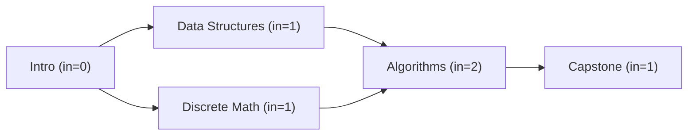
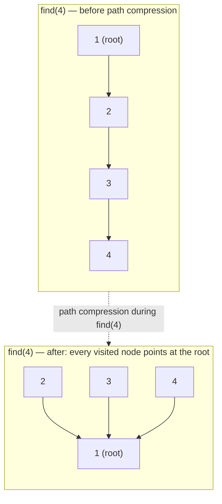

# 16 — Graphs II: Ordering, Union-Find & Weighted Paths

## Why this exists

Module 15 answered "can I reach X?" and "what's the shortest path when
every edge costs the same?" with DFS/BFS. Three questions those tools
can't touch:

- What **ORDER** must dependent tasks run in? ("compile A before B" —
  BFS/DFS visit nodes, they don't produce a valid sequence.)
- Are these nodes **merged into one group** as edges arrive one at a
  time, without re-scanning the whole graph on every arrival?
- What's the **CHEAPEST** path or the **CHEAPEST** way to connect
  everything, when edges have different weights? (BFS's "fewest edges"
  guarantee breaks the instant edges aren't all equal.)

Four new tools, one for each question: **topological sort**,
**union-find**, **minimum spanning tree** (Kruskal/Prim), and
**Dijkstra** (with a Bellman-Ford-flavored fallback for negative
weights or hop limits).

## Topological sort: a valid build order, or proof none exists

A topological order only makes sense on a **DAG** (directed, acyclic).
It's a linear ordering of nodes such that every directed edge `u -> v`
puts `u` before `v` — "u must happen before v".

**Kahn's algorithm**: track each node's **in-degree** (how many
prerequisites point at it). Start with every in-degree-0 node in a
queue (nothing blocks them). Pop a node, add it to the order, and
"remove" its outgoing edges by decrementing its neighbors' in-degrees
— any neighbor that hits 0 just became unblocked, so enqueue it.
Repeat until the queue is empty.

*What to notice: "Intro" is the only in-degree-0 node, so it must go
first. After it's processed, both "Data Structures" and "Discrete
Math" drop to in-degree 0 — either order between them is valid. Two
correct orders: `[Intro, DataStruct, DiscreteMath, Algorithms,
Capstone]` and `[Intro, DiscreteMath, DataStruct, Algorithms,
Capstone]`. A topological order is rarely unique.*

**Cycle detection for free**: if the queue empties but you've
processed fewer than `n` nodes, the remaining nodes are stuck in a
cycle (every one of them still has in-degree > 0 — something in the
cycle is always waiting on something else in the cycle). No valid
order exists.

## Union-find: near-O(1) "are these merged?" under merging

A **disjoint-set / union-find** structure answers "same group?" and
"merge these two groups" close to O(1) each, using a **parent
forest**: each node points at a parent; the **root** (a node that
points to itself) names the group. Two optimizations make it fast:

- **Path compression**: while finding a root, re-point every node
  visited straight at that root, so the *next* find on any of them is
  O(1).
- **Union by rank/size**: when merging two trees, attach the smaller
  one under the bigger one's root, so trees stay shallow instead of
  turning into a long chain.

*What to notice: before compression, `4`'s chain to the root is 3
hops long — and every future find on 2, 3, or 4 would re-walk it.
After one `find(4)`, all three point directly at the root, so every
future find on any of them is O(1).*

Without either optimization, union-find degrades toward O(n) per
operation (a straight-line chain). With both, a sequence of `m`
operations costs `O(m * alpha(n))` total — `alpha` is the inverse
Ackermann function, which is <= 4 for any `n` you'll ever see in
practice. Treat it as O(1) amortized.

## Minimum spanning tree: cheapest way to connect everything

Given a connected, weighted, **undirected** graph, an MST is a subset
of edges that connects every node using the least total weight,
with no cycles (a tree on `n` nodes always has exactly `n - 1`
edges).

**Kruskal**: sort all edges by weight, ascending. Walk the sorted list
and add an edge unless it would connect two nodes already in the same
union-find group (that would be a cycle — skip it). Stop when you've
added `n - 1` edges. Greedy: the cheapest edge that doesn't create a
cycle is always safe to take.

**Prim**: grow ONE tree from a start node. Keep a min-heap of
"(weight, node)" candidates reachable from the tree so far; repeatedly
pop the cheapest, and if its node isn't in the tree yet, add it and
push its edges.

| | Kruskal | Prim |
| --- | --- | --- |
| Best when | edges are sparse / given as a list | graph is dense (near-complete) |
| Needs | sort + union-find | heap + adjacency list |
| Complexity | O(E log E) | O(E log V) |

## Dijkstra: BFS's weighted upgrade

BFS explores in "layers" because every edge costs 1 — the queue order
IS the distance order. With unequal weights, a priority queue takes
over that job: always expand whichever frontier node currently has the
smallest known distance. That greedy choice is safe as long as **no
edge weight is negative** (see below).

**Worked example** — 5 nodes (A is the source), edges: A-B(4), A-C(1),
C-B(2), B-D(5), C-D(8), D-E(3):

| Step | Pop (dist, node) | dist[A] | dist[B] | dist[C] | dist[D] | dist[E] |
| --- | --- | --- | --- | --- | --- | --- |
| start | — | 0 | inf | inf | inf | inf |
| 1 | (0, A) | 0 | 4 | 1 | inf | inf |
| 2 | (1, C) | 0 | 3 | 1 | 9 | inf |
| 3 | (3, B) | 0 | 3 | 1 | 8 | inf |
| 4 | (8, D) | 0 | 3 | 1 | 8 | 11 |
| 5 | (11, E) | 0 | 3 | 1 | 8 | 11 |

*What to notice: popping C relaxes B from 4 down to 3 (via A-C-B =
1+2=3, cheaper than the direct A-B edge). A node's distance can keep
improving right up until it's POPPED — that's why you finalize a
node's distance only when you pop it, never when you first see it.*

**Why negative edges break it**: Dijkstra commits to a node's distance
the moment it's popped, betting that nothing popped later could ever
offer a cheaper route to it. A negative edge discovered later can
undercut that bet — a path that looked expensive early on might
finish cheaper once a negative edge is added in. Once a graph can have
negative weights, you need **Bellman-Ford**: relax every edge, `n - 1`
times, over the whole edge list (no priority queue, no greedy
commitment — just brute-force relaxation until nothing improves). A
**k-rounds variant** caps this at `k + 1` relaxation passes to answer
"cheapest path using at most k edges" — a constraint plain Dijkstra
has no way to express, since Dijkstra tracks "cheapest to reach a
node" without tracking "in how many hops".

## How to recognize it

- **"prerequisites", "build order", "course schedule", "must happen
  before"** -> topological sort (Kahn's).
- **"groups", "merging", "are these connected as edges arrive?",
  "redundant / extra connection"** -> union-find.
- **"connect all nodes as cheaply as possible", "minimum cost to wire
  everything"** -> MST (Kruskal or Prim).
- **"shortest / cheapest path" with weighted edges** -> Dijkstra (all
  weights non-negative).
- **"shortest path" with possibly negative weights, or "at most k
  stops/edges"** -> Bellman-Ford-style relaxation.
- **Decoy**: "shortest path" with NO weights (or all weights equal) is
  still plain BFS from module 15 — don't reach for Dijkstra when a
  cheaper tool already solves it.

## Common gotchas

- **Running topo sort on a graph with a cycle**: Kahn's algorithm
  won't crash — it just finishes with fewer than `n` nodes processed.
  Always check the processed count; returning the partial order as if
  it were valid is a classic bug.
- **Forgetting path compression (or union by rank)**: union-find still
  gives correct answers without them, just slowly — chains can degrade
  toward O(n) per `find`, which silently turns an O(m log n) algorithm
  into O(m * n) and times out on large input.
- **Stale heap entries in Dijkstra**: a lazy-deletion priority queue
  can hold several outdated `(dist, node)` pairs for the same node
  (pushed before a cheaper route was found). Always re-check `dist >
  best[node]` when you pop, and skip if it's stale — otherwise you
  reprocess a node with an outdated distance.
- **Directed vs undirected mixups**: Kruskal/Prim assume undirected
  edges (add both directions to an adjacency list, or treat the edge
  list symmetrically). Dijkstra and topological sort are usually
  directed. Mixing these up silently produces a wrong graph, not a
  crash.

## Try it now

-> `exercises/ex01-topo-sort.ts` through `ex07-k-stops-cheapest.ts`,
then `checkpoint.ts`. Check with `npm test -- 16`.
