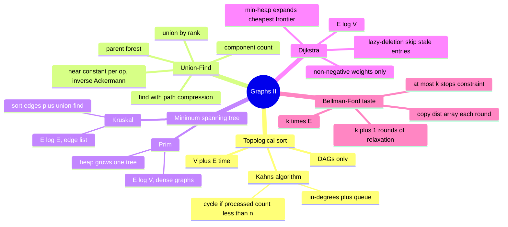

# 16 — Graphs II · Cheat-sheet

## Concept map



*What to notice: each of the four tools answers a different question —
ordering, grouping, cheapest wiring, or cheapest routing. Choosing the
right tool starts with identifying which question the problem is asking.*

## Algorithm-picker table

| Question | Tool | Complexity |
| --- | --- | --- |
| Valid ordering of dependent tasks? | Topological sort (Kahn's) | O(V + E) |
| Are these nodes in the same group? | Union-find (`find` / `union`) | O(alpha(n)) per op |
| Connect all nodes as cheaply as possible? | MST (Kruskal or Prim) | O(E log E) or O(E log V) |
| Shortest weighted path, weights >= 0? | Dijkstra | O(E log V) |
| Shortest path with weight < 0, OR at most k hops? | Bellman-Ford / k-round relaxation | O(V*E) or O(k*E) |
| Shortest path, all weights equal? | BFS (module 15!) | O(V + E) |

## Kahn's algorithm template

```ts
function topoSort(n: number, edges: [number, number][]): number[] | null {
  const adj: number[][] = Array.from({ length: n }, () => [])
  const inDegree = new Array(n).fill(0)
  for (const [to, from] of edges) {        // from must come before to
    adj[from]!.push(to)
    inDegree[to]!++
  }

  const queue: number[] = []
  for (let i = 0; i < n; i++) if (inDegree[i] === 0) queue.push(i)

  const order: number[] = []
  let head = 0
  while (head < queue.length) {
    const node = queue[head++]!
    order.push(node)
    for (const next of adj[node]!) {
      if (--inDegree[next]! === 0) queue.push(next)
    }
  }
  return order.length === n ? order : null  // null = cycle detected
}
```

## Union-find template

```ts
class UnionFind {
  private parent: number[]
  private rank: number[]
  private count: number

  constructor(n: number) {
    this.parent = Array.from({ length: n }, (_, i) => i)
    this.rank = new Array(n).fill(0)
    this.count = n
  }

  find(x: number): number {
    let root = x
    while (this.parent[root] !== root) root = this.parent[root]!
    // Path compression: re-point every walked node straight at root.
    let cur = x
    while (this.parent[cur] !== root) {
      const next = this.parent[cur]!
      this.parent[cur] = root
      cur = next
    }
    return root
  }

  union(x: number, y: number): boolean {
    const rx = this.find(x), ry = this.find(y)
    if (rx === ry) return false           // already same group
    // Union by rank: attach shorter tree under taller root.
    if (this.rank[rx]! < this.rank[ry]!) this.parent[rx] = ry
    else if (this.rank[rx]! > this.rank[ry]!) this.parent[ry] = rx
    else { this.parent[ry] = rx; this.rank[rx]!++ }
    this.count--
    return true
  }

  connected(x: number, y: number): boolean { return this.find(x) === this.find(y) }
  componentCount(): number { return this.count }
}
```

## Dijkstra template (lazy-deletion)

```ts
function dijkstra(n: number, edges: [number, number, number][], src: number): number[] {
  const adj: [number, number][][] = Array.from({ length: n }, () => [])
  for (const [from, to, w] of edges) adj[from]!.push([to, w])

  const dist = new Array(n).fill(Infinity)
  dist[src] = 0
  const heap = new MinHeap<[number, number]>((a, b) => a[0] - b[0]) // [dist, node]
  heap.push([0, src])

  while (!heap.isEmpty()) {
    const [d, node] = heap.pop()
    if (d > dist[node]!) continue            // LAZY SKIP: stale entry
    for (const [next, w] of adj[node]!) {
      const cand = d + w
      if (cand < dist[next]!) { dist[next] = cand; heap.push([cand, next]) }
    }
  }
  return dist.map(d => d === Infinity ? -1 : d)
}
```

> **Negative-edge warning**: if any edge weight is negative, Dijkstra
> can lock in a wrong distance before discovering a cheaper negative-
> weight path. Switch to Bellman-Ford (relax all edges n-1 times) or
> the k-round variant (relax k+1 times with a fresh dist copy per round).

## Rules to remember

- Topological sort only applies to a **DAG** — the cycle check
  (processed count < n) is not optional.
- Path compression without union by rank (or vice-versa) still gives
  correct answers but degrades toward O(n) per op. Both are needed for
  the near-O(1) guarantee.
- Dijkstra stale-entry skip (`if d > dist[node] continue`) is the
  substitute for a "decrease-key" operation — never remove it.
- Kruskal wants edges as a list (easy to sort); Prim works better on
  dense/complete graphs where materializing all edges at once is
  wasteful.
- k-round Bellman-Ford: copy the dist array each round. Relaxing in
  place lets one round's update chain through more than one extra hop,
  silently allowing more than k stops.

## Self-quiz

1. What does Kahn's algorithm return when the input graph has a cycle?
   How does it detect the cycle?
2. Describe path compression in one sentence. What does union by rank
   prevent?
3. You have n cities and a list of airline routes with prices. You want
   the cheapest flight from A to B. Which algorithm do you use? What
   constraint on edge weights must hold?
4. Same network, but you must get from A to B in at most 2 stops. Can
   you still use Dijkstra? Why or why not? What do you use instead?
5. When does Kruskal beat Prim? When does Prim beat Kruskal?
6. A union-find starts with 10 elements. After six `union` calls that
   each merge distinct components, what does `componentCount()` return?
7. What is the complexity of `find` in a union-find that has path
   compression but NOT union by rank? What worst-case degeneracy can
   the rank rule prevent?
8. You run topological sort and get a valid ordering. Can there be more
   than one valid ordering? When is the ordering unique?

<details><summary>Answers</summary>

1. It returns `null` (no valid order). Detection: if fewer than `n`
   nodes are added to the output, the missing nodes are stuck in a
   cycle — each still has an in-degree > 0, blocked by a cycle peer.
2. During `find(x)`, re-point every node on the path from `x` to the
   root so it points directly at the root — flattening future lookups
   to O(1). Union by rank prevents tall trees by always attaching the
   shorter tree under the taller root's subtree.
3. Dijkstra. Constraint: all edge weights must be non-negative
   (flight prices are always >= 0, so this holds here).
4. No — Dijkstra has no notion of "how many hops have been used"; it
   tracks only the cheapest accumulated cost per node. Use the k-round
   Bellman-Ford variant: relax every edge for k+1 rounds, copying the
   dist array each round to prevent chains within one round from
   exceeding the hop limit.
5. Kruskal wins when the graph is sparse (few edges relative to nodes)
   and the edge list is easy to sort. Prim wins when the graph is dense
   or complete (Kruskal would need to sort all n^2/2 edges; Prim's heap
   generates edges lazily from the frontier only).
6. `componentCount()` returns 4 (10 components minus 6 successful merges).
7. With compression only (no rank), `find` is still near-amortized O(1)
   in practice but the formal bound weakens. Without rank, repeated
   union-of-root operations can create a straight-line chain of depth
   n (every union always attaches one root under another arbitrarily),
   making a single un-compressed `find` O(n).
8. Yes, there are usually many valid orderings (any pair of
   independent nodes can appear in either order). The ordering is unique
   only if the DAG is a single path — every node has at most one
   predecessor and at most one successor.

</details>

## Pattern-recognition drill

For each, name the algorithm/structure (or say "not this module" and
where it belongs) before checking the answer.

1. "A build system lists which modules depend on which other modules.
   Print a valid compile order, or report that a circular dependency
   exists."
2. "A social network's friendship list arrives one pair at a time. After
   each addition, answer: are users A and B in the same friend group?"
3. "Find the shortest path between two cities on a map where roads have
   travel times." *(check the weight constraint)*
4. "A telecom wants to lay the least cable to connect all offices in a
   city. Candidate cable routes have different lengths."
5. "Same map as #3, but some roads have negative toll rebates (they make
   the trip cheaper). Find the true cheapest path."
6. "You can fly between cities; each flight has a price. Find the
   cheapest way to get from city X to city Y using at most 2 stops."
7. "In an undirected graph, find the edge that, when removed, eliminates
   exactly one cycle." *(hint: what structure tracks group membership?)*
8. "A grid of rooms is fully connected (all weights 1). Find the
   shortest path between two rooms." *(decoy)*

<details><summary>Answers</summary>

1. **Topological sort** (Kahn's algorithm). "Compile order" + "circular
   dependency check" are the canonical topo-sort cues.
2. **Union-find**. "Arrives one pair at a time" + "same group?" is the
   union-find signature — rerunning BFS/DFS on the whole graph after
   each arrival would be O(V + E) per query; union-find is O(alpha(n)).
3. **Dijkstra** — but ONLY if all travel times are >= 0. "Shortest path
   with weights" + non-negative weights -> Dijkstra, O(E log V).
4. **Minimum spanning tree** — Kruskal (sort routes + union-find) or
   Prim (heap). "Least total cable to connect everyone" = MST.
5. **Bellman-Ford** (full n-1 rounds). Dijkstra breaks with negative
   edge weights because it commits to a node's distance on pop, and a
   later negative edge can always undercut that commitment.
6. **k-round relaxation (bounded Bellman-Ford)**. "At most k stops" is
   the key phrase — Dijkstra can't enforce a hop limit. Relax for
   k+1 = 3 rounds, copying the dist array each round.
7. **Union-find**. Process edges in order; the first `union(a, b)` that
   returns `false` (a and b already connected) is the redundant edge
   closing the cycle.
8. **BFS (module 15)** — NOT Dijkstra. All weights equal -> BFS gives
   optimal shortest-hop distances in O(V + E). Dijkstra would work but
   adds a log-factor overhead for no benefit.

</details>
