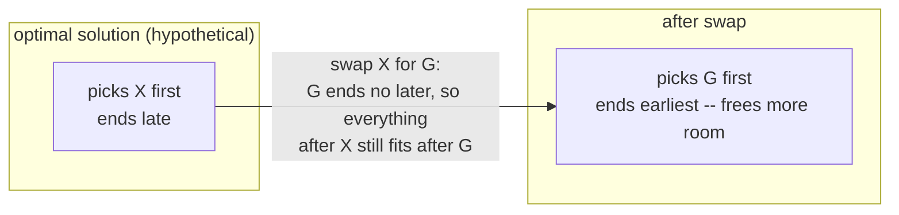
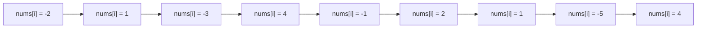
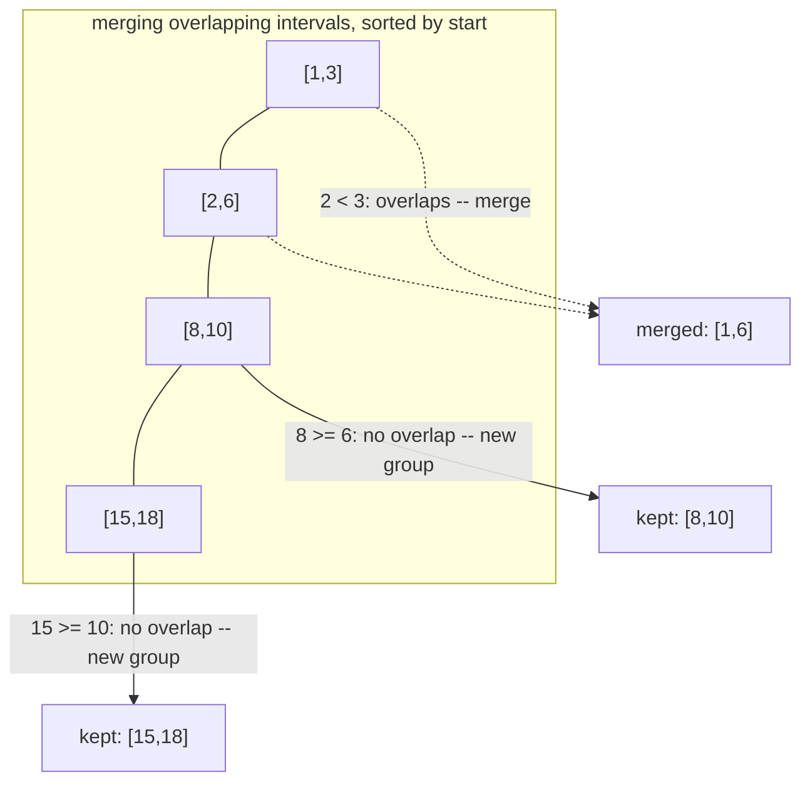

# 17 — Greedy & Intervals

## Why this exists

Most hard problems need you to explore every possibility — backtracking
(module 14), DP (module 18) — because the locally best choice can trap
you in a bad global outcome. But some problems are different: the
choice that looks best *right now* provably never costs you anything
later. When that's true, you skip the exponential search entirely and
walk through the input once, making the obvious choice at every step.

That's greedy. The payoff is huge (O(n) or O(n log n) instead of
exponential) but the catch is real: greedy is *easy to guess wrong*.
"Obviously correct" and "actually correct" are different claims, and
this module's real job is teaching you how to tell them apart.

## The exchange argument, informal

The exchange argument is the tool that turns "I think greedy works"
into "greedy works." The shape of the argument:

> Take any optimal solution. If it made a different choice than greedy
> would have at some step, **swap in greedy's choice instead**. Show
> the result is still valid and is no worse. Repeat until the optimal
> solution IS greedy's solution — so greedy was optimal all along.

Worked example — **picking the most non-overlapping intervals**, so you
can attend as many meetings as possible, one at a time, no two
overlapping. Greedy's rule: always pick the interval that **ends
earliest** among the ones still available.

Say an optimal solution `OPT` picks some interval `X` first instead of
greedy's choice `G` (the earliest-ending option). Since `G` ends
earliest by definition, `G.end <= X.end`. Swap `X` for `G` in `OPT`:

- Every interval `OPT` picked *after* `X` started after `X.end`, which
  is `>= G.end` — so it still doesn't conflict with `G`. Nothing later
  in the solution breaks.
- The swap didn't reduce the count — same number of intervals, just a
  different first pick.

So `OPT` with `G` swapped in is *at least as good* as `OPT`. Repeat this
argument for every step where `OPT` disagrees with greedy, and you
reach greedy's exact solution with no loss — greedy is optimal. This is
exactly `maxNonOverlapping` in `ex06`.



*What to notice: the swap never makes things worse because "ends
earlier" only ever frees up MORE room for later choices, never less —
that one-directional fact is the whole proof.*

You won't write out a full exchange-argument proof for every problem in
an interview, but you should be able to sketch it in one sentence
("swapping in the greedy choice never hurts because ___") before
trusting a greedy idea. If you can't finish that sentence, don't trust
it — verify against small cases or fall back to DP (module 18).

## Kadane's algorithm: running best, resetting on a bad prefix

**Problem**: find the contiguous subarray with the largest sum.

The greedy insight: track `currentSum`, the best sum of a subarray
*ending right here*. At each step you have exactly one choice — extend
the previous run, or start fresh at this element:

```
currentSum = max(nums[i], currentSum + nums[i])
```

Why is that safe? If `currentSum` before adding `nums[i]` is negative,
it can only ever *drag down* any future sum that includes it — no
subarray that starts before `i` and includes this negative prefix can
beat one that just starts at `i`. That's the exchange argument again:
"replace any run with a negative prefix by dropping the prefix" never
makes the sum worse.



Trace on `[-2, 1, -3, 4, -1, 2, 1, -5, 4]`:

| i | nums[i] | currentSum (extend vs restart) | bestSum so far |
| --- | --- | --- | --- |
| 0 | -2 | max(-2, 0-2) = -2 (start fresh) | -2 |
| 1 | 1 | max(1, -2+1=-1) = 1 (restart wins) | 1 |
| 2 | -3 | max(-3, 1-3=-2) = -2 (extend, still drops) | 1 |
| 3 | 4 | max(4, -2+4=2) = 4 (restart — prefix was dead weight) | 4 |
| 4 | -1 | max(-1, 4-1=3) = 3 (extend) | 4 |
| 5 | 2 | max(2, 3+2=5) = 5 (extend) | 5 |
| 6 | 1 | max(1, 5+1=6) = 6 (extend) | 6 |
| 7 | -5 | max(-5, 6-5=1) = 1 (extend, still positive) | 6 |
| 8 | 4 | max(4, 1+4=5) = 5 (extend) | 6 |

Answer: `6`, from the run `[4, -1, 2, 1]`. Notice `currentSum` resets to
"start fresh" exactly when the running total goes negative — that's
the moment the exchange argument says "drop everything before this
point, it's only hurting you."

*What to notice: `currentSum` never has to look backward — the decision
"extend or restart" only depends on whether the number just carried
into this step is a net negative, which is a single running value.*

## Greedy sweep patterns

Three shapes cover almost every greedy sweep in this module — each
one is a single running number updated left to right:

| Pattern | Running value | Reset/update rule | Example |
| --- | --- | --- | --- |
| **Running best** | best sum ending here | drop a negative prefix | Kadane's (`ex01`) |
| **Furthest reach** | max index reachable so far | `reach = max(reach, i + nums[i])` | jump game (`ex02`) |
| **Net balance** | running total of gains/losses | if it goes negative, no valid start before the next index | gas station (`ex03`) |

All three share the same shape: one forward pass, one running number, a
rule for when to "reset" the window that's contributing to it. Once you
see that shape in a problem statement, you're looking for the specific
running value and reset rule — not a new algorithm.

## Intervals: always sort first — but by which endpoint?

Every interval exercise in this module starts with a sort. The
question is always: **sort by start, or by end?**

- **Sort by start** when you're merging overlapping ranges or detecting
  any overlap at all — you need to walk the timeline left to right and
  compare each interval to what's accumulated so far.
- **Sort by end** when you're *selecting the maximum count* of
  non-overlapping intervals — the exchange argument above proves
  "always take the one that frees up the most room next" is optimal,
  and "frees up the most room" means "ends earliest."



*What to notice: only the CURRENT merged interval's end needs to be
remembered — once you've merged `[1,3]` and `[2,6]` into `[1,6]`, the
original `3` is gone from consideration; only `6` matters for deciding
whether `[8,10]` overlaps.*

## How to recognize it

- **"Maximum subarray" / "best contiguous run" / "longest streak with
  net-positive X"** → running-best sweep (Kadane shape).
- **"Can you reach the end", "minimum jumps/steps to reach"** →
  furthest-reach sweep.
- **"Minimum number of X to cover/schedule/attend everything"**, or any
  mention of **intervals, meetings, ranges** → sort-then-sweep. Decide
  start-sort vs end-sort using the rule above.
- **"Is there a valid starting point/rotation"** with a running total
  that must never go negative → net-balance sweep.
- The greedy choice can be justified in one sentence via the exchange
  argument (swapping it in never makes things worse).

**Honesty box:** greedy is the easiest pattern in this course to *guess
wrong* — it always produces *an* answer, it just might not be the
optimal one, and nothing crashes to tell you that. Before trusting a
greedy idea: (1) try to state the exchange argument in one sentence, or
(2) test it by hand against a small adversarial-looking case. If
neither convinces you, the problem probably has overlapping
subproblems in disguise — that's dynamic programming (module 18), not
greedy. Two traps are called out explicitly in this module's
pattern-recognition drill (`SUMMARY.md`).

## Common gotchas

- **Sorting by the wrong endpoint.** Sort by start for merge/overlap
  detection, by end for max-count selection. Using the wrong one
  produces a plausible-looking wrong answer, not a crash.
- **Touching vs. overlapping — this is NOT the same rule everywhere.**
  Pin `[1, 2]` and `[2, 3]`:
  - For **merging** and **scheduling** (`ex05`, `ex06`): touching at a
    single point means they do **not** overlap. A room that frees up
    at `t=2` can host a meeting that starts at `t=2` — `[1,2]` and
    `[2,3]` stay two separate intervals, and both can be scheduled.
  - For **covering with a point** (`ex07`, popping balloons with an
    arrow): an interval is a *closed* range, so the point `x=2` is
    inside BOTH `[1,2]` and `[2,3]` — one arrow shot at `2` pops both.
  These aren't contradictory rules — they're two different questions
  ("do these ranges overlap in the middle?" vs. "does this point
  belong to both closed ranges?"). Read the problem carefully and check
  which one it's actually asking.
- **Forgetting the empty/single-interval case.** Zero intervals merge
  to zero intervals; one interval never overlaps anything.
- **All-negative input for Kadane's.** The answer is the *least
  negative single element*, not `0` — you can't skip picking a
  subarray entirely if the problem requires a non-empty one.
- **Off-by-one in furthest-reach / net-balance sweeps.** The reach
  check and the loop bound are easy to shift by one; trace the
  worked example by hand before trusting your loop bounds.

## Try it now

→ `exercises/ex01-kadane-max-run.ts` through
`exercises/ex07-min-arrows.ts`, then `checkpoint.ts`.
Check with `npm test -- 17`.
