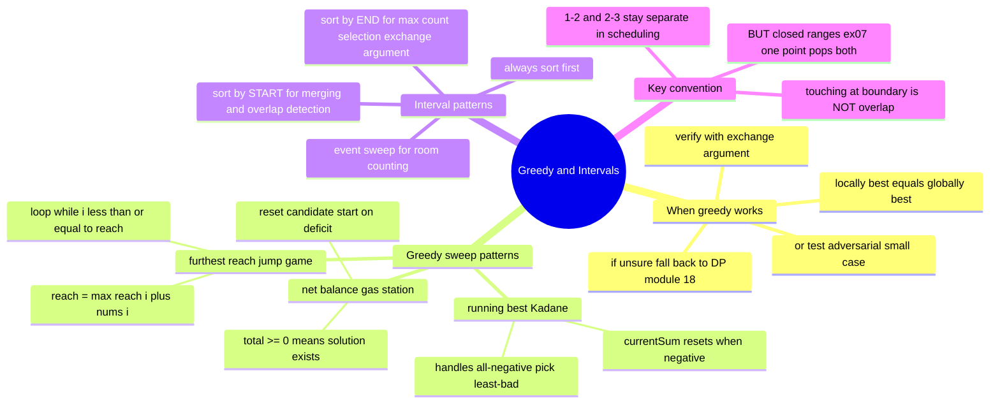

# 17 — Greedy & Intervals · Cheat-sheet

## Concept map

*What to notice: all greedy patterns share one shape — one forward pass,
one running number, one rule for when to reset or commit. The only
hard part is knowing WHICH pattern to apply and WHICH value to track.*

## The greedy pattern menu

| Pattern | Running value | When to reset | Problems |
| --- | --- | --- | --- |
| Running best (Kadane) | `currentSum` ending here | when `currentSum < 0`, restart at `nums[i]` | max subarray, best stretch |
| Furthest reach | `reach` = max index reachable | never (just keep taking the max) | can you reach end, min jumps |
| Net balance | running total of `gas - cost` | when it goes negative, reset candidate start | gas station, circular validity |
| Earliest-end selection | `lastEnd` of last picked interval | on every new pick | max non-overlapping, conference scheduling |
| Event sweep | running room count | on every event | min rooms, meeting rooms |
| Sort by start + merge | `currentEnd` of merged interval | when next `start >= currentEnd` | merge intervals, insert interval |

## Sort by start or end? The rule

- **Sort by START** when merging overlapping ranges, detecting any overlap,
  or inserting into a sorted list. You walk the timeline and compare each
  interval's start against the growing merged end.
- **Sort by END** when selecting the maximum number of non-overlapping
  intervals. The exchange argument says "earliest-ending choice at each
  step frees the most room" — sort by end makes this a simple greedy sweep.

## The exchange-argument checklist

Before trusting a greedy idea, fill in the blank:

> "If an optimal solution made a different choice than greedy here,
> I can swap in greedy's choice, and the result is ____________
> (no worse / at least as good) because ____________."

If you can finish those two blanks convincingly, greedy is correct.
If you can't, do not trust it — run small cases or switch to DP.

## Touching vs overlapping — pin this

| Question | Convention | Test case |
| --- | --- | --- |
| Do two events/meetings conflict? | `[1,2]` and `[2,3]` do NOT overlap | one attendee CAN attend both |
| Does a point fall in a closed range? | `x=2` IS inside both `[1,2]` and `[2,3]` | one arrow at `x=2` pops both |

The same boundary value answers the question differently depending on
what is being asked. Read the problem statement carefully.

## Complexity table

| Problem | Time | Space | Key insight |
| --- | --- | --- | --- |
| Kadane's (max subarray) | O(n) | O(1) | one pass, one running sum |
| Furthest reach (can reach end) | O(n) | O(1) | one pass, one max variable |
| Min jumps | O(n) | O(1) | window-of-window sweep |
| Gas station | O(n) | O(1) | reset candidate start on deficit |
| Merge intervals | O(n log n) | O(n) | sort dominates; one-pass merge |
| Insert interval | O(n) | O(n) | input already sorted; three-phase scan |
| Max non-overlapping | O(n log n) | O(1) | sort by end + greedy sweep |
| Min rooms (event sweep) | O(n log n) | O(n) | sort events; break ties by freeing first |
| Min arrows | O(n log n) | O(1) | sort by end; shoot at right endpoint |

## Self-quiz

1. State Kadane's update rule. What happens when `currentSum` goes
   negative, and WHY is dropping the prefix always safe?
2. What is the "exchange argument"? Give it in one sentence.
3. You need the max number of non-overlapping intervals. Do you sort
   by start or by end? Why?
4. You need to merge overlapping intervals. Do you sort by start or
   by end? Why?
5. `[1,2]` and `[2,3]`: do they overlap in the scheduling convention?
   What about in the "pop balloons with an arrow" convention?
6. Gas station: when should you reset the candidate starting station?
   What does a total `gas - cost` of `>= 0` guarantee?
7. What is the minimum-rooms event sweep, and why must you process
   "end" events before "start" events at the same timestamp?
8. Name two problem shapes where greedy FAILS and DP is needed instead.

Answers

1. `currentSum = currentSum < 0 ? value : currentSum + value`. When
   `currentSum` is negative, ANY run including that prefix has a sum
   strictly less than starting fresh at `value` — the exchange argument
   says you can always replace a negative-prefix run with the tail and
   never be worse.
2. "If I swap greedy's choice into the optimal solution at every
   disagreement, the result is never worse — so greedy must be optimal."
3. Sort by END. The exchange argument proves that the earliest-ending
   option at each step frees the most future room; any later-ending
   choice can only block more future intervals, not fewer.
4. Sort by START. You walk the timeline left to right and compare each
   new interval's start to the current merged window's end. Sorting by
   end would let you see intervals out of left-to-right order and miss
   merges.
5. Scheduling: `[1,2]` and `[2,3]` are touching, NOT overlapping — one
   person can attend both. Arrow/closed-range question: a point at `x=2`
   belongs to BOTH closed ranges, so one arrow pops both.
6. Reset the candidate start to the NEXT station whenever the running
   `gas - cost` total goes negative — no valid circuit can start at
   any station in a deficit stretch. The guarantee: if the total across
   all stations is `>= 0`, at least one valid start exists (you'll find
   it via the reset rule).
7. Build `[time, +1]` events for starts and `[time, -1]` events for
   ends. Sort by time; at equal times, sort `-1` before `+1` (free a
   room before allocating one). This captures the convention that
   touching talks (`A` ends at `t`, `B` starts at `t`) can share a room.
8. Two classic traps: (1) "minimum cost to reach the end" with varying
   step costs — greedy (always pick cheapest next step) fails on
   adversarial inputs; DP (min cost per position) is needed. (2)
   "Longest increasing subsequence" — greedy (always extend the current
   run) fails; DP (or patience sorting + binary search) is needed.

## Pattern-recognition drill

For each, name the pattern and subtype (or say "NOT greedy — why") before
checking the answer. Two of the eight are traps.

1. "Given a list of positive integers, find the maximum sum of any
   contiguous subarray."
2. "Given jump lengths at each position, can you reach the last index?"
3. "A set of tasks each has a start and end time. What is the minimum
   number of tasks to REMOVE so the remaining ones never overlap?"
4. "You have a ring of gas stations. Find a starting station where you
   can complete a full circuit without running out of fuel."
5. "Given a list of meeting time intervals, find the minimum number of
   conference rooms required."
6. "Given a set of prices on consecutive days, find the minimum number
   of trades to maximise total profit." *(trap)*
7. "Given balloon x-ranges as closed intervals, find the minimum number
   of arrows shot vertically to pop all balloons."
8. "Given a grid of integers, find the path from top-left to
   bottom-right (moving right or down) with the maximum sum." *(trap)*

Answers

1. **Kadane's / running-best sweep.** `currentSum` resets at negative
   prefixes; one pass, O(n).
2. **Furthest-reach sweep.** Track `reach = max(reach, i + nums[i])`;
   if `i > reach` at any point, return false. O(n).
3. **Sort-by-end greedy + complement.** `minRemovals = n - maxNonOverlapping`.
   Sort by end, greedily keep as many as possible, remove the rest. O(n log n).
4. **Net-balance sweep (gas station).** Run `tank += gas[i] - cost[i]`;
   reset candidate start on deficit; total `>= 0` guarantees a solution. O(n).
5. **Event-point sweep (min rooms).** `+1` at start, `-1` at end, sort
   and track peak. O(n log n).
6. **NOT greedy in the general sense — but actually trivially O(n) here.**
   The "unlimited trades" variant sums every positive daily delta; that
   IS a greedy proof (any multi-day hold telescopes into the same sum).
   But if the problem adds a transaction fee or a "hold limit," greedy
   breaks immediately — that becomes DP (module 18).
7. **Sort-by-end + shoot at right endpoint.** The closed-range convention
   means touching at a boundary is a hit. O(n log n).
8. **NOT greedy — this is grid-path DP (module 19).** At each cell you
   can only move right or down, and there are overlapping subproblems
   (many cells are reachable from multiple paths). A greedy "always pick
   the bigger neighbour" approach fails on adversarial grids where the
   locally larger step leads to a dead-end sum. Use DP (module 19).

