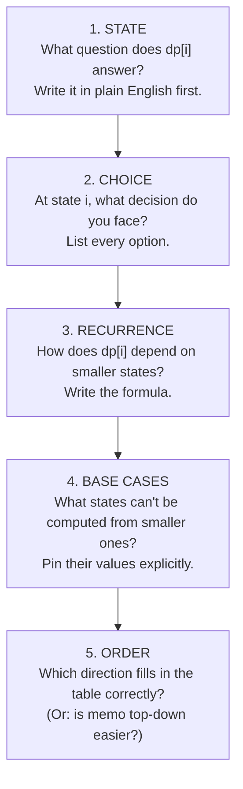
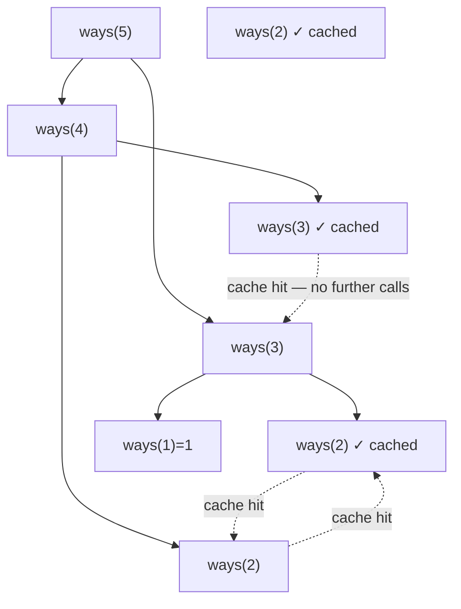

# 18 — Dynamic Programming I (1-D)

## Why this exists

Backtracking (module 14) explores the whole decision tree — every branch,
every leaf. That's correct, but often catastrophically slow: fib(40) via
plain recursion makes over a billion calls. Dynamic programming (DP) notices
the tree is asking the SAME sub-questions over and over and answers each one
exactly once. The result: exponential → polynomial.

DP doesn't replace backtracking's thinking — it refines it. You still map
out choices and sub-problems. You just stop re-doing work you've already done.

## The DP framework — the module's centerpiece

Every 1-D DP problem in this module is an instance of one five-step framework.
Internalize it once and the rest follows.



*What to notice: the framework is sequential — you cannot write the
recurrence before defining the state, and you cannot pick the order before
knowing the dependencies.*

Apply it mechanically at first. After a dozen problems it becomes instinct.

## Memoization vs tabulation

Climbing stairs (1 or 2 steps at a time) is the hello-world of 1-D DP.
Both approaches produce the same answer; the difference is direction.

**Top-down (memoization)** — recurse naturally; cache results so each state
is computed once:

```ts
function climbWaysMemo(n: number, cache = new Map<number, number>()): number {
  if (n <= 1) return 1                    // base cases
  if (cache.has(n)) return cache.get(n)!  // already answered — skip
  const result = climbWaysMemo(n - 1, cache) + climbWaysMemo(n - 2, cache)
  cache.set(n, result)                    // answer it once
  return result
}
```

**Bottom-up (tabulation)** — fill a table in dependency order:

```ts
function climbWaysTable(n: number): number {
  if (n <= 1) return 1
  const dp = new Array<number>(n + 1)
  dp[0] = 1; dp[1] = 1           // base cases
  for (let i = 2; i <= n; i++) {
    dp[i] = dp[i - 1]! + dp[i - 2]!   // recurrence
  }
  return dp[n]!
}
```

| | Memoization (top-down) | Tabulation (bottom-up) |
|---|---|---|
| Direction | start from the big problem | start from the smallest cases |
| Call stack | O(n) deep for large n | no recursion depth risk |
| Ease | follows the natural recursion | forces you to state the order |
| Space optimization | hard — cache entries must stay | easy — keep only what future steps need |
| When to prefer | complex state, sparse sub-problems | most interview answers; space-savings |

**Space optimization:** when `dp[i]` only reads `dp[i-1]` and `dp[i-2]`,
the whole table collapses to two variables:

```ts
function climbWaysOptimized(n: number): number {
  if (n <= 1) return 1
  let prev2 = 1, prev1 = 1     // dp[0], dp[1]
  for (let i = 2; i <= n; i++) {
    const curr = prev1 + prev2
    prev2 = prev1; prev1 = curr
  }
  return prev1
}
```

## The collapsed call tree — the whole trick

In module 08 you saw the fibonacci call tree balloon exponentially.
Memoization collapses it: every node that was recomputed many times becomes
a single cached lookup.



*What to notice: the ✓ nodes are cache hits — they return instantly without
spawning more calls. Each distinct sub-problem is computed exactly once.*

## Worked example — house robber through all 5 steps

**Problem:** row of warehouses `values = [2, 7, 9, 3, 1]`; never pick two
adjacent; maximize total.

1. **State:** `best(i)` = max loot using only the first `i` warehouses (indices 0..i-1).

2. **Choice at each state:** skip warehouse `i-1`, or pick it.

3. **Recurrence:**
   `best(i) = max(best(i-1),  best(i-2) + values[i-1])`

4. **Base cases:** `best(0) = 0` (no warehouses), `best(1) = 0` (skipping is always valid).

5. **Order:** fill ascending from `i = 2` to `i = n`; `best(i)` only reads
   two earlier cells.

State table:

| i | warehouse i-1 | best(i-1) | best(i-2) + values[i-1] | best(i) |
|---|---|---|---|---|
| 0 | — | — | — | 0 |
| 1 | 2 | — | — | 0 |
| 2 | 7 | 0 | 0 + 2 = 2 | max(0, 2) = 2 |
| 3 | 9 | 2 | 0 + 7 = 7 | max(2, 7) = 7 |
| 4 | 3 | 7 | 2 + 9 = 11 | max(7, 11) = 11 |
| 5 | 1 | 11 | 7 + 3 = 10 | max(11, 10) = 11 |
| — | — | 11 | 11 + 1 = 12 | max(11, 12) = **12** |

Final answer: `12` (pick warehouses 0, 2, 4 → values 2 + 9 + 1 = 12).

*What to notice: the table fills left to right; each row only needs the two
cells before it, which is why the space-optimized version uses two rolling
variables.*

## How to recognize it

DP applies when ALL of the following are true:

- **"Count the ways"**, **"minimum/maximum cost to reach"**, or **"can it be done"** — the answer is a single number (not a list of all paths).
- **Overlapping sub-problems** — the same smaller question arises from many different larger questions (the memoization speedup actually helps).
- **No need to enumerate every combination** — you need the optimal aggregate, not a list of all valid sequences.

Contrast with backtracking (module 14), which is correct when you genuinely
need every solution enumerated (all permutations, all subsets) — DP is wrong
there because the answer IS the list, and caching sub-answers doesn't help you
build distinct top-level outputs.

Problem-statement cues that point to 1-D DP:

- "How many distinct ways to reach / tile / decode…" → **count DP**.
- "Minimum number of coins / steps / jumps…" → **min-cost DP**.
- "Maximum profit / loot / sum / length…" → **max-value DP**.
- "Can you split / segment / make exactly…" → **feasibility DP**.
- "Longest increasing / decreasing subsequence…" → **LIS DP**.

The problem constrains you to a linear dimension (steps, indices, amounts)
and choices at each point depend on a bounded lookback.

## Complexity

| Problem | Time | Space | Why |
|---|---|---|---|
| Climbing stairs (optimized) | O(n) | O(1) | One pass, two variables |
| House robber | O(n) | O(1) | One pass, two variables |
| Coin change (min) | O(n · k) | O(n) | n = amount, k = coin count; nested loops, amount-size table |
| Word break | O(n²) | O(n) | Outer loop × inner scan; substring comparison per pair |
| Decode ways | O(n) | O(1) | Two-variable rolling, linear scan |
| LIS (n²) | O(n²) | O(n) | For each index, scan all prior indices |
| LIS (n log n) | O(n log n) | O(n) | Binary search per element into `tails` |

## Common gotchas

- **State too vague.** "best so far" is incomplete — best so far *of what*?
  The state must uniquely identify the sub-problem. "Max loot using the first
  i warehouses" is complete; "best loot" is not.
- **Iteration order violates dependencies.** Coin change needs ascending
  amounts because `fewest(a - coin)` must be filled in before `fewest(a)`.
  Going descending would read stale data.
- **Wrong initialization.** For min-cost problems, initialize unreachable
  states with `+Infinity`, not `0`. Initializing with `0` falsely claims
  "this is free" — it corrupts every result that reads from it.
- **Off-by-one between "first i items" and index i.** When `best(i)` means
  "using items 0 through i-1", item `i-1` is `values[i-1]`, not `values[i]`.
  Trace with a two-row table (i column, item-being-considered column) until
  your indexing is bulletproof.
- **Circular house robber.** The first and last house are adjacent.
  Do NOT try to handle this in one DP pass — reduce it to two linear runs:
  one that excludes the first house, one that excludes the last. Take the
  max of the two. This is cleaner and exactly correct.
- **LIS: "smallest tail" invariant.** `tails[k]` is not the actual k+1-th
  element of a real LIS — it's the smallest tail seen for any subsequence of
  length k+1. Replacing a tail with a smaller value never reduces the achievable
  length; it only opens more future possibilities.

## Try it now

→ `exercises/ex01-stairs-framework.ts` through
`exercises/ex07-longest-rising.ts`, then `checkpoint.ts`.
Check with `npm test -- 18`.
