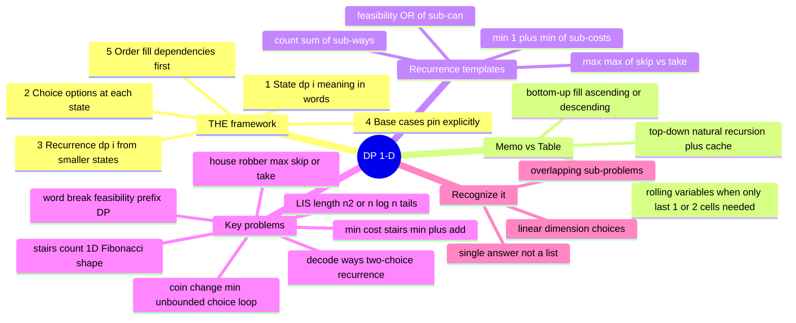

# 18 — Dynamic Programming I (1-D) · Cheat-sheet

## Concept map



*What to notice: every 1-D DP problem is just the framework applied
with a different recurrence template — count, min, max, or feasibility.*

## THE framework (5 steps)

| Step | Question to answer |
|---|---|
| 1. State | What does `dp[i]` mean, in one sentence? |
| 2. Choice | At state `i`, what options exist? |
| 3. Recurrence | How does `dp[i]` combine smaller results? |
| 4. Base cases | Which states cannot be computed from smaller ones? |
| 5. Order | Which direction fills dependencies before they're needed? |

## Memo vs table comparison

| | Memoization (top-down) | Tabulation (bottom-up) |
|---|---|---|
| Direction | big problem → small | smallest cases → big |
| Stack depth risk | yes (O(n) deep) | none |
| Space optimization | hard | easy: rolling variables |
| When to prefer | sparse sub-problems | most interview scenarios |

**Rolling-variable rule:** when `dp[i]` only reads `dp[i-1]` and `dp[i-2]`,
collapse the whole table into two variables and update them in the loop.

## Recurrence templates

```ts
// Count the ways
dp[i] = sum of dp[i - choice] for each valid choice

// Minimum cost
dp[i] = Math.min(...(dp[i - choice] + cost) for each valid choice)
// Initialize unreachable states with Infinity, not 0

// Maximum value
dp[i] = Math.max(dp[i - 1], dp[i - 2] + value)

// Feasibility (can it be done?)
dp[i] = dp[j] && wordSet.has(s.slice(j, i))  // for some j
```

## Greedy vs DP decision

Greedy is safe when the locally best choice never costs you later
(exchange argument in one sentence). If you cannot state that argument,
or a small counter-example breaks it, fall back to DP.

Classic trap from ex04: coins = `[1, 3, 4]`, amount = 6.
Greedy (biggest first) takes 4 + 1 + 1 = 3 coins.
DP finds 3 + 3 = **2 coins**. Always test greedy against a counter-example.

## LIS: two complexities

| Approach | Time | Key idea |
|---|---|---|
| O(n²) DP | dp[i] = 1 + max(dp[j]) for j < i where nums[j] < nums[i] | direct nested scan |
| O(n log n) tails | binary search into `tails[]` array | `tails[k]` = smallest tail of length-(k+1) LIS |

The `tails` array is NOT an actual LIS — it is a bookkeeping structure.
Its length is the answer. Binary search finds where to "place" each new
element (replace the first tail >= it, or extend if larger than all).

## Self-quiz

1. What are the 5 steps of the DP framework, in order?
2. Why does initializing a min-cost table with `0` instead of `Infinity`
   corrupt the results?
3. What is the space-optimization rule, and when does it apply?
4. Why does greedy fail on the coin change problem? Give the counter-example.
5. House robber circular version: why do you run two separate linear passes
   instead of one modified pass?
6. In `decodeWays`, why does `ways(0) = 1` (not 0) even though there is
   nothing to decode at the empty prefix?
7. What does `tails[k]` represent in the LIS patience-sort trick?
   (Hint: it is NOT the k+1-th element of the actual LIS.)
8. A problem says "find the minimum number of jumps to reach the end of
   an array." Is this DP or greedy? What is the deciding test?

<details><summary>Answers</summary>

1. (1) Define the state, (2) enumerate choices, (3) write the recurrence,
   (4) pin base cases, (5) choose the fill order.
2. `0` claims "this amount is reachable at zero cost." Any real path through
   an unreachable intermediate amount would look cheaper than it truly is —
   you would read a `0` that should say "impossible."
3. When `dp[i]` only depends on `dp[i-1]` and `dp[i-2]` (or any fixed
   bounded lookback), replace the whole array with that many named variables,
   saving O(n) space down to O(1).
4. Greedy (biggest coin first) fails because a later, smaller choice can
   combine better. Counter-example: coins = `[1, 3, 4]`, amount = 6.
   Greedy: 4 + 1 + 1 = 3 coins. Optimal: 3 + 3 = 2 coins.
5. In the circular version, houses 0 and n-1 are adjacent — you cannot pick
   both. Any valid solution excludes at least one endpoint. Run `maxLoot` on
   `values[0..n-2]` and on `values[1..n-1]`; take the max. One combined pass
   would need to track two mutually exclusive sub-problems simultaneously.
6. `ways(0) = 1` is an internal accounting convention: "the empty prefix
   decodes in exactly one way — by decoding nothing." It exists so the
   recurrence `ways(i) += ways(j)` works correctly when a single chunk
   covers the entire prefix (j = 0). The public contract returns 0 for an
   empty input string — a different question.
7. `tails[k]` is the SMALLEST tail element seen so far among all increasing
   subsequences of exactly length k + 1. It tracks achievable lengths so the
   binary search quickly finds where a new element can extend or improve the
   set of achievable subsequences.
8. For arrays where "always jump as far as possible" provably never costs
   future options, greedy runs in O(n). If the problem asks for a COUNT of
   ways, or costs are weighted in a way that creates overlapping sub-problems,
   that is DP. The deciding test: can you state the exchange argument in one
   sentence? If not, use DP.

</details>

## Pattern-recognition drill

For each description, say: **DP** (what shape?), **backtracking** (enumerate
all), **greedy** (exchange argument works), or **not this module**.

1. "Given coin denominations and a target, count the number of distinct
   ordered sequences of coins that sum to the target (order matters)."
2. "List every possible way to split the string 'abc' into non-empty
   substrings."
3. "Given a set of intervals, choose the maximum number that do not overlap."
4. "Given a digit string, count how many ways to decode it if '1' maps to
   A, '2' to B, ..., '26' to Z."
5. "Find the longest palindromic subsequence of a string."
6. "Given coin values, find the minimum number of coins to make a target;
   a coin can be reused."
7. "List every permutation of the characters in the string 'abc'."
8. "You can climb 1, 2, or 3 stairs at once. How many ways to reach the top?"

<details><summary>Answers</summary>

1. **DP — count compositions** (order matters, unbounded reuse). Same
   shape as `waysToFill` in the checkpoint: `ways[i] = sum of ways[i - coin]`.
2. **Backtracking** — "list every way" means enumerate all valid splits.
   There is no single number to cache; you need the actual list.
3. **Greedy** — sort by end time, always pick the earliest-ending available
   interval. The exchange argument: swapping in the earlier-ending interval
   never reduces the count of what fits after it.
4. **DP — count DP** (`decodeWays`, ex06): one-digit or two-digit choice at
   each position, overlapping sub-answers, single numeric result.
5. **DP** — but 2-D (depends on both ends of the substring). Module 19.
6. **DP — min-cost DP** (`minCoins`, ex04): greedy fails (counter-example
   above), overlapping sub-amounts, single-number result.
7. **Backtracking** — "list every permutation" means enumerate all.
   The output size is n! — DP cannot avoid generating each one explicitly.
8. **DP — count DP** (stairs variant with three choices). Recurrence:
   `dp[i] = dp[i-1] + dp[i-2] + dp[i-3]` (where dp[j] = 0 for j < 0).

</details>
