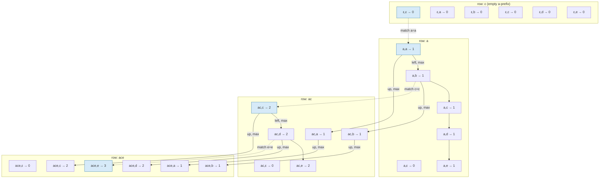
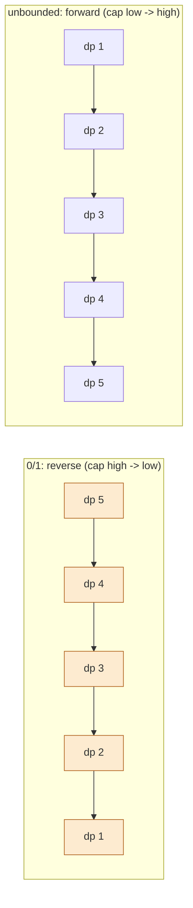

# 19 — Dynamic Programming II (2-D)

## Why this exists

Module 18's whole trick was: define `dp[i]` in words, find the choice,
write the recurrence, pin the base case, pick memo-or-table order. That
framework doesn't change here — but sometimes **one index can't
describe the state**. "How similar are these two strings, up to
position `i` in one and `j` in the other?" needs *two* positions.
"What's the best value I can carry, having considered the first `i`
items with `cap` room left?" needs an item index *and* a capacity. The
table grows a dimension; the framework stays identical.

The naive alternative is the same one from module 18: recompute every
sub-answer from scratch (recursion with no memo), except now the
overlap is worse — the same `(i, j)` pair gets re-derived through
exponentially many different paths through the two-index space. Two
strings of length `n` compared character by character without memo
costs `O(2^(n+m))`; the DP table visits each `(i, j)` cell once, for
`O(n * m)`.

## The LCS grid, fully filled

Longest Common Subsequence of `"ace"` and `"abcde"`. `dp[i][j]` = LCS
length of the first `i` characters of `"ace"` and the first `j`
characters of `"abcde"`. A match extends the diagonal (↖); no match
takes the best of "drop this character of `a`" (↑) or "drop this
character of `b`" (←).



*What to notice: the highlighted diagonal hops (c00 → c11 → c23 →
c35) are exactly the three matches `a`, `c`, `e` — walking backward
from the bottom-right corner along "where did this value come from"
reconstructs the LCS itself, not just its length.*

## The two big 2-D families

| Family | State means | Example | Recurrence shape |
| --- | --- | --- | --- |
| **Two-sequences** | `dp[i][j]` = answer for the first `i` chars of one sequence and the first `j` of another | LCS, edit distance | compare `seqA[i-1]` vs `seqB[j-1]`: match → diagonal + 1; no match → best of ← / ↑ (or ← / ↑ / ↖ for edit distance) |
| **Item-and-budget** | `dp[i][cap]` = best using the first `i` items within `cap` capacity | 0/1 knapsack, coin change | for each item: either skip it (`dp[i-1][cap]`) or take it (`dp[i-1][cap-weight] + value`) |

Both are still "state, choice, recurrence, base case, order" — the
state just has two numbers in it instead of one.

## Worked example: 0/1 knapsack, all 5 framework steps

Items (weight, value): `(1,1) (3,4) (4,5) (5,7)`. Capacity `7`.

1. **State**: `dp[i][cap]` = max value achievable using only the first
   `i` items, with total weight ≤ `cap`.
2. **Choice**: for item `i`, either **leave it out** (value stays
   `dp[i-1][cap]`) or, if it fits (`weight[i] <= cap`), **take it**
   (value becomes `dp[i-1][cap - weight[i]] + value[i]`). Take-it-or-
   leave-it — there is no partial take. That's what makes this "0/1".
3. **Recurrence**:
   `dp[i][cap] = dp[i-1][cap]` if `weight[i] > cap`, else
   `dp[i][cap] = max(dp[i-1][cap], dp[i-1][cap - weight[i]] + value[i])`.
4. **Base case**: `dp[0][cap] = 0` for every `cap` (no items yet, no
   value) — and `dp[i][0] = 0` for every `i` (no room, nothing fits).
5. **Order**: rows (items) must be filled in item order, because row
   `i` reads only row `i-1`. Columns within a row can go in any order —
   that freedom is exactly what makes the 1-row space optimization
   possible later.

Table (rows = items considered so far, cols = capacity 0..7):

| items \ cap | 0 | 1 | 2 | 3 | 4 | 5 | 6 | 7 |
| --- | --- | --- | --- | --- | --- | --- | --- | --- |
| none | 0 | 0 | 0 | 0 | 0 | 0 | 0 | 0 |
| +(1,1) | 0 | 1 | 1 | 1 | 1 | 1 | 1 | 1 |
| +(3,4) | 0 | 1 | 1 | 4 | 5 | 5 | 5 | 5 |
| +(4,5) | 0 | 1 | 1 | 4 | 5 | 6 | 6 | 9 |
| +(5,7) | 0 | 1 | 1 | 4 | 5 | 7 | 8 | 9 |

`dp[4][7] = 9`, achieved by items `(3,4)` and `(4,5)`: weight `3+4=7`,
value `4+5=9` — better than grabbing the biggest single item.

## 0/1 vs unbounded: one line of code

Unbounded knapsack (unlimited copies of each item — coin change is
this shape) changes exactly the loop's **iteration direction** once
you space-optimize to a 1-D row. Everything else — state, recurrence
shape, base case — is identical.

```ts
// 0/1: each item usable once. Reverse: high cap -> low cap.
for (let cap = capacity; cap >= weight; cap--) {
  dp[cap] = Math.max(dp[cap]!, dp[cap - weight]! + value)
}

// unbounded: item reusable. Forward: low cap -> high cap.
for (let cap = weight; cap <= capacity; cap++) {
  dp[cap] = Math.max(dp[cap]!, dp[cap - weight]! + value)
}
```

## Space optimization: 2 rows → 1 row → direction rule

`dp[i][cap]` only ever reads row `i-1` (never row `i-2` or earlier),
so you never need the full table:

- **2 rows**: keep `prev` and `curr`, swap after each item. Correct
  for both 0/1 and unbounded, but twice the memory of the next step.
- **1 row**: reuse a single array **if** you iterate capacity in the
  direction that guarantees you read an *old* (pre-this-item) value
  before you'd overwrite it.



*What to notice: in the 0/1 row, processing `cap=5` before `cap=4`
means `dp[cap - weight]` (a smaller index) hasn't been touched by THIS
item yet — it's still last item's value, exactly what "use item i at
most once" requires. In the unbounded row, processing low-to-high
means `dp[cap - weight]` MAY already include this item — that's what
lets it be reused.* Going the wrong direction for 0/1 silently turns
it into an unbounded knapsack (a classic interview bug that still
"runs" and still returns a number — just the wrong one).

## How to recognize it

- Two strings/sequences being **compared** (edit one into the other,
  find what they share) → two-sequence DP, `dp[i][j]`.
- "Pick items **under a limit**" (weight, budget, capacity) and each
  item is usable **at most once** → 0/1 knapsack.
- "**Count the ways** to make `X`" from a set of reusable parts (coins,
  pack sizes) → unbounded knapsack; "**order doesn't matter**" (a
  *combination* count) means the reusable-item loop goes on the
  **outside**.
- Grid movement with a per-cell cost or obstacle, only right/down (or
  similar restricted moves) → grid DP, `dp[row][col]`.
- "Longest/shortest ... substring/subsequence" where the string is
  compared **against itself** (palindromes) → still 2-D, just one
  sequence checked against its own reverse-order self.

## Common gotchas

- **The `+1` border**: a `dp` table sized `(n+1) x (m+1)` (one extra
  row/col for "zero characters considered") avoids a special case for
  empty prefixes — but it also means `dp[i][j]` corresponds to
  `seq[i-1]`/`seq[j-1]`, not `seq[i]`/`seq[j]`. Off-by-one here is the
  single most common bug in this module.
- **Capacity direction**: iterating the wrong way when space-optimized
  to 1 row (see above) — 0/1 needs reverse, unbounded needs forward.
- **Subsequence vs substring**: a *subsequence* skips freely (LCS); a
  *substring/subarray* must be contiguous (palindromic substrings).
  Mixing these up changes which recurrence applies — substring
  problems usually key on `dp[i][j]` = "is `s[i..j]` valid", not "best
  answer using prefixes."
- Initializing a "min cost" table with `0` when it should be `Infinity`
  (or vice versa for "max value" and `-Infinity`) silently makes an
  unreachable cell look reachable at zero cost.

## Try it now

→ `exercises/ex01-grid-paths.ts` through
`exercises/ex07-palindrome-dp.ts`, then `checkpoint.ts`.
Check with `npm test -- 19`.
