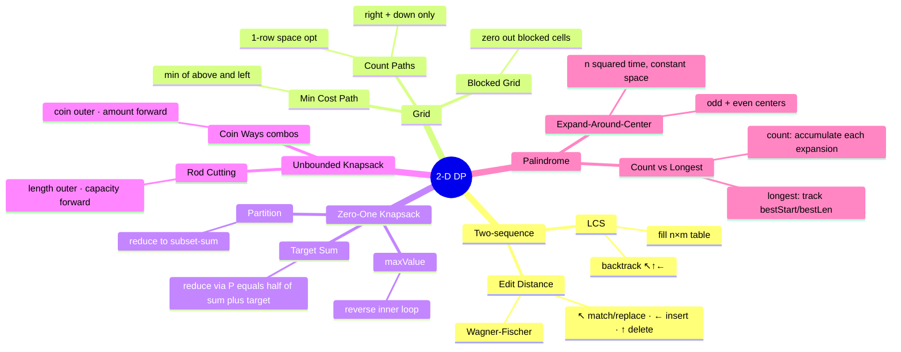

# Module 19 — 2-D DP: Pattern Summary

## Family Cheat-Sheet

| Family | Prototype | Table shape | Outer loop | Inner loop |
|---|---|---|---|---|
| Two-sequence | LCS, edit distance | (n+1) × (m+1) | chars of `a` | chars of `b` |
| Grid traversal | count paths, min cost | rows × cols | row | column |
| Item-and-budget (0/1) | knapsack, partition | n+1 × (W+1) | items | budget ↓ (reverse) |
| Item-and-budget (unbounded) | coin ways, rod cut | 1-D length W+1 | items | budget ↑ (forward) |

---

## 0/1 vs Unbounded — One-Liner Diff

| Variant | Inner loop direction | Why |
|---|---|---|
| **0/1** (each item once) | **Reverse** — `w = W .. item.weight` | Prevents "seeing" the same item's contribution again in the same pass |
| **Unbounded** (reusable) | **Forward** — `w = item.weight .. W` | Allows the item to be added again to amounts already containing it |

---

## Space-Optimisation Ladder

```
Full 2-D table (n+1) × (W+1)     O(n × W) space
         ↓  only need last two rows
Two-row rolling buffer             O(2W) space
         ↓  recurrence reads dp[w] (above) and dp[w-1] (just updated)
One 1-D array + direction rule     O(W) space
  • 0/1:        reverse inner loop (never read "already updated" cell)
  • Unbounded:  forward inner loop (reuse "already updated" cell freely)
         ↓  special: grid paths countPaths
Single row, left-to-right          O(cols) space
  dp[j] += dp[j-1]  (dp[j] = from above; dp[j-1] = from left, just updated)
```

---

## Reduction Gallery

### Equal Partition (ex04)
> Can `nums` be split into two subsets of equal sum?

```
total = sum(nums)
total is odd  →  false (integer arithmetic cannot split odd total evenly)
target = total / 2
Reduce to: does any subset of nums sum to exactly target?
Solve with 0/1 subset-sum dp, O(n × total) time.
```

### Target Sum with Signs (ex06)
> Assign +/- to each number in `nums` to reach `target`.

```
Let P = "+"-assigned subset sum,  N = "-"-assigned subset sum.
P + N = sum      (all elements)
P - N = target   (the signed sum we want)
─────────────────
2P = sum + target
P  = (sum + target) / 2

Preconditions to check FIRST:
  • (sum + target) must be even  →  if odd, return 0
  • |target| must be ≤ sum      →  if not, return 0
Then: count 0/1 subsets that sum to P.
Zeros double dp[0] each pass — they add two assignments (+0, -0).
```

---

## Mermaid Mindmap



---

## Self-Quiz (8 Questions)

<details>
<summary>Q1. Why does the 0/1 knapsack inner loop go in reverse?</summary>

**A.** The 1-D dp array is reused across items. Iterating `w` from `W` down to `item.weight` ensures that when we read `dp[w - item.weight]`, it still reflects the state *before* the current item was considered (i.e., we have not yet "added" this item at a smaller weight). If we went forward, we could count the same item multiple times.
</details>

<details>
<summary>Q2. In the coin-combination count (ex05), why is the coin the outer loop and the amount the inner loop?</summary>

**A.** Putting the coin in the outer loop ensures that each denomination is introduced once, preventing permutations from being counted separately. After processing coin `c`, `dp[a]` counts only combinations that use coins seen so far (in any quantity). If the amount were the outer loop, `[1,2]` and `[2,1]` would each increment `dp[3]` separately, giving permutation counts instead.
</details>

<details>
<summary>Q3. What two preconditions must hold for the target-sum reduction to be valid?</summary>

**A.** (1) `(sum + target)` must be even — otherwise `P` would not be an integer. (2) `|target| ≤ sum` — if `target > sum`, no assignment of signs can bridge the gap. Both are checked before running the DP.
</details>

<details>
<summary>Q4. How does expand-around-center count even-length palindromes?</summary>

**A.** For each index `i`, a second expansion uses `left = i` and `right = i + 1` as the two starting positions (a "gap" center). The expansion proceeds as long as `s[left] === s[right]`, counting the even-length palindromes from length 2 upward.
</details>

<details>
<summary>Q5. What is the recurrence for LCS, and in which direction do you backtrack?</summary>

**A.** `dp[i][j] = dp[i-1][j-1] + 1` when `a[i-1] === b[j-1]`; `dp[i][j] = max(dp[i-1][j], dp[i][j-1])` otherwise. Backtrack from `(n, m)`: go ↖ on a character match (collecting that character), else go ↑ if `dp[i-1][j] >= dp[i][j-1]`, else go ←.
</details>

<details>
<summary>Q6. In edit distance, what does each table direction represent?</summary>

**A.** ↖ = replace (or match for free); ← = insert a character from `b` into the current alignment; ↑ = delete a character from `a`. The cost is 0 for ↖ when `a[i-1] === b[j-1]`, and 1 otherwise.
</details>

<details>
<summary>Q7. How do you reconstruct which items were chosen in the 0/1 knapsack?</summary>

**A.** Build the full 2-D `dp[i][w]` table (not the 1-D optimised version). Then backtrack from `dp[n][budget]`: if `dp[i][w] !== dp[i-1][w]`, item `i-1` was included — record it and subtract its cost from `w`. Repeat until `i = 0`.
</details>

<details>
<summary>Q8. What is the space-complexity difference between the 2-D DP table for LCS and a space-optimised 1-D rolling version?</summary>

**A.** Full 2-D table: O(n × m). Space-optimised: O(m) — keep only the previous row. The optimised version cannot reconstruct the actual LCS string (only the length), because backtracking requires the full table.
</details>

---

## Pattern-Recognition Drill

For each problem, identify the DP pattern. Answers are below — try first.

1. Count ways to tile a `2 × n` board with `1 × 2` dominoes.
2. Given two protein sequences, find their longest common subsequence.
3. Fewest deletions to make a string a palindrome.
4. Can you partition `[3,1,1,2,2,1]` into three subsets of equal sum?
5. Count distinct binary strings of length `n` with no two consecutive `1`s.
6. Given a list of word lengths and their values, fill a page of exactly `L` lines maximising value (each word used at most once).
7. Minimum cost to convert string `X` to string `Y` using only insertions and deletions (no replacements).
8. How many ways can you make change for `$1.00` using pennies, nickels, dimes, quarters?

**Decoys (not 2-D DP):**

- D1. Find the kth largest element in an unsorted array.
- D2. Detect if a linked list has a cycle.

<details>
<summary>Answers</summary>

1. **1-D DP** (Fibonacci variant) — `ways(n) = ways(n-1) + ways(n-2)`.
2. **LCS (two-sequence DP)** — `dp[i][j]` on the two sequences.
3. **LCS / edit-distance reduction** — `n - lcsLength(s, s.reversed())` gives minimum deletions.
4. **Subset-sum / 0/1 knapsack** — reduce to: can some subset sum to `total/3`? Then apply twice.
5. **1-D DP** — state tracks whether the previous bit was a 1.
6. **0/1 knapsack** — items = words, weight = word length, capacity = page length `L`.
7. **Edit distance without replace** — cost = `(n - lcsLength(X, Y)) + (m - lcsLength(X, Y))` = sum of chars not in LCS.
8. **Unbounded knapsack — combination count** — coins outer, amount inner (forward). Answer: 242.

D1. Heap / quickselect — not DP at all.
D2. Floyd's cycle detection — pointer technique, not DP.
</details>
