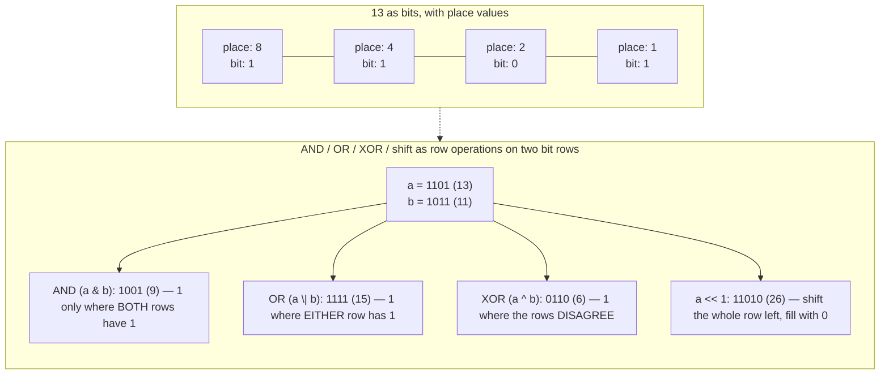
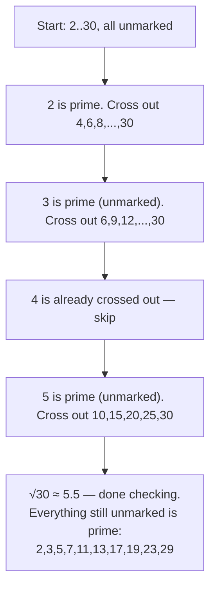
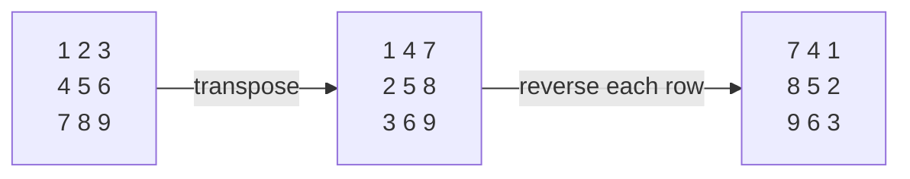

# 20 — Bit Manipulation & Math

## Why this exists

Every integer your program touches is already a bit array — you've
just been looking at it through a decimal costume. Some problems that
look like they need O(n) extra memory (a `Set` to track "have I seen
this twice?", a whole visited array) collapse to O(1) space once you
notice the answer is hiding in the bits themselves. Interviewers also
reach for bit questions specifically because they're small enough to
probe whether you actually understand how numbers are represented,
not just whether you memorized a library call.

The math half of this module is a similar "know the primitive"
toolkit: gcd/lcm, fast exponentiation, and primality testing show up
as *sub-routines* inside bigger problems constantly, so they need to
be reflexes, not things you re-derive under pressure.

## The number line, in binary

*What to notice: `8 + 4 + 0 + 1 = 13` — each bit is just "is this
place value included?" AND/OR/XOR are all the same shape: look at the
same column in both rows and combine it with one rule. A shift moves
every bit to a new column, which is why `<< 1` doubles a number and
`>> 1` halves it (floor division).*

## The bit toolkit

Each of these is a one-line recipe once you see the trick. `i` is a
bit position counting from 0 at the least-significant (rightmost)
bit.

| Op | Recipe | What it does |
| --- | --- | --- |
| Get bit `i` | `(n >> i) & 1` | shift the target bit to position 0, mask off everything else |
| Set bit `i` | `n \| (1 << i)` | OR in a 1 at position `i`; other bits pass through unchanged |
| Clear bit `i` | `n & ~(1 << i)` | AND with a mask that's 0 only at position `i` |
| Toggle bit `i` | `n ^ (1 << i)` | XOR flips exactly the bit that's set in the mask |
| Lowest set bit | `n & -n` | two's-complement makes `-n` the bitwise-not-plus-one; ANDing isolates the rightmost 1 |
| Drop lowest set bit | `n & (n - 1)` | `n - 1` flips the lowest set bit to 0 and every bit below it to 1; ANDing clears just that one bit |
| Is power of two | `n > 0 && (n & (n - 1)) === 0` | a power of two has exactly one set bit, so dropping it leaves 0 |

`n & (n - 1)` — "drop the lowest set bit" — is worth memorizing on
its own: looping it until `n` reaches 0 counts set bits in O(popcount)
iterations instead of O(bit width), which matters when the input is
sparse (few 1-bits).

## XOR's three superpowers

XOR (`^`) has three properties that, combined, make it the workhorse
of this module:

1. **`a ^ a = 0`** — a value XORed with itself cancels out.
2. **`a ^ 0 = a`** — XOR with 0 is a no-op (an identity element).
3. **Order doesn't matter** — XOR is commutative and associative, so
   `a ^ b ^ c` gives the same result no matter how you group or
   reorder the terms.

Put together: XOR every element of a list where everything appears in
**pairs except one** value, and every pair cancels to 0, leaving only
the odd one out. That's "canceling pairs." The same three properties
also power **swap-free diffing** — `a ^ b` tells you exactly which
bit *positions* two numbers disagree on, with no subtraction and no
temp variable, and running it back (`(a ^ b) ^ b === a`) is how a
classic XOR-swap recovers either original value without extra
storage.

## Worked example: single number

Array `[4, 1, 2, 1, 2]` — every value appears twice except one. Fold
XOR across the whole array, left to right:

| Step | Value | Running XOR | Binary running XOR |
| --- | --- | --- | --- |
| start | — | `0` | `000` |
| 1 | 4 | `0 ^ 4 = 4` | `100` |
| 2 | 1 | `4 ^ 1 = 5` | `101` |
| 3 | 2 | `5 ^ 2 = 7` | `111` |
| 4 | 1 | `7 ^ 1 = 6` | `110` |
| 5 | 2 | `6 ^ 2 = 4` | `100` |

Final running XOR: `4`. Every value that appeared twice contributed
`x ^ x = 0` and vanished (order didn't matter, so the two 1's and two
2's could "find" each other across the gaps); the value that appeared
once is all that's left — O(n) time, **O(1) space**, no `Set` needed.

## Math essentials

**Euclid's gcd** — `gcd(a, b) = gcd(b, a % b)`, until `b` hits 0. Why
it works in two sentences: any divisor of both `a` and `b` also
divides `a % b` (since `a = k*b + (a % b)`), so replacing `a` with `b`
and `b` with `a % b` never changes the *set* of common divisors —
only shrinks the numbers, fast (each step roughly halves the smaller
number, so it's O(log(min(a, b)))).

**lcm via gcd** — `lcm(a, b) = (a / gcd(a, b)) * b`. Divide first,
then multiply, so the intermediate product stays smaller (less
overflow risk in languages with fixed-width ints).

**Fast pow** — `pow(base, exp)`: if `exp` is even, `base^exp =
(base^(exp/2))^2`; if odd, peel off one factor of `base` first. This
is the same divide-and-conquer halving idea from module 08
(`08-recursion-divide-conquer`) applied to exponents instead of
arrays — O(log exp) instead of O(exp) multiplications.

**Primality by trial division** — to test if `n` is prime, only trial
divisors up to `√n` need checking: if `n = a * b` with both `a, b >
√n`, then `a * b > n`, a contradiction — so if no factor exists at or
below `√n`, none exists above it either. O(√n) time.

**Sieve of Eratosthenes** — to find *every* prime up to `n` at once,
trial division per number (O(n√n) total) is wasteful. Instead, walk
up from 2: the first unmarked number is prime, then cross out every
multiple of it. Numbers that survive un-crossed are prime.

*What to notice: the outer loop only needs to run to `√n` (past that,
every composite has already been crossed out by a smaller factor) —
that's what pushes the total cost down to O(n log log n), far below
the O(n√n) of testing each number independently.*

## Matrix as math

A 2D grid is just numbers arranged in rows and columns, and a
surprising number of "matrix" interview questions are really two
tricks in disguise:

**Rotate 90° clockwise, in place** = **transpose** (flip across the
main diagonal: `grid[i][j] <-> grid[j][i]`) **then reverse each row**.
Both steps are O(1) extra space, so the composition is too.

*What to notice: transpose alone would be a diagonal flip, not a
rotation — it's the row-reverse afterward that turns it into a true
90° clockwise turn. (Rotating counter-clockwise instead: reverse each
row first, then transpose — or transpose then reverse each column.)*

**Spiral order** = walk with **four shrinking bounds** (`top`,
`bottom`, `left`, `right`): sweep right across the top row, down the
right column, left across the bottom row, up the left column, then
shrink all four bounds inward by one and repeat until they cross. No
"visited" grid needed — the bounds themselves are the visited state.

## How to recognize it

- **"without extra memory" / "O(1) extra space"** on a small-value or
  presence/absence problem → bits as a compact set.
- **"appears once" / "appears twice except one" / "find the missing
  number"** → XOR fold (or, if values aren't guaranteed unique
  otherwise, careful use of sum — see ex02's docstring).
- **"count the set bits" / "hamming weight" / "hamming distance"** →
  `n & (n - 1)` loop, or XOR then count.
- **divisibility, "greatest common", "smallest number divisible by
  both", "how many primes below n"** → gcd/lcm/sieve.
- **"rotate the image", "spiral order", "zero out the row and column"**
  → in-place matrix tricks (transpose+reverse, four bounds, first
  row/col as markers).

## Complexity

| Operation | Time | Space | Why |
| --- | --- | --- | --- |
| get/set/clear/toggle bit | O(1) | O(1) | fixed-width arithmetic, no loop |
| count set bits (Kernighan) | O(popcount) | O(1) | one iteration per 1-bit, not per bit-width |
| XOR fold over n values | O(n) | O(1) | single pass, no auxiliary structure |
| gcd (Euclidean) | O(log(min(a,b))) | O(1) | each step shrinks the smaller number geometrically |
| fast pow | O(log exp) | O(1) iterative / O(log exp) recursive | halving the exponent each step |
| is prime (trial division) | O(√n) | O(1) | only need factors up to √n |
| sieve up to n | O(n log log n) | O(n) | each number is crossed out once per prime factor, and primes thin out like the harmonic-ish sum 1/2 + 1/3 + 1/5 + ... |
| rotate 90° in place | O(n²) | O(1) extra | transpose + reverse touch every cell a constant number of times |
| spiral order | O(rows × cols) | O(1) extra (excluding output) | four bounds visit each cell exactly once |

## Common gotchas

- **Operator precedence: `&`/`|`/`^` bind LOOSER than `==`/`===`.**
  `if (n & 1 == 0)` parses as `n & (1 == 0)`, not `(n & 1) == 0` —
  always parenthesize bitwise comparisons.
- **Negative numbers and shifts.** Shifting is defined on the
  underlying bit pattern, and negative numbers use two's-complement —
  `-8 >> 1` is `-4` (arithmetic shift preserves the sign bit), which
  is usually what you want for "divide by 2, rounding toward
  negative infinity", but it is easy to *assume* it just zero-fills
  like an unsigned shift. It doesn't (see the next point).
- **Sign-bit surprises — this is JS/TS-specific, read carefully.**
  JavaScript's bitwise operators (`&`, `|`, `^`, `~`, `<<`, `>>`,
  `>>>`) do NOT operate on the arbitrary-precision `number` type you
  normally use. They first convert both operands to a **32-bit
  signed integer** (via `ToInt32`), do the operation, then convert
  the 32-bit result back to a `number`. Two consequences:
  - `>>` is the **sign-propagating** ("arithmetic") right shift — it
    copies the sign bit into the vacated high bits, so shifting a
    negative number stays negative.
  - `>>>` is the **zero-fill** ("logical" / unsigned) right shift —
    it always fills with 0s, so `-1 >>> 0` gives `4294967295` (the
    unsigned 32-bit reading of all-1-bits), not `-1`. This module's
    `reverseBits32` relies on exactly this: after reversing, `>>> 0`
    reinterprets the bit pattern as the correct unsigned decimal
    value instead of a (possibly negative) signed one.
  - Because of the 32-bit truncation, bitwise ops silently misbehave
    above `2**31 - 1` — this module's bit-toolkit exercises assume
    inputs stay within the signed 32-bit range unless stated
    otherwise. (Python's twin lesson has the opposite problem:
    Python ints are arbitrary-precision, so it has to *manually* mask
    with `& 0xFFFFFFFF` to emulate 32-bit behavior — TS gets it for
    free from `&`/`|`/`^`/`~`/`<<`/`>>`, but pays for it with the
    `>>>` vs `>>` distinction Python doesn't need at all.)
- **Integer division vs float division.** TS/JS has no `//` operator
  — `a / b` always produces a float. Use `Math.floor(a / b)` (or, for
  non-negative values only, `a >> ...` style tricks, or `Math.trunc`
  when you want truncation-toward-zero instead of floor for negative
  inputs) when you need integer division.

## Try it now

→ `exercises/ex01-bit-basics.ts` through `ex06-digit-strings.ts`, then
`checkpoint.ts`. Check with `npm test -- 20`.
