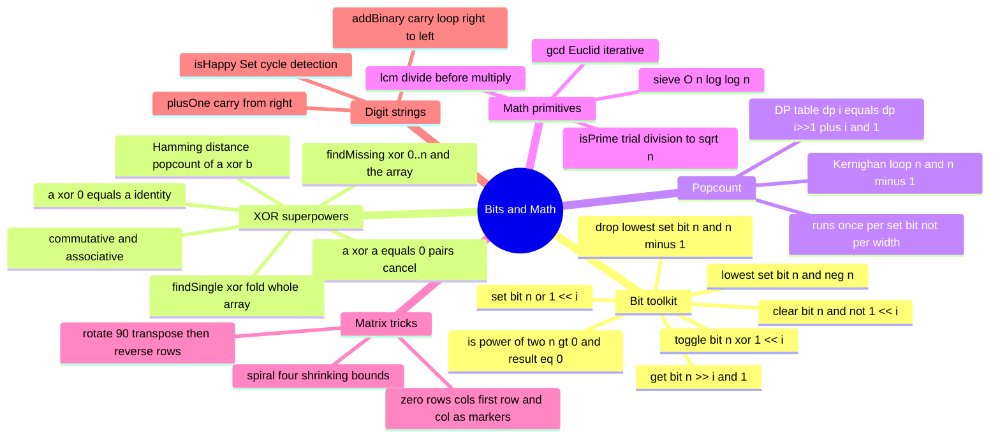

# 20 — Bit Manipulation & Math · Cheat-sheet

## Concept map



*What to notice: two toolkits, one principle — use the structure of the
data (bit patterns, number theory, grid geometry) to avoid extra space.*

## The bit-recipe table

| Op | One-liner | What it does |
| --- | --- | --- |
| Get bit `i` | `(n >> i) & 1` | shift target to bit 0, mask the rest |
| Set bit `i` | `n \| (1 << i)` | OR in a 1 at position `i` |
| Clear bit `i` | `n & ~(1 << i)` | AND with a mask that is 0 only at `i` |
| Toggle bit `i` | `n ^ (1 << i)` | XOR flips exactly that position |
| Lowest set bit | `n & -n` | two's-complement isolates the rightmost 1 |
| Drop lowest set bit | `n & (n - 1)` | `n-1` flips the lowest 1 and everything below it |
| Is power of two | `n > 0 && (n & (n-1)) === 0` | powers of two have exactly one set bit |

## XOR laws (memorize these three)

```
a ^ a = 0          // any value XORed with itself cancels
a ^ 0 = a          // XOR with 0 is the identity
a ^ b ^ c === c ^ a ^ b   // commutative and associative
```

**Consequences:** XOR-fold an array where everything appears twice except
one value → pairs cancel → the lone survivor is the answer.
XOR-fold `0..n` and every element of the array → the missing value
survives (it has no partner in the array).

## Popcount — Kernighan vs DP table

**When you need one value:** `n & (n-1)` loop — O(popcount), not O(bit width).

**When you need a table for 0..n:**
```ts
dp[0] = 0
for (let i = 1; i <= n; i++) dp[i] = dp[i >> 1] + (i & 1)
```
This is DP: `i >> 1` is a smaller number whose popcount you already know;
the `(i & 1)` restores the bit you shifted away.

## Sieve template

```ts
const composite = new Array(n + 1).fill(false)
for (let i = 2; i <= n; i++) {
  if (!composite[i]) {
    primes.push(i)
    for (let j = i * i; j <= n; j += i) composite[j] = true
    // start at i*i: all smaller multiples were marked by smaller primes
  }
}
```

## Fast-pow reminder (from module 08)

```ts
function fastPow(base: number, exp: number): number {
  if (exp === 0) return 1
  if (exp % 2 === 0) {
    const half = fastPow(base, exp / 2)
    return half * half
  }
  return base * fastPow(base, exp - 1)
}
```

O(log exp) multiplications instead of O(exp).

## Language-reality box — JS/TS vs Python 32-bit behavior

| Aspect | JS / TS | Python |
| --- | --- | --- |
| Integer width for bitwise ops | **Always 32-bit signed** (ToInt32 conversion) | Arbitrary precision |
| Sign-propagating right shift | `>>` (copies sign bit) | `>>` (same) |
| Zero-fill right shift | `>>>` (fills with 0; use for unsigned result) | Not needed |
| `~n` | `-(n + 1)` (32-bit NOT) | `-(n + 1)` (same, arbitrary precision) |
| Simulate 32-bit in Python | use `& 0xFFFFFFFF` | — |
| Values above 2^31 - 1 | **Silently wrong** with bitwise ops | Fine natively |

## Self-quiz

1. What is `n & (n - 1)` doing, and why does it run the popcount loop
   in O(popcount) iterations instead of O(bit width)?
2. Name XOR's three algebraic properties. How do they let you find "the
   value that appears exactly once" in one pass with O(1) space?
3. Why does Euclid's gcd replace `(a, b)` with `(b, a % b)` rather than
   `(a - b, b)`, and why does that make it O(log min(a, b))?
4. The sieve's inner loop starts at `i * i`, not `2 * i`. Why is
   `2 * i` wasteful?
5. Why does rotating 90° clockwise equal "transpose then reverse each
   row"? What would you do for 90° counter-clockwise instead?
6. In the spiral-order algorithm, why do you need the two `if`-guards
   before the "sweep left" and "sweep up" passes?
7. In `zeroRowsCols`, why must you save two booleans for the first
   row/column *before* using them as markers for the interior?
8. What is `>>> 0` doing in `reverseBits32`, and why is `>> 0` wrong?

<details><summary>Answers</summary>

1. `n & (n - 1)` drops the lowest set bit: `n - 1` flips that bit from
   1 to 0 and every bit below it from 0 to 1; ANDing with `n` (whose
   lower bits are all 0) clears just that one bit. The loop executes
   once per 1-bit in `n`, not once per bit position.
2. `a ^ a = 0` (cancel), `a ^ 0 = a` (identity), commutative and associative
   (order doesn't matter). Together: XOR every element; each pair
   contributes `x ^ x = 0`, and XOR with 0 is a no-op, so only the
   unpaired element survives.
3. Subtraction shrinks numbers linearly; `a % b` jumps to the remainder
   which is at most `b - 1`, roughly halving the smaller number each
   step — O(log min(a, b)) total steps.
4. For any prime `i`, every multiple `k * i` with `k < i` was already
   crossed out when we processed the prime `k`. Starting at `i*i`
   skips all that redundant work.
5. Transpose is a reflection across the main diagonal. Reversing each row
   turns that reflection into a true 90° clockwise rotation. For
   counter-clockwise: reverse each row first, then transpose (or
   transpose then reverse each column).
6. After sweeping right and incrementing `top`, or sweeping down and
   decrementing `right`, the bounds may have crossed. Without the guards
   you would sweep the same row or column again in the opposite
   direction, duplicating elements in the output.
7. The first row and column are used as marker storage during the interior
   scan. If they originally contained zeros, that information would be
   overwritten during the marking phase. The saved booleans preserve it
   so the first row/column can be correctly zeroed in the final step.
8. `>>> 0` is the unsigned (zero-fill) right shift by zero bits — it
   does no shifting but reinterprets the 32-bit result as an unsigned
   integer (0 to 2^32 - 1), preventing JS from returning a negative
   signed value when the sign bit is 1. `>> 0` is the arithmetic
   (signed) shift and would propagate the sign bit, yielding a negative
   number for patterns with a leading 1.

</details>

## Pattern-recognition drill

For each, name the pattern/structure before peeking at the answer.

1. "Given an array where every value appears exactly twice except one,
   find the odd one out — in O(n) time, O(1) space."
2. "Count the number of 1-bits in a very large integer whose bit
   representation is extremely sparse (mostly zeros)."
3. "Given a list of integers 0..n with one missing, find the gap —
   no extra array allowed." *(bonus: two approaches)*
4. "How many prime numbers are there up to one million?" *(which
   algorithm, and what's its complexity?)*
5. "Rotate a 100x100 image 90 degrees clockwise without allocating a
   second matrix."
6. "Find the shortest repeating cycle that covers two event periods of
   length A and B — the answer is a single number derived from A and B."
   *(decoy: not bits, but what two primitives?)*

<details><summary>Answers</summary>

1. XOR fold — XOR every element; pairs cancel (a^a=0), the lone value
   survives (a^0=a). O(n) time, O(1) space.
2. Kernighan's `n & (n-1)` popcount loop — runs O(popcount) iterations,
   not O(bit width), so a sparse number with only 3 set bits out of 64
   needs just 3 iterations.
3. XOR version: XOR together all of 0..n AND every element of the array;
   present values cancel in pairs, the missing one survives. Sum version:
   compute n*(n+1)/2 minus sum(nums). Both are O(n) time, O(1) space.
   The XOR version avoids any overflow risk in fixed-width-integer languages.
4. Sieve of Eratosthenes — O(n log log n) time, O(n) space. For n =
   1,000,000 that yields 78,498 primes. Trial-dividing each number
   independently would be O(n*sqrt(n)) and far too slow.
5. In-place matrix rotation: transpose (swap grid[i][j] with grid[j][i]
   for j > i) then reverse each row. O(n^2) time, O(1) extra space.
6. NOT bit manipulation — this is lcm (least common multiple).
   lcm(a, b) = a / gcd(a, b) * b. The two primitives are gcd
   (Euclid's algorithm) and the divide-before-multiply trick to avoid
   overflow. Bit ops are not the right tool here.

</details>
