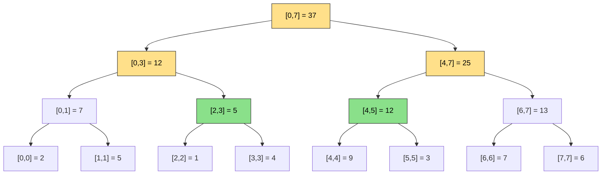
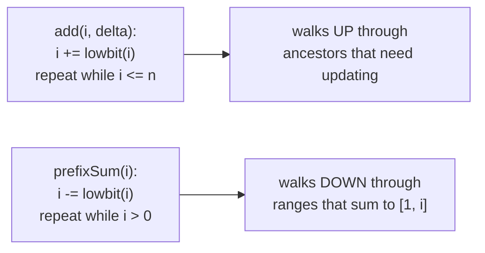
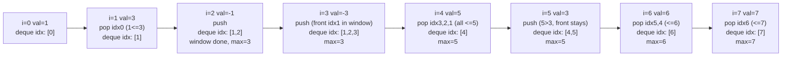
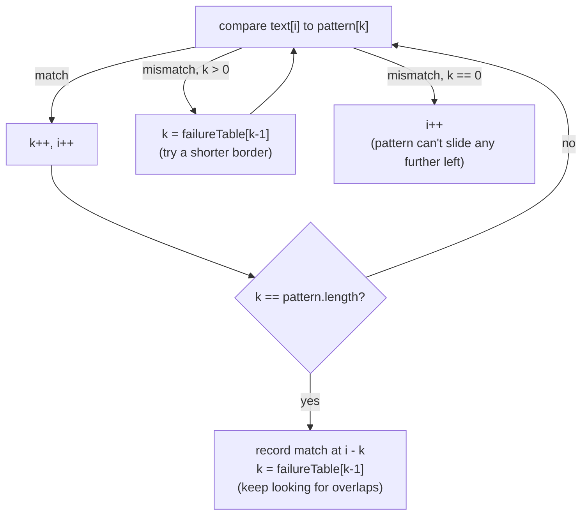

# 21 — Advanced Structures & String Algorithms

## Why this exists

Module 04's prefix-sum array answers "sum of a range" in O(1) — but the
instant the underlying data can **change**, that trick dies. Rebuilding
the whole prefix array after every update is O(n) per update, and n
updates cost O(n²) total. A **segment tree** (and its leaner cousin,
the **Fenwick tree**) answers both "update one value" AND "query a
range" in O(log n) each — the sweet spot prefix sums can't reach.

Two more gaps this module closes:

- **"max/min of every window as it slides"** — module 05's sliding
  window tracks a running *sum* in O(1) per step, but a running *max*
  needs re-scanning the window every time... unless you keep a
  **monotonic deque** (this module) that also does it in O(1)
  amortized per step.
- **"find every occurrence of a pattern in a huge text"** — comparing
  the pattern at every position is O(n·m). **Rabin-Karp** (rolling
  hash) and **KMP** (failure function) both bring that down to
  O(n + m).

**Honesty box:** these are senior-level differentiators, not everyday
tools. You'll reach for hash maps, two pointers, and BFS/DFS ten times
more often than a segment tree. But they show up in range-query
problems, "design a metrics/analytics service" system questions, and
the harder half of competitive-style interview sets — and knowing them
signals you can build a structure, not just call one.

## Segment tree: an array wearing a binary tree's clothes

A segment tree stores one **aggregate** (sum, min, max — any
associative "merge") per node, where each node owns a **range** of the
original array. The root owns the whole array; each node's range
splits in half between its two children; leaves own one element each.



*What to notice: this is the segment tree over `[2, 5, 1, 4, 9, 3, 7,
6]`. Answering `rangeSum(2, 5)` only fully USES two nodes — `[2,3]=5`
and `[4,5]=12` (green), summing to `17` — while `[0,7]`, `[0,3]`, and
`[4,7]` (yellow) are just waypoints the recursion passes through on
the way down, and `[0,1]`/`[6,7]` are skipped entirely (no overlap
with `[2,5]`). A query only ever touches O(log n) nodes: at most a
handful per level, and there are log n levels.*

**Build**: recursively split `[lo, hi]` in half until `lo === hi`
(a leaf), then merge children bottom-up. O(n) total (same "most nodes
are near the leaves" argument as heapify in module 12).

**Query(i, j)**: at each node, three cases —
1. Node's range is *entirely inside* `[i, j]` → return its stored
   aggregate directly (the green nodes above).
2. Node's range *doesn't overlap* `[i, j]` at all → return the merge's
   identity element (`0` for sum, `+Infinity` for min) and stop.
3. *Partial* overlap → recurse into both children and merge their
   results (the yellow nodes above).

**Update(i, value)**: walk down to the leaf for index `i`, set it,
then merge back up every ancestor on the way out.

**The merge-function generalization**: nothing above mentions "sum"
specifically. Swap the merge function from `(a, b) => a + b` (identity
`0`) to `(a, b) => Math.min(a, b)` (identity `+Infinity`) and you have
a **range-min tree** — same build, same query shape, same update. The
tree doesn't care what it's aggregating.

**Storage**: array-based, indexed like a heap (node `i`'s children are
`2i+1` and `2i+2`), sized `4 * n` — generous enough that the tree never
runs out of slots regardless of how the recursion's ranges land.

## Fenwick tree (Binary Indexed Tree): smaller, faster, prefix-only

A Fenwick tree answers **prefix sums** (`sum[0..i]`) and point updates
in O(log n), using a single array of size `n + 1` — no tree structure,
no `4n` overhead, and about a third of the code of a segment tree.
`rangeSum(i, j)` falls out for free: `prefixSum(j) - prefixSum(i - 1)`.

The trick is **lowbit**: `i & (-i)` isolates the lowest set bit of
`i`, which is exactly the size of the range that index `i` (1-indexed)
is responsible for.



*What to notice: `add` and `prefixSum` walk the SAME implicit tree in
opposite directions — `add` climbs toward the root fixing every
ancestor's stored sum, `prefixSum` descends from `i` picking up
pre-summed chunks. Both loops run at most O(log n) times because each
step changes a different bit of `i`.*

## Comparison: prefix array vs Fenwick vs segment tree

| | Prefix array (module 04) | Fenwick tree | Segment tree |
| --- | --- | --- | --- |
| Build | O(n) | O(n log n) naive / O(n) smart | O(n) |
| Point update | O(n) (rebuild suffix) | O(log n) | O(log n) |
| Range query | O(1) | O(log n) | O(log n) |
| Range min/max | not supported (sum only, not invertible) | not supported (needs invertible merge) | supported (any associative merge) |
| Code size | tiny | small | medium |
| When to reach for it | data never changes | sum/count/XOR + updates | min/max/gcd + updates, or anything not invertible |

*What to notice: Fenwick needs the merge to be **invertible**
(subtraction undoes addition) — that's why it only does sum/count/XOR,
never min/max. A segment tree has no such restriction, at the cost of
more code and a bigger constant factor.*

## Monotonic deque: sliding-window maximum in O(n)

Module 06's monotonic stack answers "next greater element" by popping
smaller values off the back before pushing. A **monotonic deque** is
its two-ended sibling: it also evicts from the **front** once an index
falls outside the current window.

Invariant: the deque holds *indexes*, front-to-back, with **values
strictly decreasing**. The front is always the max of the current
window.



*What to notice: this traces `nums = [1, 3, -1, -3, 5, 3, 6, 7]`,
`k = 3`, producing maxes `[3, 3, 5, 5, 6, 7]`. The front index is only
evicted when it falls OUTSIDE the window (`idx <= i - k`); every other
eviction happens from the BACK, and only because something bigger
showed up later. Each index is pushed once and popped at most once, so
the whole pass is O(n) even though it "looks like" nested loops.*

## Rabin-Karp: rolling hash, verify on hit

Comparing the pattern against every text position character-by-character
is O(n·m). Rabin-Karp instead hashes a window of the text and slides it
one character at a time, **updating the hash in O(1)**: drop the
outgoing character's contribution, shift, add the incoming character.

For a window `[i, i + m)` with base `B` and modulus `M`:

```
hash = (hash - code(text[i]) * B^(m-1)) * B + code(text[i + m])   (mod M)
```

`B^(m-1) mod M` only needs computing once per call — the same
"repeated squaring" idea as module 08's `powerMod`, though here a
plain O(m) accumulation loop (`pow = (pow * B) % M`, m times) is both
simpler and safer: repeatedly squaring a value close to M risks
`value * value` overflowing `Number.MAX_SAFE_INTEGER` unless M is kept
tiny, while multiplying by the small constant `B` at each step never
does.

**Collision honesty**: two different substrings CAN hash to the same
value (a false positive). Rabin-Karp is only correct if you **verify
with a real string comparison whenever the hashes match** — never
report a match on hash equality alone.

## KMP: never re-read text you've already matched

Naive search backtracks the TEXT pointer on a mismatch, re-reading
characters it already saw. KMP instead precomputes, for the PATTERN
alone, how far it can "slide itself" on a mismatch — so the text
pointer **never moves backward**.

**The failure function** (`failureTable[i]`) is the length of the
longest proper prefix of `pattern[0..i]` that is also a suffix of it —
its longest **border**. Walked on `"ababaca"`:

| i | pattern[i] | prefix so far | longest border | failureTable[i] |
| --- | --- | --- | --- | --- |
| 0 | a | `a` | none (proper prefix/suffix can't be the whole string) | 0 |
| 1 | b | `ab` | none | 0 |
| 2 | a | `aba` | `a` | 1 |
| 3 | b | `abab` | `ab` | 2 |
| 4 | a | `ababa` | `aba` | 3 |
| 5 | c | `ababac` | none (`abac` vs `c`... falls all the way back) | 0 |
| 6 | a | `ababaca` | `a` | 1 |

*What to notice: row 5 is the subtle one. `pattern[5] = 'c'` doesn't
extend the border of length 3 (`pattern[3] = 'b' != 'c'`), so the
algorithm falls back to `failureTable[2] = 1`'s border and tries again
(`pattern[1] = 'b' != 'c'`), then to `failureTable[0]`'s border
(empty) — landing on `0`. Falling back through PREVIOUS failure
values (never rescanning the string) is what keeps building the table
itself O(m), not O(m²).*

**The search loop** reuses the same idea against the text: keep a
pointer `k` into the pattern; on a mismatch, don't reset `k` to `0` —
jump it to `failureTable[k - 1]` and keep comparing from there, without
ever moving the text pointer backward.



*What to notice: `i` (the text pointer) only ever increases — it is
never rewound. All the "backtracking" happens on `k` (the pattern
pointer), and only by jumping to values already computed in the
failure table, which is why the whole search is O(n + m), not O(n·m).*

## How to recognize it

- **"values update AND you need range sums/mins/maxes repeatedly"** →
  segment tree (any merge) or Fenwick (sum/count/XOR only).
- **"how many elements smaller than me appear after me"** (or similar
  "count while scanning" problems) → Fenwick tree over
  coordinate-compressed values.
- **"max/min of every window as it slides"** → monotonic deque.
- **"find/count occurrences of a pattern in a huge text"** → Rabin-Karp
  (rolling hash, great for "does ANY k-length window repeat") or KMP
  (guaranteed linear time, no reliance on hashing).
- **Decoy cue**: "range sum, but the array never changes" → that's
  still module 04's plain prefix sums — a segment tree is overkill.

## Common gotchas

- **Segment-tree index arithmetic**: mixing up the *array-storage*
  index (`2*node+1`, `2*node+2`) with the *data-range* midpoint
  (`Math.floor((lo + hi) / 2)`) is the #1 bug. They are two unrelated
  numbers that happen to both be called "index".
- **Off-by-one on range bounds**: this module treats every range as
  **inclusive** (`rangeSum(i, j)` includes both `i` and `j`) — mixing
  inclusive and exclusive conventions mid-implementation silently
  drops or double-counts an element.
- **Rabin-Karp without verification**: reporting a match purely on
  hash equality WILL eventually produce a false positive on
  adversarial or just unlucky input. Always compare the actual
  substring on a hash hit.
- **Rolling-hash overflow**: computing `B^(m-1) mod M` by repeated
  squaring can silently lose precision in JS once intermediate values
  exceed `Number.MAX_SAFE_INTEGER` — prefer the linear accumulation
  loop described above, or keep every intermediate product well under
  2^53.
- **Failure-table off-by-one**: `failureTable[i]` describes the border
  of `pattern[0..i]` (inclusive of `i`) — when falling back mid-search
  or mid-build, you look up `failureTable[k - 1]`, not
  `failureTable[k]`.

## Try it now

→ `exercises/ex01-build-segment-tree.ts` through
`ex06-kmp-search.ts`, then `checkpoint.ts`. Check with `npm test -- 21`.
