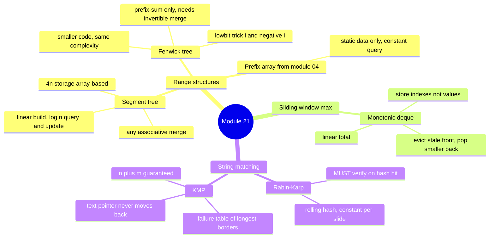

# Module 21 — Advanced Structures & String Algorithms: Summary

## Quick-reference cheat sheet

### Three range tools compared

| | Prefix array (module 04) | Fenwick tree | Segment tree |
| --- | --- | --- | --- |
| Build | O(n) | O(n log n) | O(n) |
| Point update | O(n) | O(log n) | O(log n) |
| Range query | O(1) | O(log n) | O(log n) |
| Range min/max | no (not invertible) | no (not invertible) | yes (any merge fn) |
| Code size | tiny | small | medium |
| Reach for when | data never changes | sum/count/XOR + updates | min/max/gcd + updates |

*Fenwick needs the merge to be invertible (subtraction undoes addition). Segment tree has no such restriction — at the cost of ~3x the code.*

---

### Monotonic deque template

```typescript
function windowMaxes(nums: number[], k: number): number[] {
  const result: number[] = []
  const deque: number[] = []   // stores indexes, values decreasing front to back

  for (let i = 0; i < nums.length; i++) {
    if (deque.length > 0 && deque[0]! <= i - k) deque.shift()
    while (deque.length > 0 && nums[deque.at(-1)!]! <= nums[i]!) deque.pop()
    deque.push(i)
    if (i >= k - 1) result.push(nums[deque[0]!]!)
  }
  return result
}
```

**Invariant**: deque values are strictly decreasing front-to-back; the front index is always the window maximum.

---

### Rolling-hash recipe (Rabin-Karp)

Constants: `B = 31`, `MOD = 1_000_000_007`.

**Drop-char formula** (slide window right by one):

```
newHash = ((oldHash - charCode(outgoing) * B^(m-1)) * B + charCode(incoming))  mod MOD
```

Compute `B^(m-1)` with a plain loop (`pow = pow * B % MOD`, repeated m-1 times) — NOT repeated squaring.
**Always verify** the actual substring on a hash match — a collision gives a false positive.

---

### Failure-table mini walkthrough (KMP)

Pattern: `"abab"` → `[0, 0, 1, 2]`

| i | char | longest proper border of pattern[0..i] | table[i] |
| --- | --- | --- | --- |
| 0 | a | none | 0 |
| 1 | b | none | 0 |
| 2 | a | "a" (length 1) | 1 |
| 3 | b | "ab" (length 2) | 2 |

On a mismatch at pattern index `k`, jump to `table[k-1]` — NOT `table[k]` and NOT 0.

---

### Where these appear in interviews

**Segment / Fenwick tree**: range-query-with-updates problems, "design analytics service", count inversions. Senior-level differentiator — asked less often than DP or graphs, but signals depth.

**Monotonic deque**: "sliding window maximum/minimum". Medium frequency.

**Rabin-Karp / KMP**: "find all pattern occurrences", "repeated DNA sequences". Less common in standard interview rounds.

---

## Mindmap



*What to notice: the left branch (range structures) deals with mutable aggregates over arrays; the right branch (string matching) finds a pattern inside a large text. The monotonic deque sits between them — it is a range-max structure for a sliding window.*

---

## Self-quiz (8 questions)

1. A segment tree and a Fenwick tree both give O(log n) updates and range queries. What can a segment tree do that a Fenwick tree cannot, and why?

2. The Fenwick `add(i, delta)` loop does `pos += pos & -pos`. What does this compute and why does it visit exactly the right ancestors?

3. "Given an array with point updates, answer range-PRODUCT queries." Segment tree or Fenwick? Why?

4. In the monotonic deque for sliding-window maximum, why store indexes rather than values?

5. Rabin-Karp reports a hash match but the substrings differ. What is this called and what is the fix?

6. In the KMP failure table, `table[i] = 3` means what exactly?

7. A KMP mismatch at position `k` jumps to `table[k-1]` instead of restarting from 0. Why?

8. "Find every 10-character DNA sequence that appears more than once in a 1 million character genome." Which algorithm and why?

<details>
<summary>Quiz answers (peek after attempting)</summary>

1. A segment tree supports any **associative** merge (min, max, GCD). Fenwick requires an **invertible** merge so a range can be computed as prefix(j) minus prefix(i-1); min and max have no inverse.

2. `pos & -pos` isolates the lowest set bit — the number of elements index `pos` (1-indexed) is responsible for. Adding it climbs to the next ancestor that includes `pos` in its range.

3. **Segment tree**. Multiplication is not invertible (division by zero is undefined), so prefix(j) / prefix(i-1) breaks. Segment tree merge `(a, b) => a * b` needs no inverse.

4. Indexes carry position information. When the front index falls outside `[i-k+1, i]`, you evict it. Values alone cannot tell you whether the front is still in the window.

5. A **hash collision** (false positive). Fix: character-by-character comparison whenever hashes match, before reporting a hit.

6. The longest **proper** prefix of `pattern[0..i]` that is also a suffix of `pattern[0..i]` has length 3. "Proper" means neither empty nor the whole string.

7. `table[k-1]` points to the next-longest border of the characters already matched. Restarting from 0 discards that information. The fallback chain guarantees O(m) total work.

8. **Rabin-Karp** rolling hash. One O(n) pass: hash every 10-char window in O(1), collect hashes in a Set. Running KMP for each candidate would cost O(n) per candidate and become quadratic overall.

</details>

---

## Pattern-recognition drill

Name the pattern or structure for each one-liner before peeking.

1. "An array of sensor readings gets frequent point updates; answer range-max queries."
2. "Find every occurrence of 'CRITICAL' in a 50 MB server log."
3. "Return the maximum price in every consecutive 7-day window as the stream slides."
4. "An array of stock prices never changes; return the sum over any date range in O(1)."
5. "Count how many elements to the RIGHT of position k are strictly smaller than nums[k]."
6. "Find all 12-character substrings in a genome of length 1 million that appear at least twice."

<details>
<summary>Answers</summary>

1. **Segment tree** — range max + point update; max is not invertible so Fenwick does not apply.
2. **KMP** (or Rabin-Karp) — linear string search in a huge text.
3. **Monotonic deque** — sliding-window maximum in O(n).
4. **Prefix array** (module 04) — static data, O(1) range sum. A segment tree would be overkill.
5. **Fenwick tree** + coordinate compression — "count smaller after" (ex03).
6. **Rabin-Karp** rolling hash — one O(n) pass, hash each 12-char window, collect those seen more than once.

</details>
