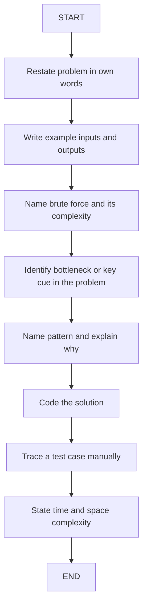

# Module 22 — Capstone: Interview Sets

---

## Step 1 — Why this exists

Knowing 20 patterns is not the skill. **Picking the right one under time pressure is.**

You have drilled 20 patterns across 21 modules. Each module gave you the structure, the template, and the drill problems. But the real interview does not label its questions. It drops a fresh scenario in front of you, starts a clock, and expects code.

Key realities:
- The interview tests **speed of recognition**, not memorization of algorithms.
- A pattern you cannot identify in 90 seconds might as well not be in your toolkit.
- These timed sets simulate the real environment: fresh scenario, no hints, clock running.
- **The goal:** when you read a problem statement, the right pattern label surfaces within 90 seconds — before you write a single line of code.

What these sets are:
- Curated problem bundles that span all 20 patterns from the course.
- Each set is designed to be run in one sitting (45–120 minutes).
- Problems are unlabeled — you must identify the pattern yourself.
- After each set, you debrief: what you missed, what fired correctly, what to revisit.

What these sets are not:
- A place to learn a new pattern for the first time.
- A substitute for the drills in earlier modules.
- Something to rush through just to say you finished.

---

## Step 2 — How to run a set

### Timebox rules

| Difficulty | Time per problem |
|------------|-----------------|
| Easy | 15 minutes |
| Medium | 25 minutes |
| Hard | 40 minutes |

When time runs out, **stop coding**. Look up the solution, understand it, and log the miss. Finishing within the timebox matters more than finishing perfectly.

### The mandatory 4-step pre-code ritual

Do this **before writing any code** — every single time, without exception:

1. **Restate**: Write the problem in your own words in one sentence. State the input type and output type explicitly.
2. **Brute force**: Name the brute force approach and its time/space complexity. Never skip this — it anchors your optimization and gives you a fallback.
3. **Name the pattern**: State the pattern you suspect and the specific **CUE** from the problem statement that suggested it (quote the exact phrase if possible).
4. **Code**: Only now, write the code.

This ritual takes 2–4 minutes. It will save you from spending 20 minutes coding the wrong approach.

### After coding

- Trace through your chosen test case mentally before submitting.
- State time complexity (worst case) and space complexity out loud or in a comment.
- If you were wrong about the pattern, note what the actual cue was.

---

## Step 3 — Diagram 1: The Interview Loop



*What to notice: the pattern identification step is in the MIDDLE, not the beginning. Brute force first forces you to see the bottleneck — you cannot spot what to optimize until you know what is slow.*

---

## Step 4 — Diagram 2: The Cue Map

This is the most important reference diagram in the course. When you see a cue phrase in a problem, follow the arrow to the pattern.

```mermaid
flowchart TD
    CUE1["sorted array or sorted input"] --> P1["binary-search OR two-pointers"]
    CUE2["contiguous subarray / substring / window"] --> P2["fixed-window OR variable-window OR prefix-sums+hash-map"]
    CUE3["count or frequency of elements"] --> P3["hash-map/set"]
    CUE4["pairs that sum / complement lookup"] --> P4["hash-map/set OR two-pointers if sorted"]
    CUE5["nesting / matching / valid parentheses"] --> P5["stack/queue"]
    CUE6["next greater or next smaller element"] --> P6["monotonic-stack"]
    CUE7["subarray sum equals k / prefix sum"] --> P7["prefix-sums + hash-map"]
    CUE8["shortest path / minimum steps in unweighted graph or grid"] --> P8["BFS"]
    CUE9["shortest path / minimum cost in weighted graph"] --> P9["Dijkstra"]
    CUE10["all configurations / permutations / subsets / combinations"] --> P10["DFS/backtracking"]
    CUE11["prerequisite order / dependency order / detect cycle in directed graph"] --> P11["topological-sort"]
    CUE12["dynamic grouping / connected components / union of sets"] --> P12["union-find"]
    CUE13["top-K / Kth largest / Kth smallest"] --> P13["heap/priority-queue"]
    CUE14["merge K sorted lists or streams"] --> P14["heap/priority-queue"]
    CUE15["stream median / running median"] --> P15["two-heaps"]
    CUE16["word prefix / autocomplete / spell check"] --> P16["trie"]
    CUE17["count ways / min cost / max value with overlapping subproblems"] --> P17["DP-1D or DP-2D"]
    CUE18["log n hint or efficiently on sorted data"] --> P18["binary-search"]
    CUE19["range queries with updates"] --> P19["segment-tree"]
    CUE20["interval scheduling / minimum resources"] --> P20["greedy"]
```



*What to notice: the first words of the problem statement are the biggest cue — "sorted", "contiguous", "path", "prefix", "stream" each pre-select 1-2 patterns before you have read the full problem.*

---

## Step 5 — Mock-interview mode

### How to ask Claude to run a mock interview

Say one of:

- `"Run a mock interview — medium difficulty"`
- `"Run a mock interview with a hard graph problem"`
- `"Run a mock interview — easy array problem"`

You can scope by difficulty and topic. Claude will pick a problem you have not seen in this session.

### What Claude will do in mock-interview mode

- Present the problem statement only — no category label, no hints embedded in the description.
- Stay silent while you work through the pre-code ritual.
- Give at most **one hint** per problem if you explicitly ask. (Asking for a hint is allowed; expecting it is not.)
- Ask for your complexity analysis at the end before revealing the optimal solution.
- **Debrief**: state which cue you missed (if any), which cue you caught correctly, and what to revisit.

### Best practice tips

- Speak (or type) each pre-code ritual step explicitly before coding. Do not skip Restate even if it feels obvious.
- Do not ask for hints until you have:
  1. Named your brute force approach with its complexity.
  2. Named at least one pattern you are considering and why.
- After the debrief, **immediately** log your weak pattern in `NOTES.md` with the date and the cue you missed.
- If you failed to identify the pattern within 90 seconds of reading, that pattern goes on your revisit list.

---

## Step 6 — After each set: honest scoring and review

### Scoring

Score = problems solved within timebox / total problems in the set.

| Score | Action |
|-------|--------|
| 5/5 or 4/5 | Move to next set (harder difficulty or next module) |
| 3/5 | Identify missed patterns; revisit those modules before next set |
| 2/5 or below | Pause sets; go back to drill mode for the weak patterns |

### What to log in NOTES.md

For each set session, log:

- **Date**
- **Set name / problem list**
- **Pattern misidentified**: what you guessed vs. what the correct pattern was
- **Cue missed**: the exact phrase in the problem that should have triggered the correct pattern
- **Time taken per problem**: did you stay within timebox?

Example entry:
```
2024-01-15 | Set 22-A
Problem: "Sliding Window Maximum"
- Guessed: heap | Correct: monotonic-stack (deque)
- Missed cue: "maximum in a sliding window" → monotonic structure
- Time: 31min (over 25min budget)
```

### Pattern review cadence

- After every 3 sessions, **quiz yourself on the cue map cold** — no looking at diagrams or notes. For each pattern, can you name 3 cues that suggest it?
- If you blank on a pattern during the cold quiz, that pattern gets a dedicated drill session before your next interview set.
- Revisit the relevant module's `LESSON.md` and do the drill problems again with fresh eyes.

---

## Step 7 — How to recognize patterns (bulleted cue reference)

| Pattern | Cues that suggest it |
|---------|---------------------|
| hash-map/set | "count", "frequency", "seen before", "group by", "complement lookup" |
| two-pointers | "sorted array", "pair sum", "remove duplicates from sorted", "palindrome check" |
| fixed-window | "exactly k consecutive", "subarray of length k", "average of window size k" |
| variable-window | "longest/shortest subarray", "at most k distinct", "no repeated chars" |
| prefix-sums | "subarray sum equals k", "range sum query", "difference array", "number of subarrays" |
| monotonic-stack | "next greater element", "next smaller", "largest rectangle", "daily temperatures" |
| stack/queue | "balanced brackets", "valid parentheses", "undo/redo", "process in LIFO/FIFO order" |
| binary-search | "sorted + find position", "minimize maximum", "log n", "first/last occurrence" |
| BFS | "shortest path in unweighted graph", "minimum moves", "level-order traversal", "nearest cell in grid" |
| DFS/backtracking | "all combinations", "all permutations", "generate all", "word search", "constraint satisfaction" |
| heap/priority-queue | "top-K", "Kth largest/smallest", "merge k sorted", "stream with ordering" |
| topological-sort | "course schedule", "build order", "dependency", "detect cycle in directed graph" |
| union-find | "dynamic connectivity", "number of islands (dynamic)", "friend circles", "Kruskal's MST" |
| greedy | "interval scheduling", "minimum rooms", "locally optimal choice", "provable exchange argument" |
| DP-1D | "count ways", "min/max value with 1D state", "climb stairs", "house robber", "coin change" |
| DP-2D | "grid path", "edit distance", "longest common subsequence", "knapsack", "2D state" |
| Dijkstra | "weighted shortest path", "cheapest flight", "minimum latency", "network delay" |
| segment-tree | "range query with point updates", "range min/max/sum + updates", "RMQ" |
| trie | "word prefix", "autocomplete", "word search in grid", "dictionary of strings" |
| two-heaps | "stream median", "running median", "sliding window median" |

---

## Step 8 — Code templates and worked example

### The 3 most reusable templates

**Template 1: Sliding window (variable)**

```typescript
function variableWindow(arr: number[], condition: (map: Map<number,number>) => boolean): number {
  const freq = new Map<number, number>()
  let left = 0, maxLen = 0
  for (let right = 0; right < arr.length; right++) {
    freq.set(arr[right]!, (freq.get(arr[right]!) ?? 0) + 1)
    while (!condition(freq)) {
      const l = arr[left]!
      freq.set(l, freq.get(l)! - 1)
      if (freq.get(l) === 0) freq.delete(l)
      left++
    }
    maxLen = Math.max(maxLen, right - left + 1)
  }
  return maxLen
}
```

**Template 2: BFS grid**

```typescript
function bfsGrid(grid: number[][]): number {
  const rows = grid.length, cols = grid[0]?.length ?? 0
  if (!rows || grid[0]![0] === 1) return -1
  const queue: [number,number,number][] = [[0, 0, 0]]
  const visited = new Set<string>(['0,0'])
  const dirs = [[-1,0],[1,0],[0,-1],[0,1]] as const
  while (queue.length) {
    const [r, c, dist] = queue.shift()!
    if (r === rows-1 && c === cols-1) return dist
    for (const [dr, dc] of dirs) {
      const nr = r+dr, nc = c+dc
      const key = `${nr},${nc}`
      if (nr>=0 && nr<rows && nc>=0 && nc<cols && grid[nr]![nc] === 0 && !visited.has(key)) {
        visited.add(key)
        queue.push([nr, nc, dist+1])
      }
    }
  }
  return -1
}
```

**Template 3: DP tabulation (1D)**

```typescript
function dp1D(n: number): number {
  if (n <= 1) return n
  let prev2 = 0, prev1 = 1
  for (let i = 2; i <= n; i++) {
    const curr = prev1 + prev2  // recurrence here
    prev2 = prev1
    prev1 = curr
  }
  return prev1
}
```

---

### Worked example: dependency ordering (topological sort)

**Problem**: `buildOrder(4, [[1,0],[2,0],[3,1],[3,2]])`

Given 4 build steps numbered 0–3 and a list of dependency pairs `[a, b]` meaning "step a requires step b to finish first", return a valid order to run all steps, or `null` if impossible. (This is the same engine you need for ex02's pipeline problem — the trace below shows the full ritual on the simpler "return an order" variant.)

#### Step 1 — Restate

Input: number of steps `n`, list of `[step, dependency]` pairs. Output: an array of step numbers in a valid execution order (each dependency appears before the step that needs it).

#### Step 2 — Brute force

Try all permutations of `[0, 1, 2, 3]` and check each against every dependency pair. If dependency `b` appears after `a` in the permutation, the permutation is invalid. Complexity: O(V! * E) — completely infeasible for large V.

#### Step 3 — CUE

"Requires ... to finish first" and "ordering" → **dependency / ordering constraint on a directed graph** → **topological sort** (Kahn's BFS).

#### Step 4 — Kahn's BFS trace

Build the adjacency list and in-degree array from the dependencies:

- `adj`: `{ 0: [1, 2], 1: [3], 2: [3] }` — "0 must come before 1 and 2; 1 and 2 must come before 3"
- `inDegree`: `[0, 1, 1, 2]` — step 0 has no dependencies, steps 1 and 2 each have 1, step 3 has 2

Start the queue with all nodes whose in-degree is 0: `[0]`.

| Step | Queue | Process | in-degrees after | Order so far |
|------|-------|---------|-----------------|--------------|
| 0 | [0] | — | [0, 1, 1, 2] | [] |
| 1 | [1, 2] | 0 | [0, 0, 0, 2] | [0] |
| 2 | [2, 1] | 1 | [0, 0, 0, 1] | [0, 1] |
| 3 | [3] | 2 | [0, 0, 0, 0] | [0, 1, 2] |
| 4 | [] | 3 | — | [0, 1, 2, 3] |

Result: `[0, 1, 2, 3]` — a valid topological order. If the final order contains fewer than `n` nodes, a cycle exists and we return `null`.

**Complexity**: O(V + E) time, O(V + E) space.

---

### Complexity reference table

| Pattern | Time | Space | Notes |
|---------|------|-------|-------|
| hash-map/set | O(n) | O(n) | amortized |
| two-pointers | O(n) | O(1) | sorted input required |
| fixed-window | O(n) | O(1) | — |
| variable-window | O(n) | O(k) | k = window state size |
| prefix-sums | O(n) | O(n) | preprocess then O(1) query |
| monotonic-stack | O(n) | O(n) | each element pushed/popped once |
| stack/queue | O(n) | O(n) | — |
| binary-search | O(log n) | O(1) | requires sorted |
| BFS | O(V+E) | O(V) | unweighted shortest path |
| DFS/backtracking | O(k^n) | O(n) | k = branching factor |
| heap/priority-queue | O(n log k) | O(k) | top-K via min-heap |
| topological-sort | O(V+E) | O(V+E) | Kahn's BFS |
| union-find | O(n α(n)) | O(n) | α = inverse Ackermann ≈ O(1) |
| greedy | varies | O(1)–O(n) | problem-specific |
| DP-1D | O(n) | O(1)–O(n) | rolling vars reduce to O(1) space |
| DP-2D | O(m*n) | O(m*n) | can optimize to O(min(m,n)) |
| Dijkstra | O((V+E) log V) | O(V+E) | non-negative weights only |
| segment-tree | O(n) build / O(log n) query+update | O(n) | — |
| trie | O(L) per op | O(n*L) | L = word length |
| two-heaps | O(log n) per insert | O(n) | running median |

---

### Common gotchas

- **Off-by-one in binary search**: use `lo <= hi` (inclusive bounds), or be precise about your invariant. Mixing open/closed bounds is the single most common binary search bug.
- **Empty input**: always check `nums.length === 0` before accessing `nums[0]`. TypeScript's `noUncheckedIndexedAccess` enforces this — every `arr[i]` returns `T | undefined`.
- **Sliding window shrink condition**: `while` vs `if` matters. Over-shrinking collapses a valid window; under-shrinking allows an invalid one.
- **BFS visited set**: mark nodes as visited when **enqueuing**, not when dequeuing. Marking at dequeue allows the same node to be enqueued multiple times before it is processed.
- **Cycle detection vs topological sort**: if you only need to detect a cycle, DFS with 3-state coloring (unvisited / in-progress / done) works. Kahn's BFS gives you the ordering too — and cycle detection is free (result length < n).
- **Heap with custom comparator**: JavaScript has no built-in heap. Always implement a min-heap class or sort after collecting top-K candidates. Do not rely on array sort inside a loop — it is O(n log n) per iteration.
- **DP initialization**: base cases for `i = 0` and `i = 1` often need special handling before the main loop. Getting these wrong silently corrupts all subsequent values.
- **noUncheckedIndexedAccess**: every `arr[i]` returns `T | undefined` in strict TypeScript — use the non-null assertion `!` only after confirming bounds, or add a bounds guard first.
- **Two-pointer only on sorted input** (or when the data structure guarantees monotonicity without sorting).
- **Backtracking: restore state** after each recursive call. The undo step (removing the last choice before returning) is what makes the search exhaustive without duplicating paths.

---

## Next Steps

You have completed all 22 modules of the course. Here is what to do next:

- **Practice on LeetCode or NeetCode with self-imposed timebox.** Pick problems blind (no category filter). Use the Cue Map in Step 4 as your only reference during the first attempt.
- **Maintain a NOTES.md error log.** Every missed pattern, every blown timebox, every gotcha that bit you — log it with the date and the cue you missed. Review it before every practice session.
- **Revisit weak patterns every 2 weeks.** If a pattern name does not immediately bring 3 cues to mind, go back to that module's `LESSON.md` and run the drills again cold.
- **Mock interviews with a peer.** Reading problems alone is not the same as thinking aloud under a real person's observation. Find a peer, take turns presenting problems, and practice the pre-code ritual verbally. Saying "the cue is 'next greater element' which suggests monotonic-stack" out loud is a different skill than thinking it silently.

The patterns are in your toolkit. The next skill is deploying them automatically, under pressure, on problems you have never seen before. That only comes from repetitions with honest feedback.
