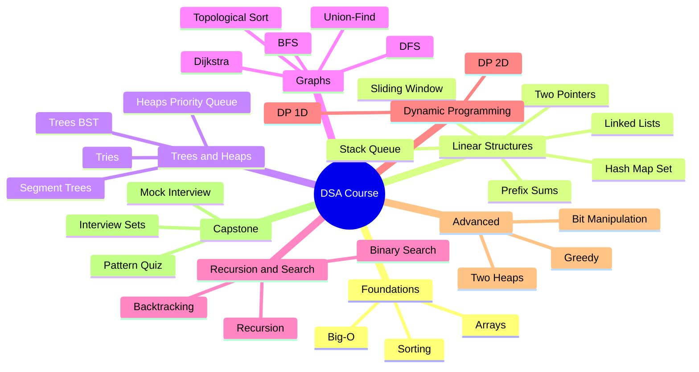

# Module 22 Summary — Capstone Coverage Map

## 1. Course Coverage Map

| Interview Topic | Module | Key Exercises |
|---|---|---|
| Big-O & the 5-step framework | 01 | ex01-growth-rates, ex02-count-ops, ex05-target-pair |
| Dynamic arrays & in-place ops | 02 | ex01-dynamic-array, ex02-reverse-in-place, ex03-remove-in-place |
| Hash counting / grouping | 03 | ex01-first-unique, ex02-pair-sum, ex03-group-anagrams |
| Hash-set tricks (consecutive run) | 03 | ex04-consecutive-run |
| Build a hash map | 03 | ex06-build-hash-map |
| Two pointers | 04 | ex01-sorted-pair-target, ex04-triplet-sum, ex05-container-water |
| Prefix sums | 04 | ex06-prefix-ranges, ex07-subarray-sum-k |
| Fixed sliding window | 05 | ex01-fixed-window-stats, ex06-window-anagram |
| Variable sliding window | 05 | ex03-longest-unique-run, ex05-smallest-window-sum, ex07-min-cover-window |
| Stack matching / stack design | 06 | ex02-balanced-brackets, ex04-min-stack, ex05-postfix-eval |
| Queue via stacks | 06 | ex03-queue-via-stacks |
| Monotonic stack | 06 | ex06-monotonic-warm-days, ex07-histogram-max-rect |
| Linked lists (reverse, cycle, LRU) | 07 | ex02-reverse-list, ex03-fast-slow, ex07-lru-cache |
| Recursion & divide-conquer | 08 | ex03-fast-pow, ex05-merge-count-inversions |
| Sorting (merge, quick, quickselect) | 09 | ex02-merge-sort, ex03-quick-sort, ex04-quickselect |
| Binary search & boundaries | 10 | ex01-classic-search, ex02-boundaries, ex03-rotated-search |
| Search on the answer | 10 | ex04-rate-on-answer, ex05-capacity-on-answer |
| Trees & BST | 11 | ex01-build-bst, ex03-traversals, ex04-tree-metrics |
| Heaps & top-K | 12 | ex01-build-min-heap, ex03-top-k-frequent, ex05-kth-largest-stream |
| Two heaps (running median) | 12 | ex06-running-median |
| Merge k sorted | 12 | ex07-merge-k-sorted |
| Tries | 13 | ex01-build-trie, ex02-wildcard-dictionary, ex03-prefix-counts |
| Backtracking | 14 | ex01-subsets-drill, ex03-permutations-drill, ex07-n-queens |
| Graph BFS/DFS & grids | 15 | ex02-dfs-bfs-basics, ex03-island-count, ex05-infection-spread |
| Graph cloning / bipartite | 15 | ex06-clone-graph, ex07-bipartite-check |
| Topological sort | 16 | ex01-topo-sort |
| Union-find | 16 | ex02-build-union-find, ex03-redundant-link |
| Minimum spanning tree | 16 | ex04-kruskal-mst, ex05-prim-connect-points |
| Dijkstra / Bellman-Ford (k stops) | 16 | ex06-dijkstra-delivery, ex07-k-stops-cheapest |
| Greedy & Kadane | 17 | ex01-kadane-max-run, ex02-jump-reach, ex03-fuel-circuit |
| Interval patterns | 17 | ex05-merge-intervals, ex06-interval-scheduling, ex07-min-arrows |
| DP 1-D | 18 | ex01-stairs-framework, ex03-robber-houses, ex04-coin-min, ex07-longest-rising |
| DP 2-D (two-sequence, grid) | 19 | ex01-grid-paths, ex02-common-subsequence, ex03-edit-distance |
| Knapsack (0/1 & unbounded) | 19 | ex04-knapsack-01, ex05-knapsack-unbounded |
| Bit manipulation & math | 20 | ex02-xor-tricks, ex03-bit-tables, ex04-math-essentials |
| Segment / Fenwick trees | 21 | ex01-build-segment-tree, ex02-range-min-tree, ex03-build-fenwick |
| Monotonic deque (window max) | 21 | ex04-window-max-deque |
| String matching (Rabin-Karp, KMP) | 21 | ex05-rabin-karp, ex06-kmp-search |

Every topic above is rehearsed **unlabeled** in this module: the timed
sets (ex01–ex03), the pattern quiz (ex04), and the final-mock
checkpoint that gates the course.

---

## 2. Condensed Cue Map Table

| Pattern | Quick cue (1-2 words) | Example problem shape |
|---|---|---|
| hash-map/set | "count", "group" | "how many times does X appear" |
| two-pointers | "sorted pair" | "sorted array, two values sum to target" |
| fixed-window | "exactly k consecutive" | "max sum of k elements in a row" |
| variable-window | "longest/shortest, at most k" | "longest substring with at most k distinct chars" |
| prefix-sums | "subarray sum = k" | "count subarrays summing to k (with negatives)" |
| monotonic-stack | "next greater/smaller" | "for each element, next larger element to the right" |
| stack/queue | "nested / matching" | "valid brackets", "undo operations" |
| binary-search | "sorted + find / minimize-max" | "find insert position in sorted array" |
| BFS | "shortest path, unweighted" | "minimum moves in grid from A to B" |
| DFS/backtracking | "all configurations" | "generate all subsets / permutations" |
| heap/priority-queue | "top-K / Kth" | "find K largest elements" |
| topological-sort | "dependency order" | "course prerequisites, build order" |
| union-find | "dynamic connectivity" | "online: are X and Y in the same group?" |
| greedy | "interval / local optimal" | "minimum meeting rooms, activity selection" |
| DP-1D | "count ways / min cost (1D)" | "number of ways to climb n stairs" |
| DP-2D | "grid path / string transform" | "edit distance, minimum path in grid" |
| Dijkstra | "weighted shortest path" | "cheapest flight, network delay time" |
| segment-tree | "range query + point update" | "range sum with modifications" |
| trie | "word prefix / dictionary" | "autocomplete, word search in grid" |
| two-heaps | "stream median" | "median of stream after each insertion" |

---

## 3. What Next

After completing all 22 modules:

- **Problem journal**: Keep a log of every new problem you solve. Record: date, source (LeetCode/etc), difficulty, pattern used, time taken, what you missed. Review weekly.
- **Spaced repetition**: Every week, re-solve 3 problems from your "missed" pile without looking at notes. The goal is the 90-second cue recognition, not re-memorizing solutions.
- **Harder platforms**: Progress to LeetCode Hard, NeetCode 150 (all covered), Codeforces (Div 3/2), Advent of Code.
- **Mock interviews**: Use Pramp, interviewing.io, or Claude's mock-interview mode weekly.
- **Strengthen weak spots**: Any pattern that cost you more than 2 hints in these capstone sets needs one more week of drill.
- **System design**: The next layer after algorithms is system design — distributed systems, databases, API design. Algorithms underpin every system design choice.

---

## 4. The Complete Course Mindmap

*What to notice: the course builds from left to right — foundations → structures → graphs → DP → advanced, mirroring how interview prep difficulty scales.*

---

## 5. Self-Quiz (10 questions)

1. You need to find whether any pair in a sorted array sums to a target in O(n) time. Which pattern and why?
2. A function is O(n log n) in time and O(1) in space — what sorting algorithm does this describe?
3. What invariant does a monotonic decreasing stack maintain, and what problem shape is it ideal for?
4. In Kahn's topological sort, what does it mean when the output order has fewer nodes than the graph's total nodes?
5. What is the key difference between Dijkstra's algorithm and Bellman-Ford, and when would you use each?
6. In a DP 2D edit distance problem, what do the three transitions (from dp[i-1][j], dp[i][j-1], dp[i-1][j-1]) represent?
7. Why does the two-heaps pattern give O(log n) median queries instead of O(n)?
8. What is the time complexity of building a trie from n words of average length L, and of searching?
9. In a variable sliding window, when should you shrink from the left — use `while` or `if`?
10. Name a problem where greedy gives the wrong answer but DP gives the right answer. Why?

Answers

1. **Two-pointers.** Sorted input means you can move left and right pointers toward each other — if sum too small, move left right; if too large, move right left. O(n) time, O(1) space.

2. **Heapsort** (O(n log n) time, O(1) in-place space) or merge sort (but merge sort is O(n) space). Most commonly heapsort for O(1) space.

3. A monotonic decreasing stack maintains elements in decreasing order from bottom to top. Every new element that is larger than the top triggers pops — those popped elements have found their "next greater element" (the current element). Ideal for "next greater element to the right" problems.

4. **A cycle exists in the graph.** Nodes in the cycle never have their in-degree reach 0, so they are never enqueued and never appear in the output.

5. **Dijkstra**: O((V+E) log V), works on non-negative weights only, greedy approach. **Bellman-Ford**: O(V*E), handles negative weights (not negative cycles), DP/relaxation approach. Use Dijkstra for most weighted-shortest-path problems; use Bellman-Ford when edges can be negative.

6. **dp[i-1][j]** = delete a character from source (moving down in source, staying in target). **dp[i][j-1]** = insert a character into source (staying in source, moving in target). **dp[i-1][j-1]** = substitute (or match if chars equal, cost 0).

7. Two heaps maintain the lower and upper halves sorted at all times. The median is always at one or both heap tops — O(1) to read. Each insertion costs O(log n) for the heap push/pop rebalance. Without heaps you'd need O(n) to find the median of an unsorted list.

8. **Build**: O(n * L). **Search**: O(L) per query — just traverse one path down the trie of length L.

9. Use **`while`**. You need to keep shrinking until the window satisfies the invariant again. Using `if` would only shrink once and leave an invalid window.

10. **Classic example: the 0/1 knapsack problem or coin change.** Greedy picks the largest denomination first, which fails (e.g., coins [1,3,4], target 6 — greedy picks 4+1+1=3 coins, but DP finds 3+3=2 coins). Greedy's locally optimal choice isn't always globally optimal when items can't be reused or the structure is non-uniform.

---

## 6. Pattern-Recognition Drill

1. "Longest subarray where the sum is at most k (all positive)" — variable window or prefix+hash?

**Variable window.** All positive means shrinking from the left always reduces the sum, so the window approach is valid and O(n). Prefix+hash is unnecessary here and adds O(n) space overhead.

2. "Count subarrays with sum exactly k (array may have negatives)" — variable window or prefix+hash?

**Prefix sums + hash map.** Variable window fails with negatives because shrinking from the left doesn't monotonically reduce the sum. Use `prefixSum[j] - prefixSum[i] = k` and count via a hash map of seen prefix sums.

3. "Find if a path exists between every pair of cities after adding roads one at a time" — BFS/DFS each time, or union-find?

**Union-Find.** BFS/DFS per query would be O(V+E) each time; union-find gives O(α(n)) ≈ O(1) per query after O(n) build. This is the canonical use case for online dynamic connectivity.

4. "Minimum cost to connect all nodes in a graph (MST)" — Dijkstra or greedy (Prim/Kruskal)?

**Greedy (Prim's or Kruskal's).** Dijkstra finds shortest paths from a single source, not MST. Prim's (greedy + heap) or Kruskal's (greedy + union-find) are correct for Minimum Spanning Trees.

5. "How many distinct ways to make change for amount n with given coins (unlimited use)" — greedy or DP?

**DP-1D.** Greedy fails for non-canonical coin systems (e.g., coins [1,3,4] and target 6). DP counts all valid combinations correctly via the unbounded knapsack recurrence.

6. "Largest rectangle in a histogram" — two-pointers or monotonic stack?

**Monotonic stack.** Two-pointers would need O(n) work per bar (O(n²) total). Monotonic stack amortizes to O(n) by processing each bar at most twice — once when pushed, once when popped to compute area.

7. "Shortest path in a grid where each cell has a different weight" — BFS or Dijkstra?

**Dijkstra** (or 0-1 BFS if weights are 0/1). BFS only gives shortest path in unweighted graphs. Dijkstra handles weighted correctly by always expanding the minimum-cost frontier node.

8. "Find all valid IP addresses from a string of digits" — DFS/backtracking or DP?

**DFS/backtracking.** You're generating all valid configurations — the problem asks for all outputs, not a single min/max. DP is for counting or optimizing, not enumeration. Backtrack over the 4 segment positions, pruning invalid octets.

9. "Minimum number of intervals to remove to make the rest non-overlapping" — DP or greedy?

**Greedy** (sort by end time, greedily keep intervals that end earliest). A DP solution exists but is O(n²); the greedy exchange argument proves the optimal substructure without it, giving O(n log n).

10. "Kth largest element in an unsorted array" — sort or heap?

**Heap (min-heap of size k).** Sorting is O(n log n); a heap of size k gives O(n log k) which is better for large n and small k. Alternatively, quickselect gives O(n) average time.

