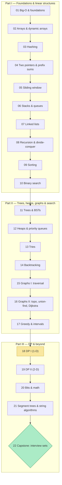

# Roadmap — Data Structures & Algorithms (zero → hero)

Your progress tracker. Tick a box when the exercises are done and the
checkpoint passes (your instructor ticks them for you).

*What to notice: three parts build on each other in order; DP (18) is
the summit of the theory and the capstone (22) is where pattern
recognition — the real skill — gets tested.*

## Part I — Foundations & linear structures

- [ ] **01 Big-O & foundations** — exercises
- [ ] 01 checkpoint
- [ ] **02 Arrays & dynamic arrays** — exercises
- [ ] 02 checkpoint
- [ ] **03 Hashing** — exercises
- [ ] 03 checkpoint
- [ ] **04 Two pointers & prefix sums** — exercises
- [ ] 04 checkpoint
- [ ] **05 Sliding window** — exercises
- [ ] 05 checkpoint
- [ ] **06 Stacks & queues** — exercises
- [ ] 06 checkpoint
- [ ] **07 Linked lists** — exercises
- [ ] 07 checkpoint
- [ ] **08 Recursion & divide-and-conquer** — exercises
- [ ] 08 checkpoint
- [ ] **09 Sorting** — exercises
- [ ] 09 checkpoint
- [ ] **10 Binary search** — exercises
- [ ] 10 checkpoint

## Part II — Trees, heaps, graphs & combinatorial search

- [ ] **11 Trees & BSTs** — exercises
- [ ] 11 checkpoint
- [ ] **12 Heaps & priority queues** — exercises
- [ ] 12 checkpoint
- [ ] **13 Tries** — exercises
- [ ] 13 checkpoint
- [ ] **14 Backtracking** — exercises
- [ ] 14 checkpoint
- [ ] **15 Graphs I: traversal** — exercises
- [ ] 15 checkpoint
- [ ] **16 Graphs II: ordering, union-find, weighted paths** — exercises
- [ ] 16 checkpoint
- [ ] **17 Greedy & intervals** — exercises
- [ ] 17 checkpoint

## Part III — Dynamic programming & beyond

- [ ] **18 DP I (1-D)** — exercises
- [ ] 18 checkpoint
- [ ] **19 DP II (2-D)** — exercises
- [ ] 19 checkpoint
- [ ] **20 Bit manipulation & math** — exercises
- [ ] 20 checkpoint
- [ ] **21 Advanced structures & string algorithms** — exercises
- [ ] 21 checkpoint
- [ ] **22 Capstone: interview sets** — set-easy
- [ ] 22 set-medium
- [ ] 22 set-hard
- [ ] 22 pattern-quiz
- [ ] 22 final-mock checkpoint 🎓
